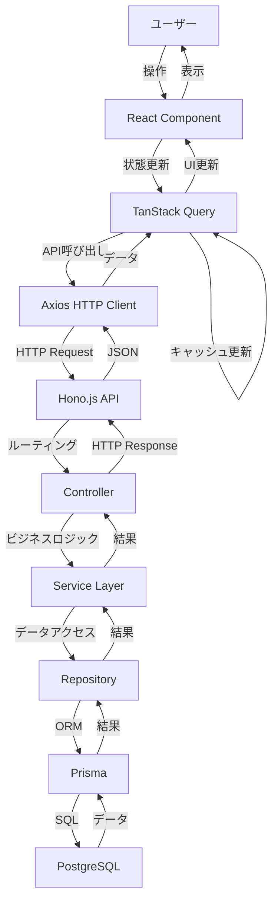
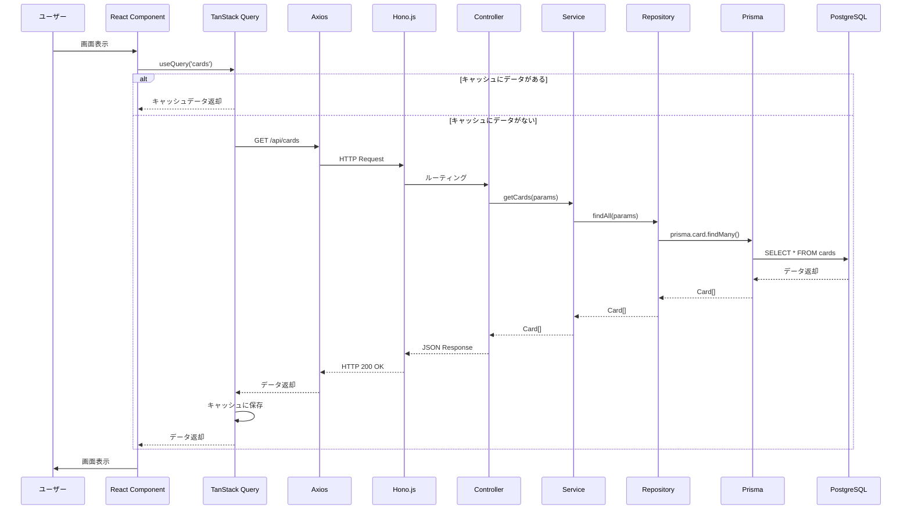
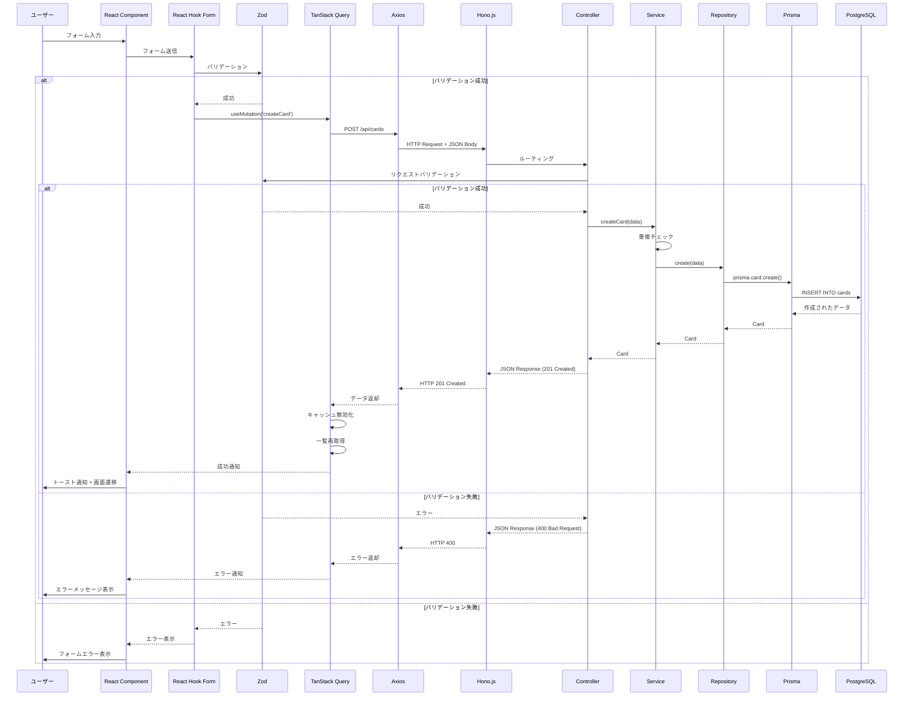
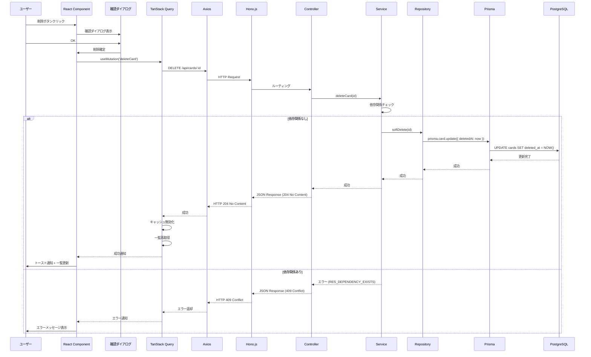
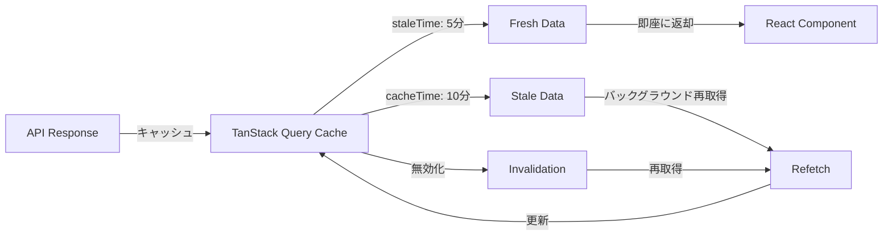
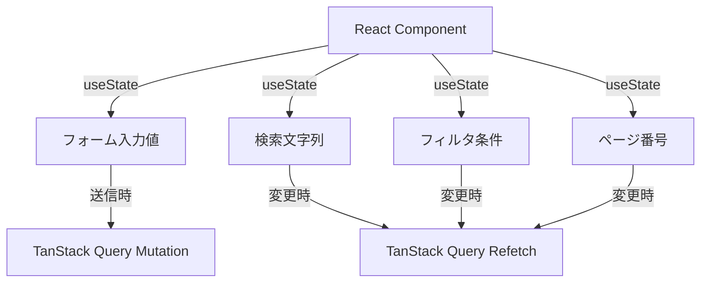
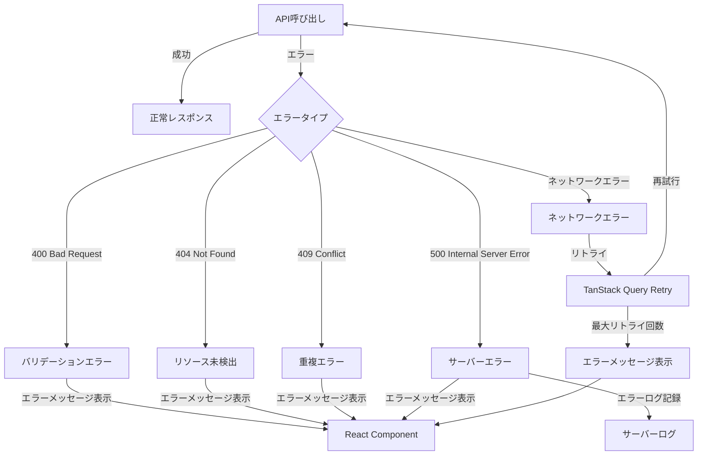
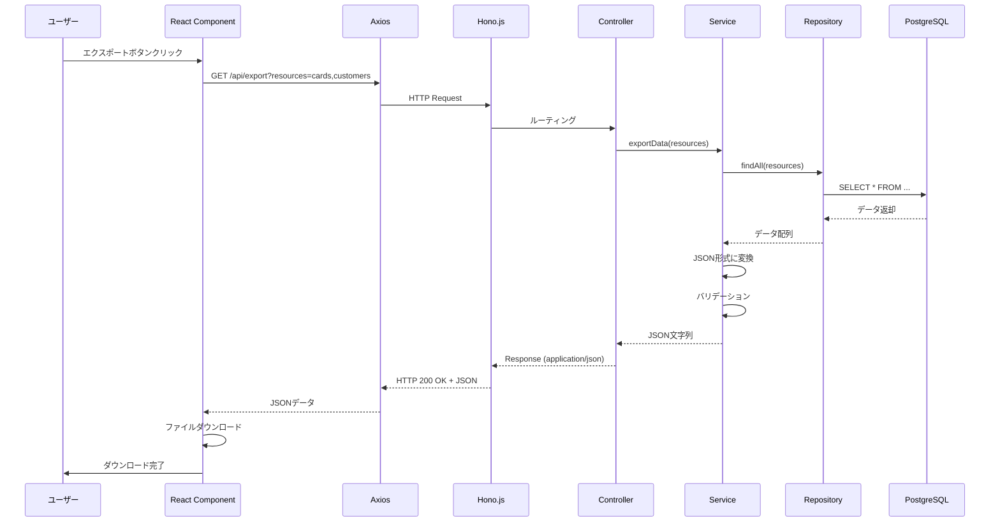
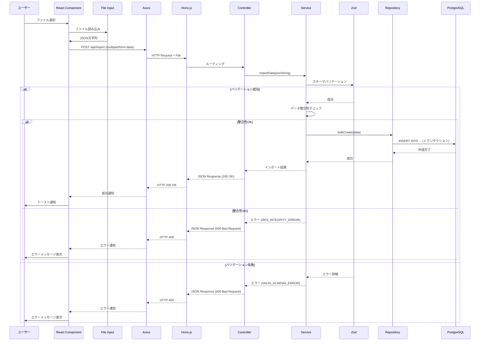
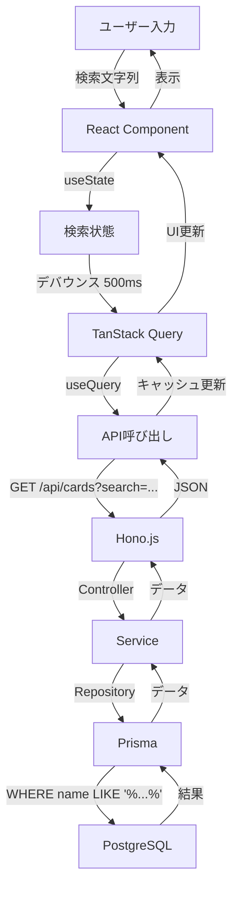

# データフロー図

## ユーザーインタラクションフロー

**【信頼性レベル】**:
- 🔵 **青信号**: 要件定義書から直接導出された確実な設計
- 🟡 **黄信号**: 要件定義書から妥当な推測による設計
- 🔴 **赤信号**: 一般的なWebアプリ管理画面のベストプラクティスから推測

---

## データ処理フロー（シーケンス図）

### カード一覧取得フロー

### カード作成フロー

### カード削除フロー

---

## 状態管理フロー

### サーバー状態（TanStack Query）

### クライアント状態（React Hooks）

---

## エラーハンドリングフロー

---

## データエクスポート/インポートフロー

### エクスポートフロー

### インポートフロー

---

## 検索・フィルタリングフロー

---

## 変更履歴

| 日付 | バージョン | 変更内容 |
|------|----------|---------|
| 2025-01-XX | 1.0 | 初版作成 |

