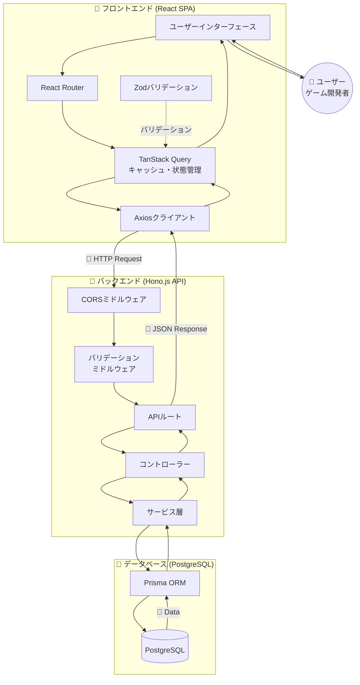
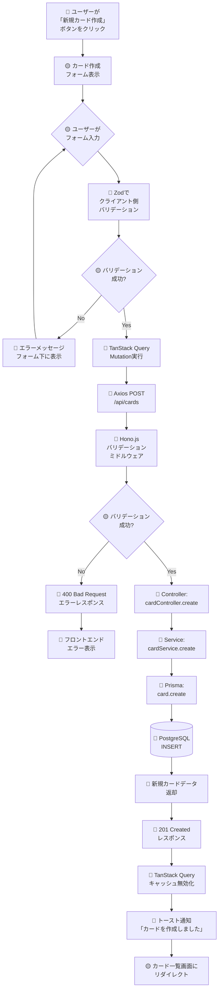
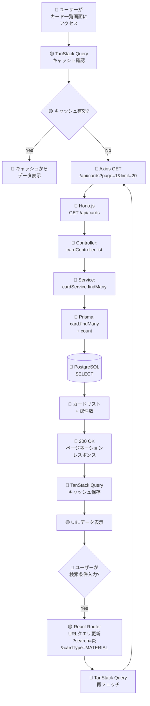
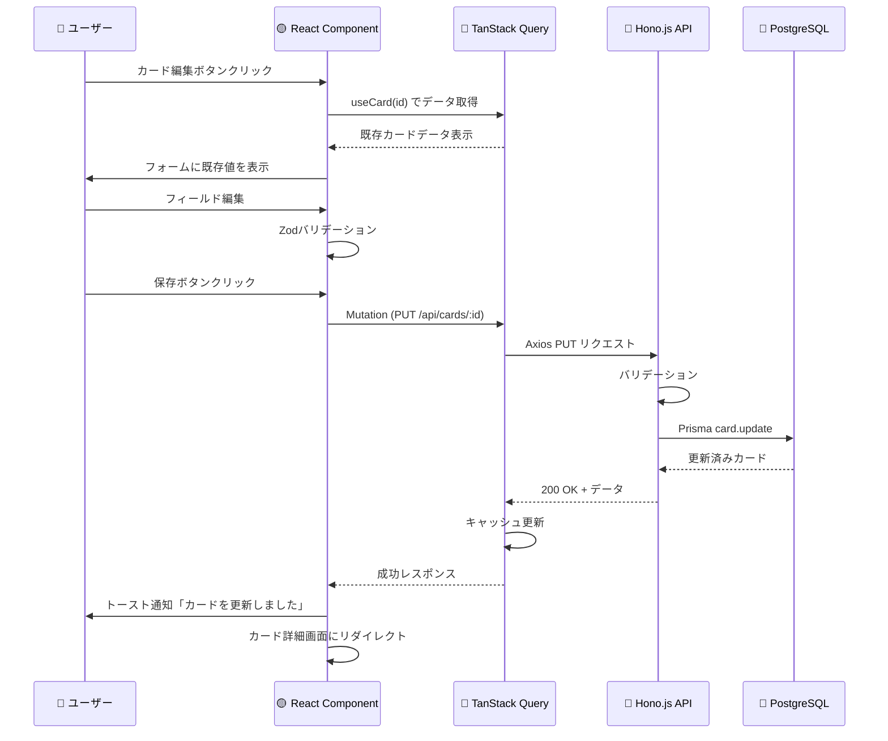
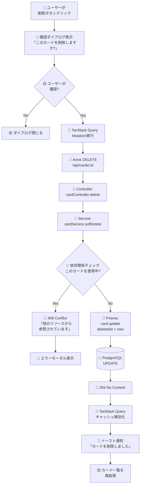
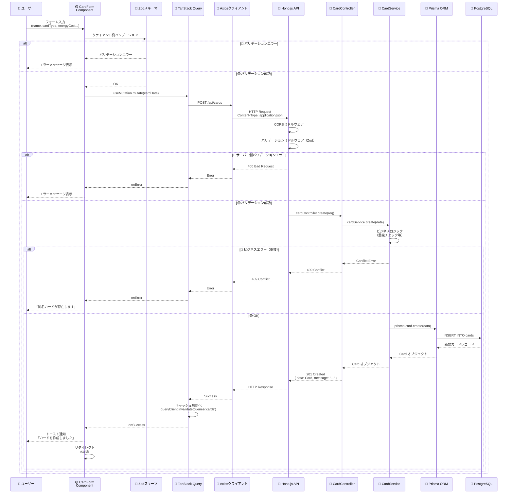
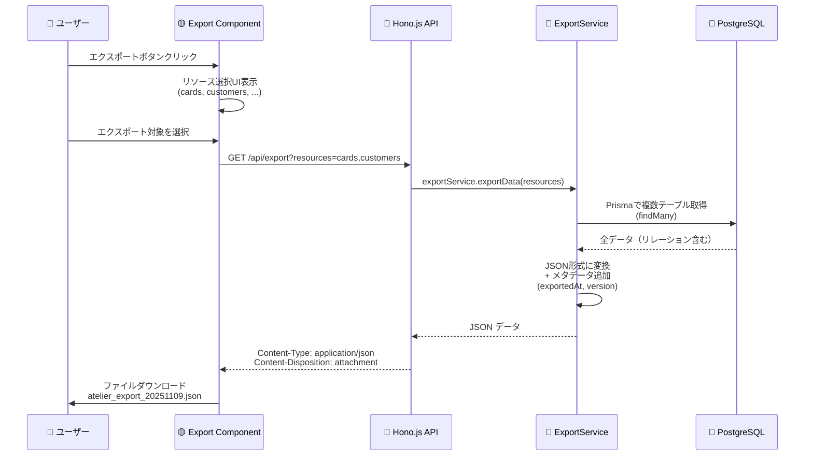
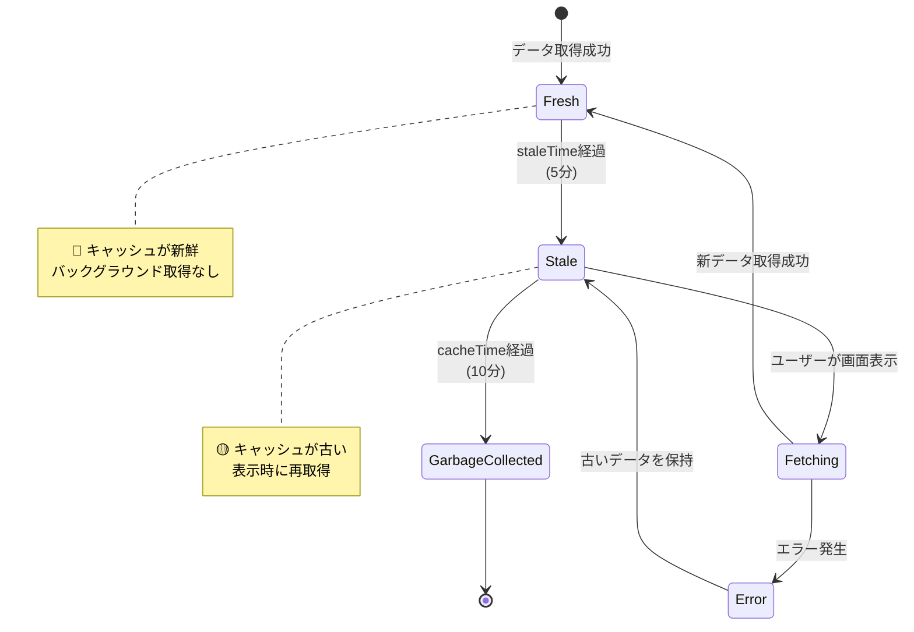

# データフロー図

## 🔵 システム全体のデータフロー

### アーキテクチャ概要図



---

## 🔵 ユーザーインタラクションフロー

### 1. カード作成フロー



---

### 2. カード一覧取得・検索フロー



---

### 3. カード更新フロー



---

### 4. カード削除フロー（ソフトデリート）



---

## 🔵 データ処理フロー（詳細）

### カードデータの流れ



---

## 🔵 顧客依頼の報酬設定フロー

### N:Mリレーション（Customer ←→ Card）の処理

```mermaid
flowchart TD
    A[🔵 ユーザーが顧客作成<br/>フォームで報酬カード選択] --> B[🟡 Card一覧から<br/>複数選択UI]
    B --> C[🔵 選択したカードIDの配列<br/>rewardCardIds: string[]]
    C --> D[🔵 POST /api/customers<br/>{ name, difficulty,<br/>rewardCardIds: [...] }]
    D --> E[🔵 customerController.create]
    E --> F[🔵 customerService.create]
    F --> G[🔵 Prisma:<br/>customer.create]
    G --> H[🔵 Prisma connect:<br/>rewardCards: {<br/>  connect: rewardCardIds.map<br/>    id => ({ id })<br/>}]
    H --> I[(🔵 PostgreSQL<br/>トランザクション開始)]
    I --> J[🔵 INSERT INTO customers]
    J --> K[🔵 INSERT INTO<br/>_CustomerRewardCards<br/>中間テーブル]
    K --> L[(🔵 COMMIT)]
    L --> M[🔵 顧客データ返却<br/>include: { rewardCards: true }]
    M --> N[🔵 TanStack Query<br/>キャッシュ保存]
    N --> O[🔴 トースト通知<br/>顧客作成成功]
```

---

## 🔵 データエクスポート/インポートフロー

### エクスポートフロー



### インポートフロー

```mermaid
flowchart TD
    A[🔵 ユーザーが<br/>JSONファイル選択] --> B[🟡 ファイルアップロード<br/>フォーム]
    B --> C[🔵 POST /api/import<br/>multipart/form-data]
    C --> D[🔵 importController.import]
    D --> E[🔵 importService.validateJSON]
    E --> F{🔴 スキーマ<br/>バリデーション?}
    F -->|Error| G[🔴 400 Bad Request<br/>詳細なエラーメッセージ]
    G --> H[🔴 エラーモーダル表示<br/>「行10: energyCostが不正」]
    F -->|OK| I[🔵 トランザクション開始]
    I --> J[🔵 既存データ削除<br/>または上書き確認]
    J --> K[🔵 Prisma createMany<br/>バルクインサート]
    K --> L{🔴 DB制約<br/>エラー?}
    L -->|Error| M[🔴 ROLLBACK]
    M --> N[🔴 409 Conflict<br/>「ユニーク制約違反」]
    N --> H
    L -->|OK| O[🔵 COMMIT]
    O --> P[🔵 インポート統計<br/>cards: 50, customers: 10]
    P --> Q[🔵 200 OK<br/>{ imported: {...} }]
    Q --> R[🔴 トースト通知<br/>「データをインポートしました」]
    R --> S[🟡 全リストを<br/>再取得・表示]
```

---

## 🔵 TanStack Query キャッシング戦略

### キャッシュライフサイクル



### キャッシュ設定

```typescript
// 🔵 TanStack Query 設定例
const queryClient = new QueryClient({
  defaultOptions: {
    queries: {
      staleTime: 5 * 60 * 1000,      // 🔵 5分間は新鮮
      cacheTime: 10 * 60 * 1000,     // 🔵 10分間キャッシュ保持
      refetchOnWindowFocus: false,   // 🟡 ウィンドウフォーカス時は再取得しない
      retry: 1,                      // 🟡 エラー時1回リトライ
    },
  },
});
```

---

## 🟡 エラー伝播フロー

### エラーハンドリングの流れ

```mermaid
flowchart TD
    A[(🔵 PostgreSQL<br/>エラー発生)] --> B[🔵 Prisma<br/>PrismaClientKnownRequestError]
    B --> C[🔵 Service層で<br/>エラーキャッチ]
    C --> D{🟡 エラー種別判定}
    D -->|P2002<br/>Unique制約| E[🔴 ConflictError<br/>409]
    D -->|P2025<br/>Not Found| F[🔴 NotFoundError<br/>404]
    D -->|その他| G[🔴 InternalServerError<br/>500]

    E --> H[🔵 Controller で<br/>エラーハンドリング]
    F --> H
    G --> H

    H --> I[🔵 Hono.js<br/>エラーレスポンス]
    I --> J[🔵 構造化エラー<br/>{ error: { code, message, details } }]
    J --> K[🔵 Axios<br/>エラーレスポンス受信]
    K --> L[🔵 TanStack Query<br/>onError コールバック]
    L --> M{🟡 エラー種別}
    M -->|400, 409| N[🔴 フォーム内エラー表示]
    M -->|404| O[🔴 「データが見つかりません」<br/>トースト]
    M -->|500| P[🔴 エラーモーダル<br/>「サーバーエラーが発生しました」]
    M -->|Network Error| Q[🔴 「ネットワークエラー」<br/>トースト]
```

---

## 🗓️ 変更履歴

| 日付 | バージョン | 変更内容 |
|------|----------|---------|
| 2025-11-09 | 1.0 | 初版作成。React+Hono.js+TanStack Query+Prismaのデータフロー図 |
