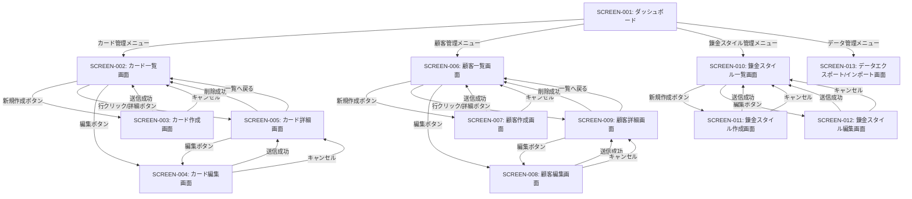

# 画面遷移図

**【信頼性レベル】**:
- 🔵 **青信号**: 要件定義書から直接導出された確実な画面遷移
- 🟡 **黄信号**: 要件定義書から妥当な推測による画面遷移
- 🔴 **赤信号**: 一般的なWebアプリ管理画面のベストプラクティスから推測

---

## 画面遷移概要



---

## 画面遷移詳細

### SCREEN-001: ダッシュボード

| 遷移先 | 遷移条件 | 遷移方法 |
|--------|---------|---------|
| SCREEN-002 | カード管理メニュークリック | React Router `navigate('/cards')` |
| SCREEN-006 | 顧客管理メニュークリック | React Router `navigate('/customers')` |
| SCREEN-010 | 錬金スタイル管理メニュークリック | React Router `navigate('/alchemy-styles')` |
| SCREEN-013 | データ管理メニュークリック | React Router `navigate('/import-export')` |

---

### SCREEN-002: カード一覧画面

| 遷移先 | 遷移条件 | 遷移方法 |
|--------|---------|---------|
| SCREEN-003 | 新規作成ボタンクリック | React Router `navigate('/cards/new')` |
| SCREEN-004 | 編集ボタンクリック | React Router `navigate('/cards/:id/edit')` |
| SCREEN-005 | 行クリックまたは詳細ボタンクリック | React Router `navigate('/cards/:id')` |
| SCREEN-001 | ホームメニュークリック | React Router `navigate('/')` |

---

### SCREEN-003: カード作成画面

| 遷移先 | 遷移条件 | 遷移方法 |
|--------|---------|---------|
| SCREEN-002 | 送信成功 | React Router `navigate('/cards')` + Toast通知 🔵 *要件WRREQ-057より* |
| SCREEN-002 | キャンセルボタンクリック | React Router `navigate('/cards')` |

---

### SCREEN-004: カード編集画面

| 遷移先 | 遷移条件 | 遷移方法 |
|--------|---------|---------|
| SCREEN-005 | 送信成功 | React Router `navigate('/cards/:id')` + Toast通知 |
| SCREEN-005 | キャンセルボタンクリック | React Router `navigate('/cards/:id')` |

---

### SCREEN-005: カード詳細画面

| 遷移先 | 遷移条件 | 遷移方法 |
|--------|---------|---------|
| SCREEN-004 | 編集ボタンクリック | React Router `navigate('/cards/:id/edit')` |
| SCREEN-002 | 削除成功 | React Router `navigate('/cards')` + Toast通知 |
| SCREEN-002 | 一覧へ戻るボタンクリック | React Router `navigate('/cards')` |

---

### SCREEN-006: 顧客一覧画面

| 遷移先 | 遷移条件 | 遷移方法 |
|--------|---------|---------|
| SCREEN-007 | 新規作成ボタンクリック | React Router `navigate('/customers/new')` |
| SCREEN-008 | 編集ボタンクリック | React Router `navigate('/customers/:id/edit')` |
| SCREEN-009 | 行クリックまたは詳細ボタンクリック | React Router `navigate('/customers/:id')` |
| SCREEN-001 | ホームメニュークリック | React Router `navigate('/')` |

---

### SCREEN-007: 顧客作成画面

| 遷移先 | 遷移条件 | 遷移方法 |
|--------|---------|---------|
| SCREEN-006 | 送信成功 | React Router `navigate('/customers')` + Toast通知 |
| SCREEN-006 | キャンセルボタンクリック | React Router `navigate('/customers')` |

---

### SCREEN-008: 顧客編集画面

| 遷移先 | 遷移条件 | 遷移方法 |
|--------|---------|---------|
| SCREEN-009 | 送信成功 | React Router `navigate('/customers/:id')` + Toast通知 |
| SCREEN-009 | キャンセルボタンクリック | React Router `navigate('/customers/:id')` |

---

### SCREEN-009: 顧客詳細画面

| 遷移先 | 遷移条件 | 遷移方法 |
|--------|---------|---------|
| SCREEN-008 | 編集ボタンクリック | React Router `navigate('/customers/:id/edit')` |
| SCREEN-006 | 削除成功 | React Router `navigate('/customers')` + Toast通知 |
| SCREEN-006 | 一覧へ戻るボタンクリック | React Router `navigate('/customers')` |

---

### SCREEN-010: 錬金スタイル一覧画面

| 遷移先 | 遷移条件 | 遷移方法 |
|--------|---------|---------|
| SCREEN-011 | 新規作成ボタンクリック | React Router `navigate('/alchemy-styles/new')` |
| SCREEN-012 | 編集ボタンクリック | React Router `navigate('/alchemy-styles/:id/edit')` |
| SCREEN-001 | ホームメニュークリック | React Router `navigate('/')` |

---

### SCREEN-011: 錬金スタイル作成画面

| 遷移先 | 遷移条件 | 遷移方法 |
|--------|---------|---------|
| SCREEN-010 | 送信成功 | React Router `navigate('/alchemy-styles')` + Toast通知 |
| SCREEN-010 | キャンセルボタンクリック | React Router `navigate('/alchemy-styles')` |

---

### SCREEN-012: 錬金スタイル編集画面

| 遷移先 | 遷移条件 | 遷移方法 |
|--------|---------|---------|
| SCREEN-010 | 送信成功 | React Router `navigate('/alchemy-styles')` + Toast通知 |
| SCREEN-010 | キャンセルボタンクリック | React Router `navigate('/alchemy-styles')` |

---

### SCREEN-013: データエクスポート/インポート画面

| 遷移先 | 遷移条件 | 遷移方法 |
|--------|---------|---------|
| SCREEN-001 | ホームメニュークリック | React Router `navigate('/')` |

---

## 画面遷移の条件

### データ依存の遷移
- **SCREEN-004, SCREEN-005**: カードID（`:id`）が必要
- **SCREEN-008, SCREEN-009**: 顧客ID（`:id`）が必要
- **SCREEN-012**: 錬金スタイルID（`:id`）が必要
- **404エラー時**: 各一覧画面へリダイレクト

### 確認ダイアログ 🔵 *要件WRREQ-056より*
- **削除操作**: 確認ダイアログ表示 → OKで遷移
- **未保存データ**: 確認ダイアログ表示 → OKで遷移、キャンセルで遷移中止

### エラー時の遷移
- **404エラー**: 各一覧画面へリダイレクト
- **バリデーションエラー**: 現在の画面に留まり、エラーメッセージ表示
- **APIエラー**: 現在の画面に留まり、Toast通知でエラーメッセージ表示

---

## ナビゲーション構造

### サイドバーメニュー 🔵 *要件WRREQ-053より*

```
- ホーム（SCREEN-001）
- カード管理
  - カード一覧（SCREEN-002）
- 顧客管理
  - 顧客一覧（SCREEN-006）
- 錬金スタイル管理
  - 錬金スタイル一覧（SCREEN-010）
- データ管理
  - エクスポート/インポート（SCREEN-013）
```

### パンくずリスト 🔵 *要件WRREQ-054より*

各画面で現在位置を表示：
- ホーム > カード管理 > カード一覧
- ホーム > カード管理 > 新規作成
- ホーム > カード管理 > {カード名}
- ホーム > カード管理 > {カード名} > 編集

---

## 変更履歴

| 日付 | バージョン | 変更内容 |
|------|----------|---------|
| 2025-01-XX | 1.0 | 初版作成 |

