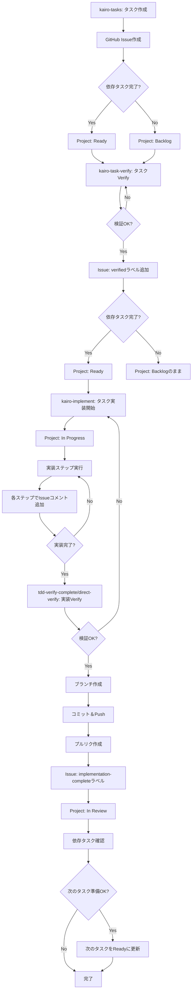

# GitHub Issue/Project連携フロー

## 概要

タスクの実施フローに合わせて、GitHubのIssueとProjectを自動的に更新するフローを定義します。`gh cli`を使用してGitHubとの連携を行います。

GitHub連携処理は`github-sync` SubAgentとして実装されており、各コマンドから`@task general-purpose /github-sync`として呼び出されます。

## 前提条件

- GitHubリポジトリが存在する
- GitHub Project（カンバン）が設定されている
- `gh cli`がインストールされ、認証済みである（`gh auth status`で確認）
- タスクには依存関係が定義されている

## Issue番号の指定方法

各コマンドでは、Issue番号を明示的に指定できます。Issue番号の取得は以下の優先順位で行われます：

1. **ユーザが指定したIssue番号**（最優先）
   - コマンド実行時に`--issue 123`のように指定
   - または`issue_number`パラメータとして指定

2. **タスクファイルから取得**
   - タスクファイル内の`<!-- GitHub Issue: #123 -->`の形式から取得

3. **タスクIDから検索**
   - `gh issue list --search "TASK-0001"`でIssueを検索

Issue番号が取得できない場合は、警告を表示し、GitHub連携をスキップします。

## Projectステータス定義

カンバンProjectのステータスは以下の5つを使用します：

- **Backlog**: 依存するタスクが完了していない
- **Ready**: 依存するタスクが完了している
- **In Progress**: タスクが実施中
- **In Review**: タスクがレビュー中
- **Done**: タスクが完了した

## タスクフローとGitHub連携

### 1. タスク作成（kairo-tasks.md）

**目的**: 新しいタスクを作成し、GitHubのIssueとProjectに登録する

**実行内容**:
- タスクファイル（`docs/tasks/{要件名}-phase*.md`）にタスクを追加
- GitHub Issueを作成
  - タイトル: `[TASK-{4桁番号}] {タスク名}`
  - 本文:
    - タスクID
    - 要件リンク
    - 依存タスク（Issue番号へのリンク）
    - 推定工数
    - タスクタイプ（TDD/DIRECT）
    - 実装詳細
  - ラベル: `task`, `{タスクタイプ}`, `{フェーズ名}`
  - マイルストーン: 該当するマイルストーンを設定
- GitHub ProjectにIssueを追加
  - 依存タスクの完了状況を確認
  - 依存タスクが全て完了している場合: ステータスを`Ready`に設定
  - 依存タスクが未完了の場合: ステータスを`Backlog`に設定

**gh cli操作**:
```bash
# Issue作成
gh issue create \
  --title "[TASK-0001] タスク名" \
  --body "タスク詳細..." \
  --label "task,tdd,phase1" \
  --milestone "Phase 1"

# Issue番号を取得（作成後の出力から取得）
ISSUE_NUMBER=$(gh issue list --limit 1 --json number --jq '.[0].number')

# ProjectにIssueを追加（Project V2の場合）
# まずProject IDとステータスフィールドIDを取得
PROJECT_ID=$(gh project list --owner OWNER --limit 1 --json id --jq '.[0].id')
BACKLOG_FIELD_ID=$(gh project view $PROJECT_ID --json status --jq '.status.options[] | select(.name=="Backlog") | .id')
READY_FIELD_ID=$(gh project view $PROJECT_ID --json status --jq '.status.options[] | select(.name=="Ready") | .id')

# 依存タスクの完了状況を確認
DEPENDENCIES_COMPLETE=true
for dep_task in TASK-0000 TASK-0001; do
  DEP_ISSUE=$(gh issue list --search "$dep_task" --json number,state --jq '.[0]')
  if [ "$(echo $DEP_ISSUE | jq -r '.state')" != "CLOSED" ]; then
    DEPENDENCIES_COMPLETE=false
    break
  fi
done

# ステータスを決定してProjectに追加
if [ "$DEPENDENCIES_COMPLETE" = "true" ]; then
  STATUS_FIELD_ID=$READY_FIELD_ID
else
  STATUS_FIELD_ID=$BACKLOG_FIELD_ID
fi

gh project item-add $PROJECT_ID --owner OWNER --url "https://github.com/OWNER/REPO/issues/$ISSUE_NUMBER"
gh api graphql -f query='
  mutation($project:ID!, $item:ID!, $field:ID!, $value:ID!) {
    updateProjectV2ItemFieldValue(
      input: {
        projectId: $project
        itemId: $item
        fieldId: $field
        value: { singleSelectOptionId: $value }
      }
    ) { projectV2Item { id } }
  }' -f project="$PROJECT_ID" -f item="$ITEM_ID" -f field="$STATUS_FIELD_ID" -f value="$STATUS_FIELD_ID"
```

### 2. タスクVerify（kairo-task-verify.md）

**目的**: タスクの内容を検証し、実装準備が整っていることを確認する

**実行内容**:
- タスクの内容を確認
  - 要件定義の完全性
  - 依存関係の明確性
  - 実装方針の妥当性
- GitHub Issueを更新
  - コメント追加: 検証結果を記録
  - ラベル追加: `verified`（検証完了時）
- GitHub Projectを更新
  - 検証完了時: ステータスを`Ready`に更新（依存タスクが完了している場合）
  - 依存タスクが未完了の場合: ステータスは`Backlog`のまま

**gh cli操作**:
```bash
# Issueコメント追加
gh issue comment $ISSUE_NUMBER --body "✅ タスク検証完了
- 要件定義: 確認済み
- 依存関係: 確認済み
- 実装方針: 妥当"

# Issueラベル追加
gh issue edit $ISSUE_NUMBER --add-label "verified"

# 依存タスクの完了状況を再確認
DEPENDENCIES_COMPLETE=true
for dep_task in TASK-0000 TASK-0001; do
  DEP_ISSUE=$(gh issue list --search "$dep_task" --json number,state --jq '.[0]')
  if [ "$(echo $DEP_ISSUE | jq -r '.state')" != "CLOSED" ]; then
    DEPENDENCIES_COMPLETE=false
    break
  fi
done

# Projectステータス更新（依存タスクが完了している場合のみReadyに更新）
if [ "$DEPENDENCIES_COMPLETE" = "true" ]; then
  READY_FIELD_ID=$(gh project view $PROJECT_ID --json status --jq '.status.options[] | select(.name=="Ready") | .id')
  gh api graphql -f query='
    mutation($project:ID!, $item:ID!, $field:ID!, $value:ID!) {
      updateProjectV2ItemFieldValue(
        input: {
          projectId: $project
          itemId: $item
          fieldId: $field
          value: { singleSelectOptionId: $value }
        }
      ) { projectV2Item { id } }
    }' -f project="$PROJECT_ID" -f item="$ITEM_ID" -f field="$STATUS_FIELD_ID" -f value="$READY_FIELD_ID"
fi
```

### 3. タスク実装（kairo-implement.md, tdd-*.md, direct-setup.md）

**目的**: タスクを実装し、進捗をGitHubに反映する

**実行内容**:
- 実装プロセスを実行（TDDまたはDIRECT）
- 実装開始時にGitHub Projectを更新
  - ステータスを`Ready`から`In Progress`に更新
- 各実装ステップでGitHub Issueを更新
  - コメント追加: 各ステップの完了を記録
    - `tdd-requirements`完了
    - `tdd-testcases`完了
    - `tdd-red`完了
    - `tdd-green`完了
    - `tdd-refactor`完了
    - または
    - `direct-setup`完了

**gh cli操作**:
```bash
# 実装開始時: ProjectステータスをIn Progressに更新
IN_PROGRESS_FIELD_ID=$(gh project view $PROJECT_ID --json status --jq '.status.options[] | select(.name=="In Progress") | .id')
gh api graphql -f query='
  mutation($project:ID!, $item:ID!, $field:ID!, $value:ID!) {
    updateProjectV2ItemFieldValue(
      input: {
        projectId: $project
        itemId: $item
        fieldId: $field
        value: { singleSelectOptionId: $value }
      }
    ) { projectV2Item { id } }
  }' -f project="$PROJECT_ID" -f item="$ITEM_ID" -f field="$STATUS_FIELD_ID" -f value="$IN_PROGRESS_FIELD_ID"

# 実装ステップ完了時のコメント
gh issue comment $ISSUE_NUMBER --body "✅ tdd-requirements完了
- 実行時間: 30分
- 作成ファイル: requirements.md"
```

### 4. タスク実装Verify（tdd-verify-complete.md, direct-verify.md）

**目的**: 実装の完了を検証し、品質を確認する

**実行内容**:
- 実装結果の検証
  - テスト結果の確認
  - コードカバレッジの確認
  - コードレビューの実施（必要に応じて）
- ブランチ作成、コミット＆Push、プルリク作成
  - タスク用のブランチを作成（例: `task/TASK-0001`）
  - 変更をコミット
  - ブランチをPush
  - プルリクエストを作成（Issueとリンク）
- GitHub Issueを更新
  - コメント追加: 検証結果を記録
    - テスト結果サマリー
    - コードカバレッジ
    - 作成ファイル一覧
  - ラベル追加: `implementation-complete`（検証完了時）
- GitHub Projectを更新
  - ステータス: `In Progress` → `In Review`
  - 依存関係を確認し、依存タスクが全て完了している場合は次のタスクを自動的に`Ready`に更新

**gh cli操作**:
```bash
# ブランチ名を生成（task_idまたはissue_numberから）
BRANCH_NAME="task/TASK-0001"  # または "task/issue-123"

# 現在のブランチを確認（mainまたはmasterであることを確認）
CURRENT_BRANCH=$(git branch --show-current)
if [ "$CURRENT_BRANCH" != "main" ] && [ "$CURRENT_BRANCH" != "master" ]; then
  echo "警告: 現在のブランチがmain/masterではありません"
fi

# 新しいブランチを作成してチェックアウト
git checkout -b $BRANCH_NAME

# 変更されたファイルをステージング
git add .

# コミットメッセージを生成
COMMIT_MESSAGE="✅ 実装検証完了
- テスト: 25/25 (100%)
- カバレッジ: 95%
- 所要時間: 3時間45分

Closes #$ISSUE_NUMBER"

# コミットを実行
git commit -m "$COMMIT_MESSAGE"

# ブランチをPush
git push -u origin $BRANCH_NAME

# プルリクエストを作成
PR_NUMBER=$(gh pr create \
  --title "[TASK-0001] タスク名" \
  --body "✅ 実装検証完了
- テスト: 25/25 (100%)
- カバレッジ: 95%
- 所要時間: 3時間45分

Closes #$ISSUE_NUMBER" \
  --base main \
  --head $BRANCH_NAME \
  --json number --jq '.number')

# Issueにコメントを追加
gh issue comment $ISSUE_NUMBER --body "✅ 実装検証完了
- テスト: 25/25 (100%)
- カバレッジ: 95%
- 所要時間: 3時間45分
- プルリクエスト: #$PR_NUMBER"

# Issueラベル追加
gh issue edit $ISSUE_NUMBER --add-label "implementation-complete"

# ProjectステータスをIn Reviewに更新
IN_REVIEW_FIELD_ID=$(gh project view $PROJECT_ID --json status --jq '.status.options[] | select(.name=="In Review") | .id')
gh api graphql -f query='
  mutation($project:ID!, $item:ID!, $field:ID!, $value:ID!) {
    updateProjectV2ItemFieldValue(
      input: {
        projectId: $project
        itemId: $item
        fieldId: $field
        value: { singleSelectOptionId: $value }
      }
    ) { projectV2Item { id } }
  }' -f project="$PROJECT_ID" -f item="$ITEM_ID" -f field="$STATUS_FIELD_ID" -f value="$IN_REVIEW_FIELD_ID"

# 依存タスクの確認と更新
# このタスクに依存している他のタスクを検索
DEPENDENT_ISSUES=$(gh issue list --search "TASK-0002" --json number,title,state --jq '.[] | select(.state != "CLOSED")')

# 各依存タスクについて、その依存タスクが全て完了しているか確認
for dep_issue in $DEPENDENT_ISSUES; do
  DEP_ISSUE_NUM=$(echo $dep_issue | jq -r '.number')
  # 依存タスクの依存関係を確認（Issue本文から取得）
  DEP_DEPS=$(gh issue view $DEP_ISSUE_NUM --json body --jq '.body' | grep -oP '依存: \K[^\\n]*')
  
  ALL_DEPS_COMPLETE=true
  for dep_task_id in $DEP_DEPS; do
    DEP_TASK_ISSUE=$(gh issue list --search "$dep_task_id" --json number,state --jq '.[0]')
    if [ "$(echo $DEP_TASK_ISSUE | jq -r '.state')" != "CLOSED" ]; then
      ALL_DEPS_COMPLETE=false
      break
    fi
  done
  
  # 依存タスクが全て完了している場合、Readyに更新
  if [ "$ALL_DEPS_COMPLETE" = "true" ]; then
    READY_FIELD_ID=$(gh project view $PROJECT_ID --json status --jq '.status.options[] | select(.name=="Ready") | .id')
    DEP_ITEM_ID=$(gh project item-list $PROJECT_ID --owner OWNER --format json | jq -r ".[] | select(.content.number==$DEP_ISSUE_NUM) | .id")
    gh api graphql -f query='
      mutation($project:ID!, $item:ID!, $field:ID!, $value:ID!) {
        updateProjectV2ItemFieldValue(
          input: {
            projectId: $project
            itemId: $item
            fieldId: $field
            value: { singleSelectOptionId: $value }
          }
        ) { projectV2Item { id } }
      }' -f project="$PROJECT_ID" -f item="$DEP_ITEM_ID" -f field="$STATUS_FIELD_ID" -f value="$READY_FIELD_ID"
    
    # コメントを追加
    gh issue comment $DEP_ISSUE_NUM --body "✅ 依存タスクが完了しました。実装準備が整いました。"
  fi
done
```

## 依存関係の管理

### 依存関係の表現

- タスクファイル内で依存関係を定義: `依存: TASK-0001, TASK-0002`
- GitHub Issueで依存関係を表現:
  - Issue本文に依存タスクへのリンクを記載
  - GitHub Projectの依存関係機能を使用
  - または、Issueの本文に依存関係セクションを追加

### 依存関係の確認フロー

1. **タスク作成時**:
   - 依存タスクのIssue番号を取得
   - Issue本文に依存タスクへのリンクを追加
   - Projectで依存関係を設定

2. **タスク実装開始前**:
   - 依存タスクのIssueステータスを確認
   - 全ての依存タスクが`closed`であることを確認
   - 未完了の依存タスクがある場合は警告を表示

3. **タスク実装完了時**:
   - 依存タスクとして設定されているIssueを確認
   - 依存タスクが全て完了している場合、次のタスクのIssueにコメントを追加
   - 次のタスクを`Ready for Implementation`に更新

## SubAgentの使用

GitHub連携処理は`github-sync` SubAgentとして実装されています。各コマンドから以下のように呼び出します：

```bash
@task general-purpose /github-sync --action {action} --issue_number {issue_number} [その他のパラメータ]
```

### 利用可能なアクション

- `create_issue`: Issueを作成し、Projectに追加
- `add_comment`: Issueにコメントを追加
- `add_label`: Issueにラベルを追加
- `update_status`: Projectのステータスを更新
- `close_issue`: Issueをクローズし、ProjectステータスをDoneに更新
- `check_dependencies`: 依存タスクの完了状況を確認し、次のタスクをReadyに更新

詳細は `.claude/commands/github-sync.md` を参照してください。

## 実装例

### タスク作成時のGitHub連携（SubAgent呼び出し例）

```bash
# Issue作成とProject追加
@task general-purpose /github-sync \
  --action create_issue \
  --task_id TASK-0001 \
  --task_name "タスク名" \
  --task_body "タスク詳細..." \
  --labels "task,tdd,phase1" \
  --dependencies "TASK-0000"
```

### タスク検証時のGitHub連携（SubAgent呼び出し例）

```bash
# 検証結果をコメントとして追加
@task general-purpose /github-sync \
  --action add_comment \
  --issue_number 123 \
  --comment "✅ タスク検証完了
- 要件定義: 確認済み
- 依存関係: 確認済み
- 実装方針: 妥当"

# verifiedラベルを追加
@task general-purpose /github-sync \
  --action add_label \
  --issue_number 123 \
  --labels "verified"

# ステータスをReadyに更新（依存タスクが完了している場合）
@task general-purpose /github-sync \
  --action update_status \
  --issue_number 123 \
  --status "Ready"
```

## エラーハンドリング

- GitHub API呼び出し失敗時:
  - リトライロジックを実装（最大3回）
  - 失敗時はログに記録し、手動更新を促す
- 依存関係の不整合:
  - 依存タスクが存在しない場合、警告を表示
  - 依存タスクが未完了の場合、実装をブロック

## 設定

### gh cliの認証確認

```bash
# 認証状態を確認
gh auth status

# 認証が必要な場合
gh auth login
```

### 環境変数（オプション）

```bash
# gh cliは通常、認証情報を自動的に管理しますが、
# 必要に応じて環境変数を設定できます
export GH_TOKEN=your_personal_access_token
export GH_REPO=owner/repo
```

### 設定ファイル（オプション）

`docs/rule/github-config.json`:
```json
{
  "labels": {
    "task": "task",
    "tdd": "tdd",
    "direct": "direct",
    "verified": "verified",
    "implementation-complete": "implementation-complete"
  },
  "milestones": {
    "phase1": "Phase 1",
    "phase2": "Phase 2"
  },
  "projectStatus": {
    "backlog": "Backlog",
    "ready": "Ready",
    "inProgress": "In Progress",
    "inReview": "In Review",
    "done": "Done"
  }
}
```

## フロー図



## 注意事項

1. **gh cliのインストール**:
   - `gh`コマンドがインストールされていることを確認
   - インストール方法: https://cli.github.com/

2. **Project V2 API**:
   - GitHub Project V2はGraphQL APIを使用
   - `gh api graphql`コマンドでGraphQLクエリを実行
   - ProjectのステータスフィールドIDは動的に取得する必要がある

3. **依存関係の循環参照**:
   - タスク作成時に循環参照をチェック
   - 循環参照が検出された場合はエラーを表示

4. **IssueとProjectの同期**:
   - IssueのステータスとProjectのステータスを同期
   - 手動で変更された場合の整合性チェック

5. **エラーハンドリング**:
   - `gh`コマンドの実行結果を確認
   - エラー時は適切なエラーメッセージを表示
   - リトライロジックを実装（必要に応じて）

6. **進捗率の計算**:
   - 進捗率の計算は不要（ユーザー要求により）
   - ステータスのみで管理

