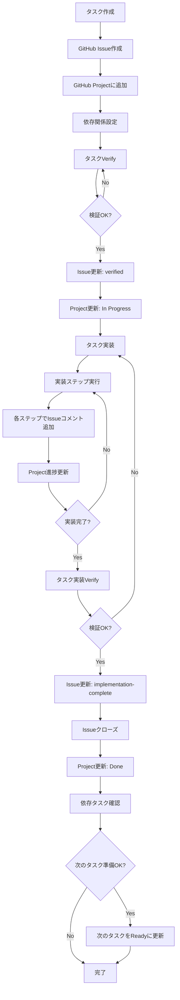

# GitHub Issue/Project連携フロー

## 概要

タスクの実施フローに合わせて、GitHubのIssueとProjectを自動的に更新するフローを定義します。

## 前提条件

- GitHubリポジトリが存在する
- GitHub Projectが設定されている
- GitHub Personal Access TokenまたはGitHub Appの認証情報が設定されている
- タスクには依存関係が定義されている

## タスクフローとGitHub連携

### 1. タスク作成

**目的**: 新しいタスクを作成し、GitHubのIssueとProjectに登録する

**実行内容**:
- タスクファイル（`docs/tasks/{要件名}-phase*.md`）にタスクを追加
- GitHub Issueを作成
  - タイトル: `[TASK-{4桁番号}] {タスク名}`
  - 本文:
    - タスクID
    - 要件リンク
    - 依存タスク（Issue番号へのリンク）
    - 推定工数
    - タスクタイプ（TDD/DIRECT）
    - 実装詳細
  - ラベル: `task`, `{タスクタイプ}`, `{フェーズ名}`
  - マイルストーン: 該当するマイルストーンを設定
- GitHub ProjectにIssueを追加
  - ステータス: `Backlog` または `Todo`
  - 依存関係をProjectで設定（依存タスクがある場合）

**GitHub API操作**:
```bash
# Issue作成
POST /repos/{owner}/{repo}/issues
{
  "title": "[TASK-0001] タスク名",
  "body": "タスク詳細...",
  "labels": ["task", "tdd", "phase1"],
  "milestone": {milestone_number}
}

# Projectへの追加（Project V2 API使用）
POST /projects/{project_id}/items
{
  "content_id": {issue_id},
  "content_type": "Issue"
}
```

### 2. タスクVerify

**目的**: タスクの内容を検証し、実装準備が整っていることを確認する

**実行内容**:
- タスクの内容を確認
  - 要件定義の完全性
  - 依存関係の明確性
  - 実装方針の妥当性
- GitHub Issueを更新
  - コメント追加: 検証結果を記録
  - ラベル追加: `verified`（検証完了時）
  - ステータス更新: `Ready for Implementation`（検証完了時）
- GitHub Projectを更新
  - ステータス: `Todo` → `In Progress`（検証完了時）
  - 検証完了日時をカスタムフィールドに記録

**GitHub API操作**:
```bash
# Issueコメント追加
POST /repos/{owner}/{repo}/issues/{issue_number}/comments
{
  "body": "✅ タスク検証完了\n- 要件定義: 確認済み\n- 依存関係: 確認済み"
}

# Issueラベル追加
POST /repos/{owner}/{repo}/issues/{issue_number}/labels
{
  "labels": ["verified"]
}

# Projectステータス更新
PATCH /projects/columns/{column_id}/cards/{card_id}
{
  "note": "検証完了: {date}"
}
```

### 3. タスク実装

**目的**: タスクを実装し、進捗をGitHubに反映する

**実行内容**:
- 実装プロセスを実行（TDDまたはDIRECT）
- 各実装ステップでGitHub Issueを更新
  - コメント追加: 各ステップの完了を記録
    - `tdd-requirements`完了
    - `tdd-testcases`完了
    - `tdd-red`完了
    - `tdd-green`完了
    - `tdd-refactor`完了
    - `tdd-verify-complete`完了
  - または
    - `direct-setup`完了
    - `direct-verify`完了
- GitHub Projectを更新
  - 進捗率を更新（カスタムフィールド）
  - 実装ステップの完了状況を記録

**GitHub API操作**:
```bash
# 実装ステップ完了時のコメント
POST /repos/{owner}/{repo}/issues/{issue_number}/comments
{
  "body": "✅ {ステップ名}完了\n- 実行時間: {time}\n- 作成ファイル: {files}"
}

# Project進捗更新
PATCH /projects/columns/{column_id}/cards/{card_id}
{
  "fields": {
    "progress": "50%"
  }
}
```

### 4. タスク実装Verify

**目的**: 実装の完了を検証し、品質を確認する

**実行内容**:
- 実装結果の検証
  - テスト結果の確認
  - コードカバレッジの確認
  - コードレビューの実施（必要に応じて）
- GitHub Issueを更新
  - コメント追加: 検証結果を記録
    - テスト結果サマリー
    - コードカバレッジ
    - 作成ファイル一覧
  - ラベル追加: `implementation-complete`（検証完了時）
  - Issueをクローズ: 実装完了時
- GitHub Projectを更新
  - ステータス: `In Progress` → `Done`
  - 完了日時を記録
  - 依存関係を確認し、依存タスクが全て完了している場合は次のタスクを自動的に`Ready`に更新

**GitHub API操作**:
```bash
# 検証結果コメント
POST /repos/{owner}/{repo}/issues/{issue_number}/comments
{
  "body": "✅ 実装検証完了\n- テスト: {passed}/{total}\n- カバレッジ: {coverage}%\n- 所要時間: {time}"
}

# Issueクローズ
PATCH /repos/{owner}/{repo}/issues/{issue_number}
{
  "state": "closed"
}

# Projectステータス更新
PATCH /projects/columns/{column_id}/cards/{card_id}
{
  "note": "完了: {date}"
}

# 依存タスクの確認と更新
GET /repos/{owner}/{repo}/issues/{dependent_issue_number}
# 依存タスクが全て完了している場合、次のタスクをReadyに更新
```

## 依存関係の管理

### 依存関係の表現

- タスクファイル内で依存関係を定義: `依存: TASK-0001, TASK-0002`
- GitHub Issueで依存関係を表現:
  - Issue本文に依存タスクへのリンクを記載
  - GitHub Projectの依存関係機能を使用
  - または、Issueの本文に依存関係セクションを追加

### 依存関係の確認フロー

1. **タスク作成時**:
   - 依存タスクのIssue番号を取得
   - Issue本文に依存タスクへのリンクを追加
   - Projectで依存関係を設定

2. **タスク実装開始前**:
   - 依存タスクのIssueステータスを確認
   - 全ての依存タスクが`closed`であることを確認
   - 未完了の依存タスクがある場合は警告を表示

3. **タスク実装完了時**:
   - 依存タスクとして設定されているIssueを確認
   - 依存タスクが全て完了している場合、次のタスクのIssueにコメントを追加
   - 次のタスクを`Ready for Implementation`に更新

## 実装例

### タスク作成時のGitHub連携

```typescript
async function createTaskInGitHub(task: Task) {
  // Issue作成
  const issue = await github.issues.create({
    owner: 'owner',
    repo: 'repo',
    title: `[${task.id}] ${task.name}`,
    body: formatTaskBody(task),
    labels: ['task', task.type, task.phase],
    milestone: task.milestone
  });

  // Projectに追加
  await github.projects.addItem({
    projectId: projectId,
    contentId: issue.data.id,
    contentType: 'Issue'
  });

  // 依存関係の設定
  if (task.dependencies.length > 0) {
    await setDependencies(issue.data.number, task.dependencies);
  }
}
```

### タスク検証時のGitHub連携

```typescript
async function verifyTaskInGitHub(issueNumber: number, verificationResult: VerificationResult) {
  // 検証結果をコメントとして追加
  await github.issues.createComment({
    owner: 'owner',
    repo: 'repo',
    issue_number: issueNumber,
    body: formatVerificationComment(verificationResult)
  });

  // 検証完了ラベルを追加
  await github.issues.addLabels({
    owner: 'owner',
    repo: 'repo',
    issue_number: issueNumber,
    labels: ['verified']
  });

  // Projectステータスを更新
  await updateProjectStatus(issueNumber, 'In Progress');
}
```

## エラーハンドリング

- GitHub API呼び出し失敗時:
  - リトライロジックを実装（最大3回）
  - 失敗時はログに記録し、手動更新を促す
- 依存関係の不整合:
  - 依存タスクが存在しない場合、警告を表示
  - 依存タスクが未完了の場合、実装をブロック

## 設定

### 環境変数

```bash
GITHUB_TOKEN=your_personal_access_token
GITHUB_OWNER=repository_owner
GITHUB_REPO=repository_name
GITHUB_PROJECT_ID=project_id
```

### 設定ファイル（オプション）

`docs/rule/github-config.json`:
```json
{
  "owner": "repository_owner",
  "repo": "repository_name",
  "projectId": "project_id",
  "labels": {
    "task": "task",
    "tdd": "tdd",
    "direct": "direct",
    "verified": "verified",
    "implementation-complete": "implementation-complete"
  },
  "milestones": {
    "phase1": 1,
    "phase2": 2
  }
}
```

## フロー図



## 注意事項

1. **GitHub APIレート制限**: 
   - 認証済みリクエスト: 5,000リクエスト/時間
   - レート制限に達した場合は、リトライロジックで対応

2. **Project V2 API**:
   - GitHub Project V2はGraphQL APIを使用
   - REST APIとGraphQL APIの使い分けに注意

3. **依存関係の循環参照**:
   - タスク作成時に循環参照をチェック
   - 循環参照が検出された場合はエラーを表示

4. **IssueとProjectの同期**:
   - IssueのステータスとProjectのステータスを同期
   - 手動で変更された場合の整合性チェック

