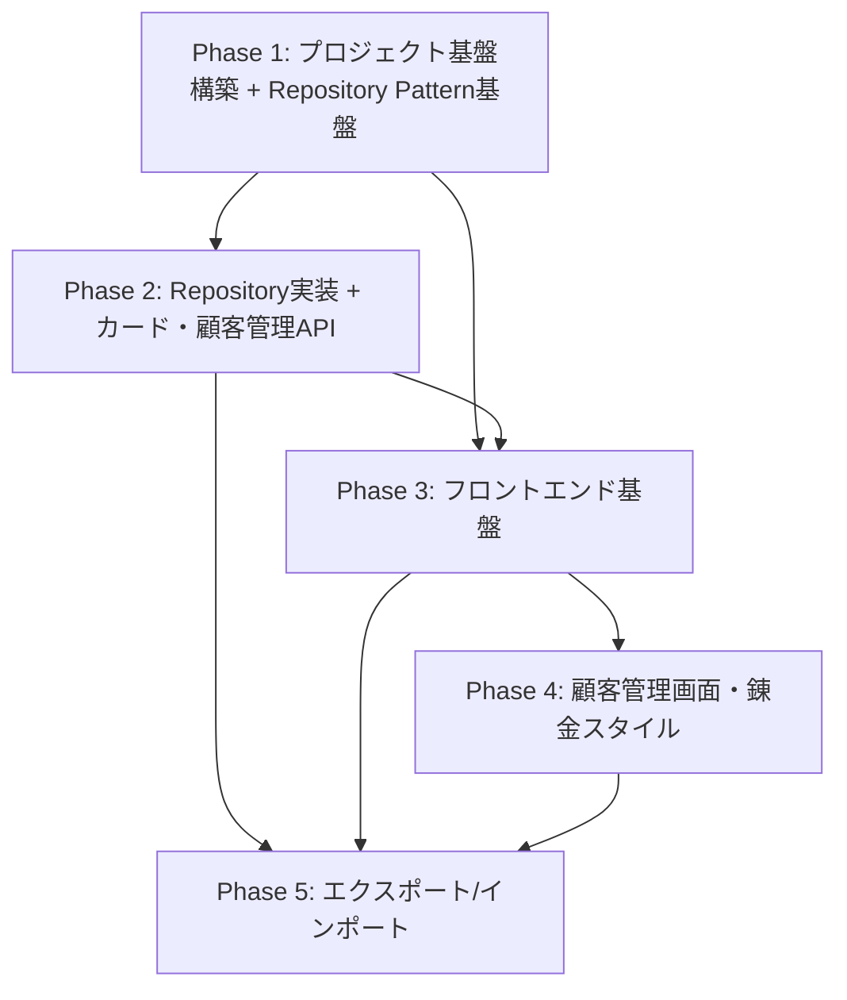

# アトリエ錬金術ゲーム リソース管理Webアプリ タスク概要

## プロジェクト概要

### 要件名
resource-management-webapp

### 期間・工数
- **総期間**: 約45営業日（9週間）
- **総工数**: 360時間
- **総タスク数**: 73タスク
- **平均タスク工数**: 約4.9時間

### 目的
「アトリエ錬金術ゲーム」の開発支援ツールとして、ゲーム内リソース（カード、顧客、錬金スタイル、マップノード、メタ進行データなど）を効率的に管理するための管理画面Webアプリケーションを開発する。

### 技術スタック
- **フロントエンド**: React 18+ + Vite + TypeScript + TailwindCSS + React Router + TanStack Query + Zod + Axios
- **バックエンド**: Hono.js + TypeScript + 🔵 **Repository Pattern** + Prisma + PostgreSQL
- **デプロイ**: Azure App Service（フロントエンド・バックエンド）+ Azure Database for PostgreSQL

---

## フェーズ構成

| フェーズ | 期間（日） | 工数（時間） | タスク数 | 成果物 | ファイル |
|---------|-----------|------------|---------|-------|---------|
| **Phase 1-A** | 5日 | 40時間 | 7タスク | プロジェクト環境セットアップ | [phase1-a-setup.md](./resource-management-webapp-phase1-a-setup.md) |
| **Phase 1-B** | 🔵 **6日** | 🔵 **48時間** | 🔵 **10タスク** | バックエンドミドルウェア基盤 + 🔵 **Repository Pattern基盤** | [phase1-b-middleware.md](./resource-management-webapp-phase1-b-middleware.md) |
| **Phase 2** | 🔵 **10日** | 🔵 **80時間** | 🔵 **16タスク** | 🔵 **Repository実装** + カード・顧客管理API | [phase2.md](./resource-management-webapp-phase2.md) |
| **Phase 3-A** | 5日 | 40時間 | 10タスク | フロントエンド基盤構築 | [phase3-a-foundation.md](./resource-management-webapp-phase3-a-foundation.md) |
| **Phase 3-B** | 5日 | 40時間 | 5タスク | カード管理画面実装 | [phase3-b-card-screens.md](./resource-management-webapp-phase3-b-card-screens.md) |
| **Phase 4-A** | 5日 | 40時間 | 5タスク | 顧客管理画面実装 | [phase4-a-customer-screens.md](./resource-management-webapp-phase4-a-customer-screens.md) |
| **Phase 4-B** | 3日 | 24時間 | 8タスク | 錬金スタイル管理API・画面 | [phase4-b-alchemy-style.md](./resource-management-webapp-phase4-b-alchemy-style.md) |
| **Phase 5** | 6日 | 48時間 | 12タスク | データエクスポート/インポート・ダッシュボード | [phase5.md](./resource-management-webapp-phase5.md) |
| **合計** | **🔵 45日** | **🔵 360時間** | **🔵 73タスク** | - | - |

---

## 既存タスク番号管理

### 使用済みタスク番号
- TASK-0001 〜 TASK-0027（Phase 1-A, 1-B, 2）
- TASK-0015A（🔵 Repository Pattern基盤構築）
- TASK-0015B, 0015C, 0015D（🔵 Card Repository + CardService）
- TASK-0021A, 0021B, 0021C（🔵 Customer Repository + CustomerService）

### 次回開始番号
TASK-0028

### タスクID範囲
- **Phase 1-A**: TASK-0001 〜 TASK-0007
- **Phase 1-B**: TASK-0008 〜 TASK-0015A（🔵 TASK-0008A, TASK-0015A追加）
- **Phase 2**: TASK-0015B 〜 TASK-0027（🔵 TASK-0015B/C/D, TASK-0021A/B/C追加）
- **Phase 3**: TASK-0028 〜 TASK-0042
- **Phase 4**: TASK-0043 〜 TASK-0055
- **Phase 5**: TASK-0056 〜 TASK-0067

---

## 全体進捗チェックボックス

### Phase 1: プロジェクト基盤構築とバックエンド基盤（🔵 88時間）
- [ ] プロジェクト基盤セットアップ完了
- [ ] データベース環境構築完了
- [ ] バックエンド基盤実装完了
- [ ] 🔵 **Repository Pattern基盤構築完了**
- [ ] 🔵 **エラーコード体系化完了**

### Phase 2: カード・顧客管理API実装（🔵 80時間）
- [ ] 🔵 **Card Repository実装完了（Prisma + In-Memory）**
- [ ] 🔵 **Customer Repository実装完了（Prisma + In-Memory）**
- [ ] カード管理API実装完了
- [ ] 顧客管理API実装完了

### Phase 3: フロントエンド基盤とカード管理画面（80時間）
- [ ] フロントエンド基盤実装完了
- [ ] カード管理画面実装完了

### Phase 4: 顧客管理画面と錬金スタイル管理（64時間）
- [ ] 顧客管理画面実装完了
- [ ] 錬金スタイル管理実装完了

### Phase 5: データエクスポート/インポートとダッシュボード（48時間）
- [ ] データエクスポート/インポート機能実装完了
- [ ] ダッシュボード画面実装完了

---

## マイルストーン定義

### M1: MVP基盤完成（Phase 1完了時）
- **期限**: Phase 1完了後（🔵 **11日目**）
- **成果物**:
  - フロントエンド・バックエンドプロジェクト初期化完了
  - PostgreSQLデータベース環境構築完了
  - Prismaスキーマ実装・マイグレーション完了
  - 共通ミドルウェア・ユーティリティ実装完了
  - 🔵 **Repository Pattern基盤構築完了**
  - 🔵 **エラーコード体系化完了**
- **受け入れ基準**:
  - `npm run dev`でフロントエンド・バックエンドが起動できる
  - PostgreSQLに接続でき、Prismaマイグレーションが適用されている
  - `/api/health`エンドポイントが200 OKを返す
  - 🔵 **Repository コンテナが動作する**
  - 🔵 **環境変数REPOSITORY_TYPEで実装を切り替えられる**

### M2: バックエンドAPI完成（Phase 2完了時）
- **期限**: Phase 2完了後（🔵 **21日目**）
- **成果物**:
  - 🔵 **Card Repository実装完了（Prisma + In-Memory）**
  - 🔵 **Customer Repository実装完了（Prisma + In-Memory）**
  - カード管理API（CRUD）完成
  - 顧客管理API（CRUD）完成
  - APIテスト実装完了（🔵 **ユニットテスト + 統合テスト**）
- **受け入れ基準**:
  - 全APIエンドポイントが正常に動作する
  - 🔵 **In-Memory Repositoryを使ったユニットテストが全て通る**
  - 🔵 **Prisma Repositoryを使った統合テストが全て通る**
  - Postman/Thunder Clientでマニュアルテスト完了

### M3: フロントエンド基盤・カード管理画面完成（Phase 3完了時）
- **期限**: Phase 3完了後（🔵 **31日目**）
- **成果物**:
  - React Router + TanStack Query + Axios設定完了
  - 共通コンポーネント・レイアウト実装完了
  - カード管理画面（一覧・作成・編集・詳細・削除）完成
- **受け入れ基準**:
  - カード管理の全機能がブラウザで動作する
  - フォームバリデーション（Zod）が動作する
  - エラーハンドリング（Toast通知）が動作する

### M4: 顧客・錬金スタイル管理完成（Phase 4完了時）
- **期限**: Phase 4完了後（🔵 **39日目**）
- **成果物**:
  - 顧客管理画面（一覧・作成・編集・詳細・削除）完成
  - 錬金スタイル管理API・画面完成
- **受け入れ基準**:
  - 顧客管理の全機能が動作する
  - 錬金スタイル管理の全機能が動作する
  - N:Mリレーション（報酬カード、初期デッキ）が正しく動作する

### M5: MVP完成（Phase 5完了時）
- **期限**: Phase 5完了後（🔵 **45日目**）
- **成果物**:
  - データエクスポート/インポート機能完成
  - ダッシュボード画面完成
  - 統合テスト完了
- **受け入れ基準**:
  - JSONエクスポート/インポートが動作する
  - ダッシュボードに統計情報が表示される
  - E2Eテストシナリオが全て通る

---

## フェーズ別詳細タスク

### Phase 1-A: プロジェクト環境セットアップ（40時間、7タスク）
**目標**: プロジェクトの基盤環境を構築する

**成果物**:
- フロントエンド・バックエンドプロジェクト初期化
- PostgreSQL環境（Docker Compose）
- Prismaスキーマ・マイグレーション

**詳細**: [resource-management-webapp-phase1-a-setup.md](./resource-management-webapp-phase1-a-setup.md)

### Phase 1-B: バックエンドミドルウェア基盤 + Repository Pattern基盤（🔵 48時間、🔵 10タスク）
**目標**: バックエンドの共通ミドルウェア・ユーティリティ・🔵 **Repository Pattern基盤**を実装する

**成果物**:
- 共通ミドルウェア（CORS、バリデーション、エラーハンドリング、ロギング）
- 共通レスポンス型・ユーティリティ
- 🔵 **Repository Pattern基盤（インターフェース、依存性注入コンテナ）**
- 🔵 **エラーコード定数定義（体系的エラーコード）**
- 🔵 **環境変数REPOSITORY_TYPE（prisma / memory）**

**詳細**: [resource-management-webapp-phase1-b-middleware.md](./resource-management-webapp-phase1-b-middleware.md)

---

### Phase 2: 🔵 Repository実装 + カード・顧客管理API実装（🔵 80時間、🔵 16タスク）
**目標**: 🔵 **Repository Pattern実装** + カード管理API・顧客管理APIを実装する

**成果物**:
- 🔵 **Card Repository実装（Prisma + In-Memory）**
- 🔵 **Customer Repository実装（Prisma + In-Memory）**
- 🔵 **CardService層実装**
- 🔵 **CustomerService層実装**
- カード管理API（GET、POST、PUT、DELETE）
- 顧客管理API（GET、POST、PUT、DELETE）
- N:Mリレーション処理（報酬カード）
- 依存関係チェック機能
- APIテスト（🔵 **ユニットテスト + 統合テスト**）

**詳細**: [resource-management-webapp-phase2.md](./resource-management-webapp-phase2.md)

---

### Phase 3-A: フロントエンド基盤構築（40時間、10タスク）
**目標**: フロントエンドの基盤を構築する

**成果物**:
- React Router設定
- TanStack Query設定
- Axiosクライアント設定
- Zodバリデーションスキーマ
- 共通コンポーネント（Button、Modal、Toast）
- レイアウトコンポーネント（Sidebar、Header、Breadcrumbs）

**詳細**: [resource-management-webapp-phase3-a-foundation.md](./resource-management-webapp-phase3-a-foundation.md)

### Phase 3-B: カード管理画面実装（40時間、5タスク）
**目標**: カード管理画面を実装する

**成果物**:
- カード管理画面（一覧・作成・編集・詳細・削除）

**詳細**: [resource-management-webapp-phase3-b-card-screens.md](./resource-management-webapp-phase3-b-card-screens.md)

---

### Phase 4-A: 顧客管理画面実装（40時間、5タスク）
**目標**: 顧客管理画面を実装する

**成果物**:
- 顧客管理画面（一覧・作成・編集・詳細・削除）

**詳細**: [resource-management-webapp-phase4-a-customer-screens.md](./resource-management-webapp-phase4-a-customer-screens.md)

### Phase 4-B: 錬金スタイル管理（24時間、8タスク）
**目標**: 錬金スタイル管理APIと画面を実装する

**成果物**:
- 錬金スタイル管理API
- 錬金スタイル管理画面（一覧・作成・編集・詳細・削除）

**詳細**: [resource-management-webapp-phase4-b-alchemy-style.md](./resource-management-webapp-phase4-b-alchemy-style.md)

---

### Phase 5: データエクスポート/インポートとダッシュボード（48時間、12タスク）
**目標**: データエクスポート/インポート機能とダッシュボード画面を実装する

**成果物**:
- データエクスポートAPI・画面
- データインポートAPI・画面
- ダッシュボード画面
- 統計情報表示機能

**詳細**: [resource-management-webapp-phase5.md](./resource-management-webapp-phase5.md)

---

## 依存関係グラフ

---

## 重要な注意事項

### タスクタイプについて
- **TDDタスク**: コーディング、ビジネスロジック実装、UI実装など開発作業
  - 実行プロセス: `/tdd-requirements` → `/tdd-testcases` → `/tdd-red` → `/tdd-green` → `/tdd-refactor` → `/tdd-verify-complete`
- **DIRECTタスク**: 環境構築、設定ファイル作成、ドキュメント作成など準備作業
  - 実行プロセス: `/direct-setup` → `/direct-verify`

### 依存関係の重要性
- 各タスクには「依存タスク」が明記されている
- 依存タスクが完了していない場合、次のタスクを開始しない
- Phase間の依存関係も考慮する（Phase 1完了後にPhase 2開始など）

### 品質基準
- **テストカバレッジ**: 重要なビジネスロジック・APIエンドポイントで80%以上推奨
- **コード品質**: ESLint・Prettierでコード整形・静的解析を実施
- **パフォーマンス**:
  - 一覧画面初期表示: 2秒以内
  - 検索・フィルタリング: 500ms以内
  - API応答時間: 1秒以内（平均）
- **🔵 Repository Pattern**:
  - ユニットテストはIn-Memory Repositoryを使用（データベース不要）
  - 統合テストはPrisma Repositoryを使用（PostgreSQL使用）

---

## 🔵 設計書変更履歴（Repository Pattern導入）

### 2025-11-10: Repository Pattern導入
**変更内容**:
1. **Repository Pattern基盤構築**（Phase 1-B）
   - Repository インターフェース定義（interfaces/）
   - 依存性注入コンテナ（di/container.ts）
   - 環境変数REPOSITORY_TYPE（prisma / memory）

2. **Repository実装**（Phase 2）
   - Card Repository（Prisma + In-Memory）
   - Customer Repository（Prisma + In-Memory）
   - CardService層（Repository使用）
   - CustomerService層（Repository使用）

3. **エラーコード体系化**（Phase 1-B）
   - AUTH_xxx、VALID_xxx、RES_xxx、DB_xxx、REPO_xxx、SYS_xxx、NET_xxx

4. **CORS設定詳細化**（Phase 1-B）
   - exposeHeaders、maxAge追加

**影響**:
- Phase 1-B: +2タスク、+8時間、+1日
- Phase 2: +4タスク、+16時間、+2日
- 合計: +6タスク、+24時間、+3日

---

## 変更履歴

| 日付 | バージョン | 変更内容 |
|------|----------|---------|
| 2025-11-09 | 1.0 | 初版作成。5フェーズ、67タスク、336時間、42日 |
| 2025-11-09 | 1.1 | タスクファイル修正。Phase 1/3/4を分割（500行以下制約対応）、Phase 2/5を簡潔化、Day/Week番号を修正、フェーズ構成テーブルを更新 |
| 2025-11-10 | 2.0 | 🔵 **設計書更新に伴うタスク追加**。Repository Pattern基盤構築（Phase 1-B）、Card/Customer Repository実装（Phase 2）、エラーコード体系化、CORS詳細設定。**5フェーズ、73タスク、360時間、45日** |
