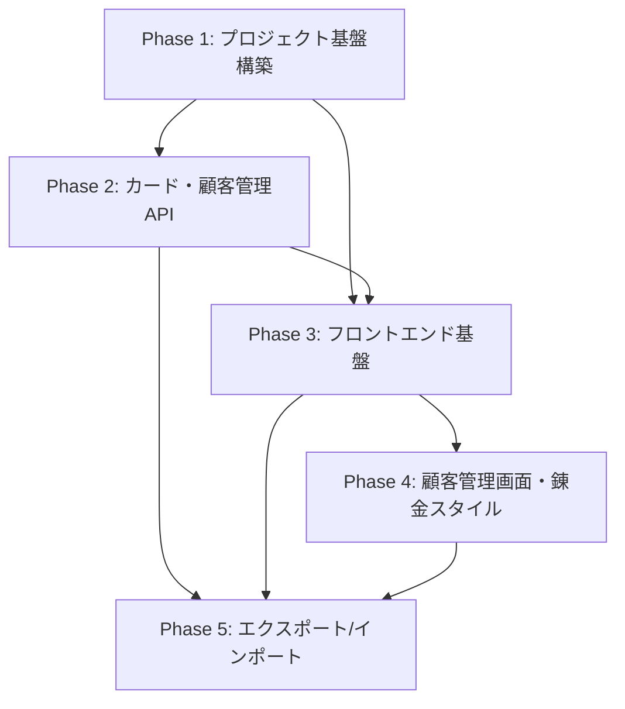

# アトリエ錬金術ゲーム リソース管理Webアプリ タスク概要

## プロジェクト概要

### 要件名
resource-management-webapp

### 期間・工数
- **総期間**: 約42営業日（8.4週間）
- **総工数**: 336時間
- **総タスク数**: 67タスク
- **平均タスク工数**: 5時間

### 目的
「アトリエ錬金術ゲーム」の開発支援ツールとして、ゲーム内リソース（カード、顧客、錬金スタイル、マップノード、メタ進行データなど）を効率的に管理するための管理画面Webアプリケーションを開発する。

### 技術スタック
- **フロントエンド**: React 18+ + Vite + TypeScript + TailwindCSS + React Router + TanStack Query + Zod + Axios
- **バックエンド**: Hono.js + TypeScript + Prisma + PostgreSQL
- **デプロイ**: Azure App Service（フロントエンド・バックエンド）+ Azure Database for PostgreSQL

---

## フェーズ構成

| フェーズ | 期間（日） | 工数（時間） | タスク数 | 成果物 | ファイル |
|---------|-----------|------------|---------|-------|---------|
| **Phase 1-A** | 5日 | 40時間 | 7タスク | プロジェクト環境セットアップ | [phase1-a-setup.md](./resource-management-webapp-phase1-a-setup.md) |
| **Phase 1-B** | 5日 | 40時間 | 8タスク | バックエンドミドルウェア基盤 | [phase1-b-middleware.md](./resource-management-webapp-phase1-b-middleware.md) |
| **Phase 2** | 8日 | 64時間 | 12タスク | カード・顧客管理API | [phase2.md](./resource-management-webapp-phase2.md) |
| **Phase 3-A** | 5日 | 40時間 | 10タスク | フロントエンド基盤構築 | [phase3-a-foundation.md](./resource-management-webapp-phase3-a-foundation.md) |
| **Phase 3-B** | 5日 | 40時間 | 5タスク | カード管理画面実装 | [phase3-b-card-screens.md](./resource-management-webapp-phase3-b-card-screens.md) |
| **Phase 4-A** | 5日 | 40時間 | 5タスク | 顧客管理画面実装 | [phase4-a-customer-screens.md](./resource-management-webapp-phase4-a-customer-screens.md) |
| **Phase 4-B** | 3日 | 24時間 | 8タスク | 錬金スタイル管理API・画面 | [phase4-b-alchemy-style.md](./resource-management-webapp-phase4-b-alchemy-style.md) |
| **Phase 5** | 6日 | 48時間 | 12タスク | データエクスポート/インポート・ダッシュボード | [phase5.md](./resource-management-webapp-phase5.md) |
| **合計** | **42日** | **336時間** | **67タスク** | - | - |

---

## 既存タスク番号管理

### 使用済みタスク番号
なし（初回タスク作成）

### 次回開始番号
TASK-0068

### タスクID範囲
- **Phase 1**: TASK-0001 〜 TASK-0015
- **Phase 2**: TASK-0016 〜 TASK-0027
- **Phase 3**: TASK-0028 〜 TASK-0042
- **Phase 4**: TASK-0043 〜 TASK-0055
- **Phase 5**: TASK-0056 〜 TASK-0067

---

## 全体進捗チェックボックス

### Phase 1: プロジェクト基盤構築とバックエンド基盤（80時間）
- [ ] プロジェクト基盤セットアップ完了
- [ ] データベース環境構築完了
- [ ] バックエンド基盤実装完了

### Phase 2: カード・顧客管理API実装（64時間）
- [ ] カード管理API実装完了
- [ ] 顧客管理API実装完了

### Phase 3: フロントエンド基盤とカード管理画面（80時間）
- [ ] フロントエンド基盤実装完了
- [ ] カード管理画面実装完了

### Phase 4: 顧客管理画面と錬金スタイル管理（64時間）
- [ ] 顧客管理画面実装完了
- [ ] 錬金スタイル管理実装完了

### Phase 5: データエクスポート/インポートとダッシュボード（48時間）
- [ ] データエクスポート/インポート機能実装完了
- [ ] ダッシュボード画面実装完了

---

## マイルストーン定義

### M1: MVP基盤完成（Phase 1完了時）
- **期限**: Phase 1完了後（10日目）
- **成果物**:
  - フロントエンド・バックエンドプロジェクト初期化完了
  - PostgreSQLデータベース環境構築完了
  - Prismaスキーマ実装・マイグレーション完了
  - 共通ミドルウェア・ユーティリティ実装完了
- **受け入れ基準**:
  - `npm run dev`でフロントエンド・バックエンドが起動できる
  - PostgreSQLに接続でき、Prismaマイグレーションが適用されている
  - `/api/health`エンドポイントが200 OKを返す

### M2: バックエンドAPI完成（Phase 2完了時）
- **期限**: Phase 2完了後（18日目）
- **成果物**:
  - カード管理API（CRUD）完成
  - 顧客管理API（CRUD）完成
  - APIテスト実装完了
- **受け入れ基準**:
  - 全APIエンドポイントが正常に動作する
  - 単体テスト・統合テストが全て通る
  - Postman/Thunder Clientでマニュアルテスト完了

### M3: フロントエンド基盤・カード管理画面完成（Phase 3完了時）
- **期限**: Phase 3完了後（28日目）
- **成果物**:
  - React Router + TanStack Query + Axios設定完了
  - 共通コンポーネント・レイアウト実装完了
  - カード管理画面（一覧・作成・編集・詳細・削除）完成
- **受け入れ基準**:
  - カード管理の全機能がブラウザで動作する
  - フォームバリデーション（Zod）が動作する
  - エラーハンドリング（Toast通知）が動作する

### M4: 顧客・錬金スタイル管理完成（Phase 4完了時）
- **期限**: Phase 4完了後（36日目）
- **成果物**:
  - 顧客管理画面（一覧・作成・編集・詳細・削除）完成
  - 錬金スタイル管理API・画面完成
- **受け入れ基準**:
  - 顧客管理の全機能が動作する
  - 錬金スタイル管理の全機能が動作する
  - N:Mリレーション（報酬カード、初期デッキ）が正しく動作する

### M5: MVP完成（Phase 5完了時）
- **期限**: Phase 5完了後（42日目）
- **成果物**:
  - データエクスポート/インポート機能完成
  - ダッシュボード画面完成
  - 統合テスト完了
- **受け入れ基準**:
  - JSONエクスポート/インポートが動作する
  - ダッシュボードに統計情報が表示される
  - E2Eテストシナリオが全て通る

---

## フェーズ別詳細タスク

### Phase 1-A: プロジェクト環境セットアップ（40時間、7タスク）
**目標**: プロジェクトの基盤環境を構築する

**成果物**:
- フロントエンド・バックエンドプロジェクト初期化
- PostgreSQL環境（Docker Compose）
- Prismaスキーマ・マイグレーション

**詳細**: [resource-management-webapp-phase1-a-setup.md](./resource-management-webapp-phase1-a-setup.md)

### Phase 1-B: バックエンドミドルウェア基盤（40時間、8タスク）
**目標**: バックエンドの共通ミドルウェア・ユーティリティを実装する

**成果物**:
- 共通ミドルウェア（CORS、バリデーション、エラーハンドリング、ロギング）
- 共通レスポンス型・ユーティリティ

**詳細**: [resource-management-webapp-phase1-b-middleware.md](./resource-management-webapp-phase1-b-middleware.md)

---

### Phase 2: カード・顧客管理API実装（64時間、12タスク）
**目標**: カード管理APIと顧客管理APIを実装する

**成果物**:
- カード管理API（GET、POST、PUT、DELETE）
- 顧客管理API（GET、POST、PUT、DELETE）
- N:Mリレーション処理（報酬カード）
- APIテスト

**詳細**: [resource-management-webapp-phase2.md](./resource-management-webapp-phase2.md)

---

### Phase 3-A: フロントエンド基盤構築（40時間、10タスク）
**目標**: フロントエンドの基盤を構築する

**成果物**:
- React Router設定
- TanStack Query設定
- Axiosクライアント設定
- Zodバリデーションスキーマ
- 共通コンポーネント（Button、Modal、Toast）
- レイアウトコンポーネント（Sidebar、Header、Breadcrumbs）

**詳細**: [resource-management-webapp-phase3-a-foundation.md](./resource-management-webapp-phase3-a-foundation.md)

### Phase 3-B: カード管理画面実装（40時間、5タスク）
**目標**: カード管理画面を実装する

**成果物**:
- カード管理画面（一覧・作成・編集・詳細・削除）

**詳細**: [resource-management-webapp-phase3-b-card-screens.md](./resource-management-webapp-phase3-b-card-screens.md)

---

### Phase 4-A: 顧客管理画面実装（40時間、5タスク）
**目標**: 顧客管理画面を実装する

**成果物**:
- 顧客管理画面（一覧・作成・編集・詳細・削除）

**詳細**: [resource-management-webapp-phase4-a-customer-screens.md](./resource-management-webapp-phase4-a-customer-screens.md)

### Phase 4-B: 錬金スタイル管理（24時間、8タスク）
**目標**: 錬金スタイル管理APIと画面を実装する

**成果物**:
- 錬金スタイル管理API
- 錬金スタイル管理画面（一覧・作成・編集・詳細・削除）

**詳細**: [resource-management-webapp-phase4-b-alchemy-style.md](./resource-management-webapp-phase4-b-alchemy-style.md)

---

### Phase 5: データエクスポート/インポートとダッシュボード（48時間、12タスク）
**目標**: データエクスポート/インポート機能とダッシュボード画面を実装する

**成果物**:
- データエクスポートAPI・画面
- データインポートAPI・画面
- ダッシュボード画面
- 統計情報表示機能

**詳細**: [resource-management-webapp-phase5.md](./resource-management-webapp-phase5.md)

---

## 依存関係グラフ

---

## 重要な注意事項

### タスクタイプについて
- **TDDタスク**: コーディング、ビジネスロジック実装、UI実装など開発作業
  - 実行プロセス: `/tdd-requirements` → `/tdd-testcases` → `/tdd-red` → `/tdd-green` → `/tdd-refactor` → `/tdd-verify-complete`
- **DIRECTタスク**: 環境構築、設定ファイル作成、ドキュメント作成など準備作業
  - 実行プロセス: `/direct-setup` → `/direct-verify`

### 依存関係の重要性
- 各タスクには「依存タスク」が明記されている
- 依存タスクが完了していない場合、次のタスクを開始しない
- Phase間の依存関係も考慮する（Phase 1完了後にPhase 2開始など）

### 品質基準
- **テストカバレッジ**: 重要なビジネスロジック・APIエンドポイントで80%以上推奨
- **コード品質**: ESLint・Prettierでコード整形・静的解析を実施
- **パフォーマンス**:
  - 一覧画面初期表示: 2秒以内
  - 検索・フィルタリング: 500ms以内
  - API応答時間: 1秒以内（平均）

---

## 変更履歴

| 日付 | バージョン | 変更内容 |
|------|----------|---------|
| 2025-11-09 | 1.0 | 初版作成。5フェーズ、67タスク |
| 2025-11-09 | 1.1 | タスクファイル修正。Phase 1/3/4を分割（500行以下制約対応）、Phase 2/5を簡潔化、Day/Week番号を修正、フェーズ構成テーブルを更新 |
