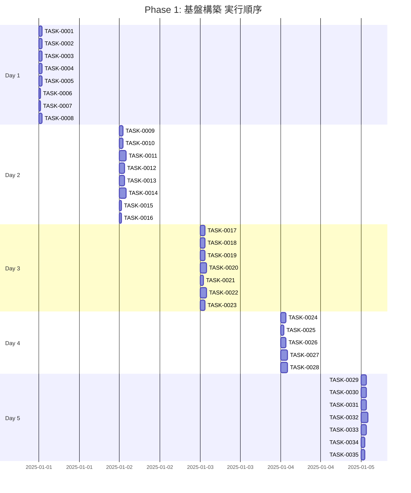

# Phase 1: 基盤構築

## フェーズ概要

**要件名**: resource-management-webapp  
**期間**: 5日（40時間）  
**目標**: 開発環境構築、データベース設定、共通型定義、エラーハンドリング基盤の実装  
**成果物**: 
- フロントエンド・バックエンドの開発環境構築完了
- PostgreSQLデータベース設定完了
- Prismaスキーマ定義・マイグレーション完了
- 共通型定義ファイル作成完了
- エラーハンドリング基盤実装完了

**関連要件**: WRREQ-001〜008-2, WRREQ-002, WRREQ-003, WRREQ-004

### タスク統計

- **総タスク数**: 35タスク
- **推定作業時間**: 40時間
- **DIRECTタスク**: 13タスク
- **TDDタスク**: 22タスク

### クリティカルパス

**クリティカルパス**: TASK-0001 → TASK-0003 → TASK-0009 → TASK-0010 → TASK-0011 → TASK-0012 → TASK-0013 → TASK-0014 → TASK-0015 → TASK-0016 → TASK-0017 → TASK-0024 → TASK-0025 → TASK-0029 → TASK-0030 → TASK-0031 → TASK-0032 → TASK-0035

---

## 実行順序（ガントチャート）

---

## タスクプロセス定義

### TDDタスクの実行プロセス

TDDタスクは以下の6ステップで実行します：

1. `/tsumiki:tdd-requirements` - 詳細要件定義
2. `/tsumiki:tdd-testcases` - テストケース作成
3. `/tsumiki:tdd-red` - テスト実装（失敗）
4. `/tsumiki:tdd-green` - 最小実装
5. `/tsumiki:tdd-refactor` - リファクタリング
6. `/tsumiki:tdd-verify-complete` - 品質確認

### DIRECTタスクの実行プロセス

DIRECTタスクは以下の2ステップで実行します：

1. `/tsumiki:direct-setup` - 直接実装・設定
2. `/tsumiki:direct-verify` - 動作確認・品質確認

---

## 週次計画

### Day 1（8時間）
- **目標**: フロントエンド・バックエンドの開発環境構築
- **成果物**: 
  - React + Vite + TypeScript プロジェクト作成
  - Hono.js + TypeScript プロジェクト作成
  - 基本的な設定ファイル作成

### Day 2（8時間）
- **目標**: データベース設定とPrismaスキーマ定義
- **成果物**: 
  - PostgreSQLデータベース設定
  - Prismaスキーマ定義
  - 初期マイグレーション実行

### Day 3（8時間）
- **目標**: 共通型定義とエラーハンドリング基盤
- **成果物**: 
  - TypeScript型定義ファイル作成
  - エラーハンドリング基盤実装
  - 共通ユーティリティ関数作成

### Day 4（8時間）
- **目標**: バックエンド基盤実装
- **成果物**: 
  - Hono.jsアプリケーション初期化
  - CORS設定
  - 基本的なミドルウェア実装

### Day 5（8時間）
- **目標**: フロントエンド基盤実装と動作確認
- **成果物**: 
  - React Router設定
  - TanStack Query設定
  - Axios設定
  - 動作確認とドキュメント作成

---

## 日次タスク

### Day 1: 開発環境構築

#### TASK-0001: フロントエンドプロジェクト初期化
- [x] **タスク完了** ✅ 完了 (2025-11-21)
- <!-- GitHub Issue: #31 -->
- **タスクタイプ**: DIRECT
- **推定工数**: 1時間
- **要件**: WRREQ-001, WRREQ-001-2, WRREQ-002
- **依存タスク**: なし
- **実装詳細**:
  - Viteを使用してReact + TypeScriptプロジェクトを作成
  - `package.json`に必要な依存関係を追加（React 18+, Vite, TypeScript, TailwindCSS）
  - 基本的なディレクトリ構造を作成（`src/components`, `src/pages`, `src/hooks`, `src/services`, `src/types`, `src/utils`）
  - `vite.config.ts`を設定
  - `tsconfig.json`を設定（strict mode有効）
- **完了条件**: 
  - [x] `npm run dev`で開発サーバーが起動すること ✅
  - [x] TypeScriptの型チェックが通ること ✅

#### TASK-0002: バックエンドプロジェクト初期化
- [x] **タスク完了** ✅ 完了 (2025-01-XX)
- <!-- GitHub Issue: #32 -->
- **タスクタイプ**: DIRECT
- **推定工数**: 1時間
- **要件**: WRREQ-001-1, WRREQ-002
- **依存タスク**: なし
- **実装詳細**:
  - Hono.js + TypeScriptプロジェクトを作成
  - `package.json`に必要な依存関係を追加（Hono.js, TypeScript, Prisma）
  - 基本的なディレクトリ構造を作成（`src/controllers`, `src/services`, `src/repositories`, `src/routes`, `src/middlewares`, `src/types`, `src/utils`, `src/config`）
  - `tsconfig.json`を設定（strict mode有効）
- **完了条件**: 
  - `npm run dev`で開発サーバーが起動すること
  - TypeScriptの型チェックが通ること

#### TASK-0003: TailwindCSS設定
- [x] **タスク完了** ✅ 完了 (2025-01-XX)
- <!-- GitHub Issue: #36 -->
- **タスクタイプ**: DIRECT
- **推定工数**: 1時間
- **要件**: WRREQ-005
- **依存タスク**: TASK-0001
- **実装詳細**:
  - TailwindCSSをインストール・設定
  - `tailwind.config.js`を作成
  - `postcss.config.js`を作成
  - 基本的なスタイル設定を確認
- **完了条件**: 
  - TailwindCSSのクラスが正しく適用されること

#### TASK-0004: ESLint・Prettier設定
- [x] **タスク完了** ✅ 完了 (2025-01-XX)
- <!-- GitHub Issue: #55 -->
- **タスクタイプ**: DIRECT
- **推定工数**: 1時間
- **要件**: WRNFR-010
- **依存タスク**: TASK-0001, TASK-0002
- **実装詳細**:
  - ESLintをインストール・設定（フロントエンド・バックエンド両方）
  - Prettierをインストール・設定
  - `.eslintrc.js`と`.prettierrc`を作成
  - エディタ設定ファイル（`.vscode/settings.json`）を作成
- **完了条件**: 
  - ESLintとPrettierが正しく動作すること
  - コードフォーマットが自動適用されること

#### TASK-0005: 環境変数設定
- [x] **タスク完了** ✅ 完了 (2025-11-22)
- <!-- GitHub Issue: #56 -->
- **タスクタイプ**: DIRECT
- **推定工数**: 1時間
- **要件**: WRREQ-007
- **依存タスク**: TASK-0001, TASK-0002
- **実装詳細**:
  - `.env.example`ファイルを作成（フロントエンド・バックエンド両方）
  - `.env.local`ファイルを作成（開発環境用）
  - 環境変数の読み込み設定を実装
  - `.gitignore`に`.env.local`を追加
- **完了条件**: 
  - 環境変数が正しく読み込まれること

#### TASK-0006: Gitリポジトリ初期化と基本設定
- [x] **タスク完了** ✅ 完了 (2025-01-XX)
- <!-- GitHub Issue: #33 -->
- **タスクタイプ**: DIRECT
- **推定工数**: 0.5時間
- **要件**: なし（一般的な開発プロセス）
- **依存タスク**: なし
- **実装詳細**:
  - `.gitignore`ファイルを作成
  - 基本的なGit設定を確認
  - 初期コミットを作成
- **完了条件**: 
  - `.gitignore`が適切に設定されていること

#### TASK-0007: プロジェクトドキュメント作成
- [x] **タスク完了** ✅ 完了 (2025-01-XX)
- <!-- GitHub Issue: #57 -->
- **タスクタイプ**: DIRECT
- **推定工数**: 0.5時間
- **要件**: なし（一般的な開発プロセス）
- **依存タスク**: TASK-0001, TASK-0002
- **実装詳細**:
  - `README.md`を更新（プロジェクト概要、セットアップ手順）
  - `CONTRIBUTING.md`を作成（開発ガイドライン）
- **完了条件**: 
  - ドキュメントが完成していること

#### TASK-0008: 開発環境動作確認
- [x] **タスク完了** ✅ 完了 (2025-11-23)
- <!-- GitHub Issue: #64 -->
- **タスクタイプ**: DIRECT
- **推定工数**: 1時間
- **要件**: WRREQ-007
- **依存タスク**: TASK-0001, TASK-0002, TASK-0003, TASK-0004, TASK-0005
- **実装詳細**:
  - フロントエンド開発サーバーが起動することを確認
  - バックエンド開発サーバーが起動することを確認
  - 基本的な動作確認を実施
- **完了条件**: 
  - [x] 両方の開発サーバーが正常に起動すること

---

### Day 2: データベース設定

#### TASK-0009: PostgreSQLデータベースセットアップ
- [x] **タスク完了** ✅ 完了 (2025-11-23)
- <!-- GitHub Issue: #34 -->
- **タスクタイプ**: DIRECT
- **推定工数**: 1時間
- **要件**: WRREQ-003
- **依存タスク**: なし
- **実装詳細**:
  - PostgreSQL 14+をインストール（開発環境）
  - データベースを作成
  - 接続設定を確認
  - 環境変数にデータベース接続情報を設定
- **完了条件**: 
  - [x] PostgreSQLに接続できること ✅
  - [x] データベースが作成されていること ✅

#### TASK-0010: Prisma初期化
- [x] **タスク完了** ✅ 完了 (2025-01-27)
- <!-- GitHub Issue: #37 -->
- **タスクタイプ**: DIRECT
- **推定工数**: 1時間
- **要件**: WRREQ-004
- **依存タスク**: TASK-0009
- **実装詳細**:
  - Prismaをインストール
  - `prisma init`を実行
  - `schema.prisma`の基本設定を確認
  - データベース接続設定を`schema.prisma`に記述
- **完了条件**: 
  - Prismaが正しく初期化されていること
  - データベース接続が確認できること

#### TASK-0011: Prismaスキーマ定義（共通フィールド・基本型）
- [x] **タスク完了** ✅ 完了 (2025-01-XX)
- <!-- GitHub Issue: #38 -->
- **タスクタイプ**: TDD
- **推定工数**: 2時間
- **要件**: WRREQ-003, WRREQ-004
- **依存タスク**: TASK-0010
- **実装詳細**:
  - 共通フィールド（id, createdAt, updatedAt, deletedAt）を定義
  - ENUM型を定義（CardType, Rarity, NodeType, CurrencyType, ContentType, BalanceCategory）
  - 基本的な型定義を確認
- **単体テスト要件**: 
  - スキーマの型定義が正しいことを確認
- **完了条件**: 
  - Prismaスキーマが正しく定義されていること
  - 型チェックが通ること

#### TASK-0012: Prismaスキーマ定義（Cardテーブル）
- [x] **タスク完了** ✅ 完了 (2025-01-XX)
- <!-- GitHub Issue: #39 -->
- **タスクタイプ**: TDD
- **推定工数**: 1.5時間
- **要件**: WRREQ-012, WRREQ-013, WRREQ-014
- **依存タスク**: TASK-0011
- **実装詳細**:
  - Cardテーブルを定義（name, description, cardType, attribute, stabilityValue, reactionEffect, energyCost, imageUrl, rarity, evolutionFromId）
  - インデックスを定義
  - 制約を定義（CHECK制約、UNIQUE制約）
- **単体テスト要件**: 
  - スキーマの型定義が正しいことを確認
- **完了条件**: 
  - Cardテーブルが正しく定義されていること

#### TASK-0013: Prismaスキーマ定義（Customerテーブル）
- [ ] **タスク完了**
- <!-- GitHub Issue: #40 -->
- **タスクタイプ**: TDD
- **推定工数**: 1.5時間
- **要件**: WRREQ-021, WRREQ-022, WRREQ-023, WRREQ-024
- **依存タスク**: TASK-0011
- **実装詳細**:
  - Customerテーブルを定義（name, description, customerType, difficulty, requiredAttribute, qualityCondition, stabilityCondition, rewardFame, rewardKnowledge, portraitUrl）
  - インデックスを定義
  - 制約を定義
- **単体テスト要件**: 
  - スキーマの型定義が正しいことを確認
- **完了条件**: 
  - Customerテーブルが正しく定義されていること

#### TASK-0014: Prismaスキーマ定義（その他テーブル）
- [ ] **タスク完了**
- <!-- GitHub Issue: #41 -->
- **タスクタイプ**: TDD
- **推定工数**: 2時間
- **要件**: WRREQ-029, WRREQ-033, WRREQ-038, WRREQ-048
- **依存タスク**: TASK-0011
- **実装詳細**:
  - AlchemyStyleテーブルを定義
  - MapNodeテーブルを定義
  - MetaCurrencyテーブルを定義
  - UnlockableContentテーブルを定義
  - GameBalanceテーブルを定義
  - 中間テーブルを定義（CustomerRewardCards, AlchemyStyleInitialDeckCards）
  - リレーションを定義
- **単体テスト要件**: 
  - スキーマの型定義が正しいことを確認
- **完了条件**: 
  - すべてのテーブルが正しく定義されていること

#### TASK-0015: Prismaマイグレーション実行
- [ ] **タスク完了**
- <!-- GitHub Issue: #63 -->
- **タスクタイプ**: DIRECT
- **推定工数**: 0.5時間
- **要件**: WRREQ-004
- **依存タスク**: TASK-0012, TASK-0013, TASK-0014
- **実装詳細**:
  - `prisma migrate dev`を実行してマイグレーションファイルを作成
  - マイグレーションを実行してデータベースに反映
  - マイグレーションファイルを確認
- **完了条件**: 
  - マイグレーションが正常に実行されること
  - データベースにテーブルが作成されていること

#### TASK-0016: Prisma Client生成と動作確認
- [ ] **タスク完了**
- <!-- GitHub Issue: #42 -->
- **タスクタイプ**: DIRECT
- **推定工数**: 0.5時間
- **要件**: WRREQ-004
- **依存タスク**: TASK-0015
- **実装詳細**:
  - `prisma generate`を実行してPrisma Clientを生成
  - 基本的なクエリを実行して動作確認
- **完了条件**: 
  - Prisma Clientが正しく生成されていること
  - 基本的なクエリが実行できること

---

### Day 3: 共通型定義とエラーハンドリング基盤

#### TASK-0017: 共通型定義ファイル作成（BaseEntity, ApiResponse等）
- [ ] **タスク完了**
- <!-- GitHub Issue: #43 -->
- **タスクタイプ**: TDD
- **推定工数**: 1.5時間
- **要件**: WRREQ-002
- **依存タスク**: TASK-0015
- **実装詳細**:
  - `src/types/common.ts`を作成
  - BaseEntity型を定義
  - ApiResponse型を定義
  - ApiErrorResponse型を定義
  - PaginationParams型を定義
  - PaginatedResponse型を定義
- **単体テスト要件**: 
  - 型定義が正しいことを確認
- **完了条件**: 
  - 共通型定義が完成していること
  - TypeScriptの型チェックが通ること

#### TASK-0018: カード関連型定義作成
- [ ] **タスク完了**
- <!-- GitHub Issue: #44 -->
- **タスクタイプ**: TDD
- **推定工数**: 1.5時間
- **要件**: WRREQ-012, WRREQ-013, WRREQ-014
- **依存タスク**: TASK-0017
- **実装詳細**:
  - `src/types/card.ts`を作成
  - CardType enumを定義
  - Rarity enumを定義
  - AttributeValues型を定義
  - Card型を定義
  - CreateCardRequest型を定義
  - UpdateCardRequest型を定義
  - GetCardsQuery型を定義
- **単体テスト要件**: 
  - 型定義が正しいことを確認
- **完了条件**: 
  - カード関連型定義が完成していること

#### TASK-0019: 顧客関連型定義作成
- [ ] **タスク完了**
- <!-- GitHub Issue: #45 -->
- **タスクタイプ**: TDD
- **推定工数**: 1.5時間
- **要件**: WRREQ-021, WRREQ-022, WRREQ-023, WRREQ-024
- **依存タスク**: TASK-0017
- **実装詳細**:
  - `src/types/customer.ts`を作成
  - Customer型を定義
  - CreateCustomerRequest型を定義
  - UpdateCustomerRequest型を定義
  - GetCustomersQuery型を定義
- **単体テスト要件**: 
  - 型定義が正しいことを確認
- **完了条件**: 
  - 顧客関連型定義が完成していること

#### TASK-0020: その他リソース型定義作成
- [ ] **タスク完了**
- <!-- GitHub Issue: #46 -->
- **タスクタイプ**: TDD
- **推定工数**: 2時間
- **要件**: WRREQ-029, WRREQ-033, WRREQ-038, WRREQ-048
- **依存タスク**: TASK-0017
- **実装詳細**:
  - `src/types/alchemy-style.ts`を作成
  - `src/types/map-node.ts`を作成
  - `src/types/meta-currency.ts`を作成
  - `src/types/unlockable-content.ts`を作成
  - `src/types/game-balance.ts`を作成
  - 各リソースの型定義を実装
- **単体テスト要件**: 
  - 型定義が正しいことを確認
- **完了条件**: 
  - すべてのリソース型定義が完成していること

#### TASK-0021: エラーコード型定義作成
- [ ] **タスク完了**
- <!-- GitHub Issue: #47 -->
- **タスクタイプ**: TDD
- **推定工数**: 1時間
- **要件**: WRREQ-069
- **依存タスク**: TASK-0017
- **実装詳細**:
  - `src/types/error.ts`を作成
  - ErrorCode enumを定義（AUTH_xxx, VALID_xxx, RES_xxx, DB_xxx, REPO_xxx, SYS_xxx, NET_xxx）
  - エラーコードの体系を定義
- **単体テスト要件**: 
  - 型定義が正しいことを確認
- **完了条件**: 
  - エラーコード型定義が完成していること

#### TASK-0022: エラーハンドリングユーティリティ作成
- [ ] **タスク完了**
- <!-- GitHub Issue: #48 -->
- **タスクタイプ**: TDD
- **推定工数**: 2時間
- **要件**: WRREQ-069, WRNFR-011
- **依存タスク**: TASK-0021
- **実装詳細**:
  - `src/utils/error-handler.ts`を作成
  - エラーレスポンス生成関数を実装
  - エラーログ記録関数を実装
  - エラーハンドリングミドルウェアの基盤を実装
- **単体テスト要件**: 
  - エラーハンドリング関数が正しく動作することを確認
  - エラーログが正しく記録されることを確認
- **完了条件**: 
  - エラーハンドリングユーティリティが完成していること

#### TASK-0023: 共通ユーティリティ関数作成
- [x] **タスク完了**
- <!-- GitHub Issue: #35 -->
- **タスクタイプ**: TDD
- **推定工数**: 1.5時間
- **要件**: なし（一般的な開発プロセス）
- **依存タスク**: なし
- **実装詳細**:
  - `src/utils/date.ts`を作成（日付フォーマット関数）
  - `src/utils/validation.ts`を作成（バリデーション関数）
  - `src/utils/logger.ts`を作成（ログ出力関数）
- **単体テスト要件**: 
  - 各ユーティリティ関数が正しく動作することを確認
- **完了条件**: 
  - 共通ユーティリティ関数が完成していること

---

### Day 4: バックエンド基盤実装

#### TASK-0024: Hono.jsアプリケーション初期化
- [x] **タスク完了** ✅ 完了 (2025-01-XX)
- <!-- GitHub Issue: #49 -->
- **タスクタイプ**: TDD
- **推定工数**: 1.5時間
- **要件**: WRREQ-001-1, WRREQ-067
- **依存タスク**: TASK-0002
- **実装詳細**:
  - `src/index.ts`を作成
  - Honoアプリケーションを初期化
  - 基本的なルーティング設定
  - ヘルスチェックエンドポイントを実装
- **単体テスト要件**: 
  - ヘルスチェックエンドポイントが正しく動作することを確認
- **完了条件**: 
  - Honoアプリケーションが正常に起動すること
  - ヘルスチェックエンドポイントが動作すること

#### TASK-0025: CORS設定
- [ ] **タスク完了**
- <!-- GitHub Issue: #50 -->
- **タスクタイプ**: DIRECT
- **推定工数**: 1時間
- **要件**: WRREQ-070-1
- **依存タスク**: TASK-0024
- **実装詳細**:
  - CORSミドルウェアを設定
  - 許可するオリジンを設定（開発環境: `http://localhost:5173`）
  - 許可するHTTPメソッドを設定
  - 許可するヘッダーを設定
- **完了条件**: 
  - CORSが正しく設定されていること
  - フロントエンドからAPIにアクセスできること

#### TASK-0026: リクエストロギングミドルウェア実装
- [ ] **タスク完了**
- <!-- GitHub Issue: #51 -->
- **タスクタイプ**: TDD
- **推定工数**: 1.5時間
- **要件**: WRNFR-011
- **依存タスク**: TASK-0024
- **実装詳細**:
  - リクエストロギングミドルウェアを実装
  - リクエスト情報（メソッド、パス、ボディ）をログ出力
  - レスポンス情報（ステータスコード、処理時間）をログ出力
  - 構造化ログ（JSON形式）で出力
- **単体テスト要件**: 
  - ログが正しく出力されることを確認
- **完了条件**: 
  - リクエストロギングミドルウェアが完成していること

#### TASK-0027: エラーハンドリングミドルウェア実装
- [ ] **タスク完了**
- <!-- GitHub Issue: #58 -->
- **タスクタイプ**: TDD
- **推定工数**: 2時間
- **要件**: WRREQ-069, WRNFR-011
- **依存タスク**: TASK-0022, TASK-0024
- **実装詳細**:
  - エラーハンドリングミドルウェアを実装
  - 各種エラー（バリデーションエラー、データベースエラー、システムエラー）を適切に処理
  - エラーレスポンスを生成
  - エラーログを記録
- **単体テスト要件**: 
  - 各種エラーが正しく処理されることを確認
  - エラーレスポンスが正しい形式で返されることを確認
- **完了条件**: 
  - エラーハンドリングミドルウェアが完成していること

#### TASK-0028: バリデーションミドルウェア基盤実装
- [ ] **タスク完了**
- <!-- GitHub Issue: #52 -->
- **タスクタイプ**: TDD
- **推定工数**: 2時間
- **要件**: WRREQ-070, WRREQ-070-2
- **依存タスク**: TASK-0024
- **実装詳細**:
  - Zodを使用したバリデーションミドルウェアを実装
  - リクエストボディのバリデーション機能
  - クエリパラメータのバリデーション機能
  - パスパラメータのバリデーション機能
  - バリデーションエラーのレスポンス生成
- **単体テスト要件**: 
  - バリデーションが正しく動作することを確認
  - バリデーションエラーが正しく返されることを確認
- **完了条件**: 
  - バリデーションミドルウェアが完成していること

---

### Day 5: フロントエンド基盤実装と動作確認

#### TASK-0029: React Router設定
- [ ] **タスク完了**
- <!-- GitHub Issue: #53 -->
- **タスクタイプ**: TDD
- **推定工数**: 1.5時間
- **要件**: WRREQ-001-3
- **依存タスク**: TASK-0001
- **実装詳細**:
  - React Routerをインストール
  - `src/App.tsx`でルーティング設定
  - 基本的なルート定義（`/`, `/cards`, `/customers`等）
  - 404ページを実装
- **単体テスト要件**: 
  - ルーティングが正しく動作することを確認
- **完了条件**: 
  - React Routerが正しく設定されていること
  - 基本的なルーティングが動作すること

#### TASK-0030: TanStack Query設定
- [ ] **タスク完了**
- <!-- GitHub Issue: #54 -->
- **タスクタイプ**: TDD
- **推定工数**: 1.5時間
- **要件**: WRREQ-001-4
- **依存タスク**: TASK-0001
- **実装詳細**:
  - TanStack Queryをインストール
  - QueryClientを設定
  - キャッシュ戦略を設定（staleTime: 5分、cacheTime: 10分）
  - QueryClientProviderを設定
- **単体テスト要件**: 
  - QueryClientが正しく設定されていることを確認
- **完了条件**: 
  - TanStack Queryが正しく設定されていること

#### TASK-0031: Axios設定
- [ ] **タスク完了**
- <!-- GitHub Issue: #59 -->
- **タスクタイプ**: TDD
- **推定工数**: 1.5時間
- **要件**: WRREQ-001-6
- **依存タスク**: TASK-0001, TASK-0025
- **実装詳細**:
  - Axiosをインストール
  - ベースURLを設定（開発環境: `http://localhost:3000/api`）
  - リクエストインターセプターを実装（認証トークン追加等）
  - レスポンスインターセプターを実装（エラーハンドリング）
  - APIクライアントラッパーを作成
- **単体テスト要件**: 
  - Axios設定が正しく動作することを確認
  - インターセプターが正しく動作することを確認
- **完了条件**: 
  - Axiosが正しく設定されていること
  - APIクライアントが動作すること

#### TASK-0032: 共通レイアウトコンポーネント作成
- [ ] **タスク完了**
- <!-- GitHub Issue: #60 -->
- **タスクタイプ**: TDD
- **推定工数**: 2時間
- **要件**: WRREQ-053, WRREQ-054
- **依存タスク**: TASK-0029, TASK-0003
- **実装詳細**:
  - `src/components/layout/Header.tsx`を作成
  - `src/components/layout/Sidebar.tsx`を作成
  - `src/components/layout/Layout.tsx`を作成
  - パンくずリストコンポーネントを作成
  - 基本的なスタイリングを実装
- **単体テスト要件**: 
  - レイアウトコンポーネントが正しく表示されることを確認
- **UI/UX要件**: 
  - レスポンシブデザイン対応（WRREQ-006）
  - 左サイドバーでナビゲーション提供（WRREQ-053）
  - パンくずリストで現在位置表示（WRREQ-054）
- **完了条件**: 
  - 共通レイアウトコンポーネントが完成していること

#### TASK-0033: エラーハンドリングコンポーネント作成
- [ ] **タスク完了**
- <!-- GitHub Issue: #61 -->
- **タスクタイプ**: TDD
- **推定工数**: 1.5時間
- **要件**: WRREQ-055
- **依存タスク**: TASK-0001, TASK-0003
- **実装詳細**:
  - `src/components/common/ErrorBoundary.tsx`を作成
  - `src/components/common/ErrorMessage.tsx`を作成
  - エラー表示コンポーネントを実装
- **単体テスト要件**: 
  - エラーハンドリングコンポーネントが正しく動作することを確認
- **UI/UX要件**: 
  - フォームバリデーションエラーを分かりやすく表示（WRREQ-055）
- **完了条件**: 
  - エラーハンドリングコンポーネントが完成していること

#### TASK-0034: ローディングコンポーネント作成
- [ ] **タスク完了**
- <!-- GitHub Issue: #62 -->
- **タスクタイプ**: TDD
- **推定工数**: 1時間
- **要件**: なし（一般的なUI要件）
- **依存タスク**: TASK-0001, TASK-0003
- **実装詳細**:
  - `src/components/common/Loading.tsx`を作成
  - スケルトンローダーコンポーネントを作成
  - 基本的なスタイリングを実装
- **単体テスト要件**: 
  - ローディングコンポーネントが正しく表示されることを確認
- **完了条件**: 
  - ローディングコンポーネントが完成していること

#### TASK-0035: 動作確認とドキュメント作成
- [ ] **タスク完了**
- <!-- GitHub Issue: #65 -->
- **タスクタイプ**: DIRECT
- **推定工数**: 1時間
- **要件**: なし（一般的な開発プロセス）
- **依存タスク**: TASK-0024, TASK-0029, TASK-0030, TASK-0031, TASK-0032, TASK-0033, TASK-0034
- **実装詳細**:
  - フロントエンド・バックエンドの動作確認
  - 基本的な統合テストを実施
  - セットアップ手順をドキュメント化
- **完了条件**: 
  - すべての機能が正常に動作すること
  - ドキュメントが完成していること

---

## フェーズ完了条件

- [ ] フロントエンド・バックエンドの開発環境が構築されていること
- [ ] PostgreSQLデータベースが設定されていること
- [ ] Prismaスキーマが定義され、マイグレーションが実行されていること
- [ ] 共通型定義が完成していること
- [ ] エラーハンドリング基盤が実装されていること
- [ ] Hono.jsアプリケーションが正常に動作すること
- [ ] React Router、TanStack Query、Axiosが正しく設定されていること
- [ ] 基本的なレイアウトコンポーネントが完成していること

---

## 変更履歴

| 日付 | バージョン | 変更内容 |
|------|----------|---------|
| 2025-01-XX | 1.0 | 初版作成 |
