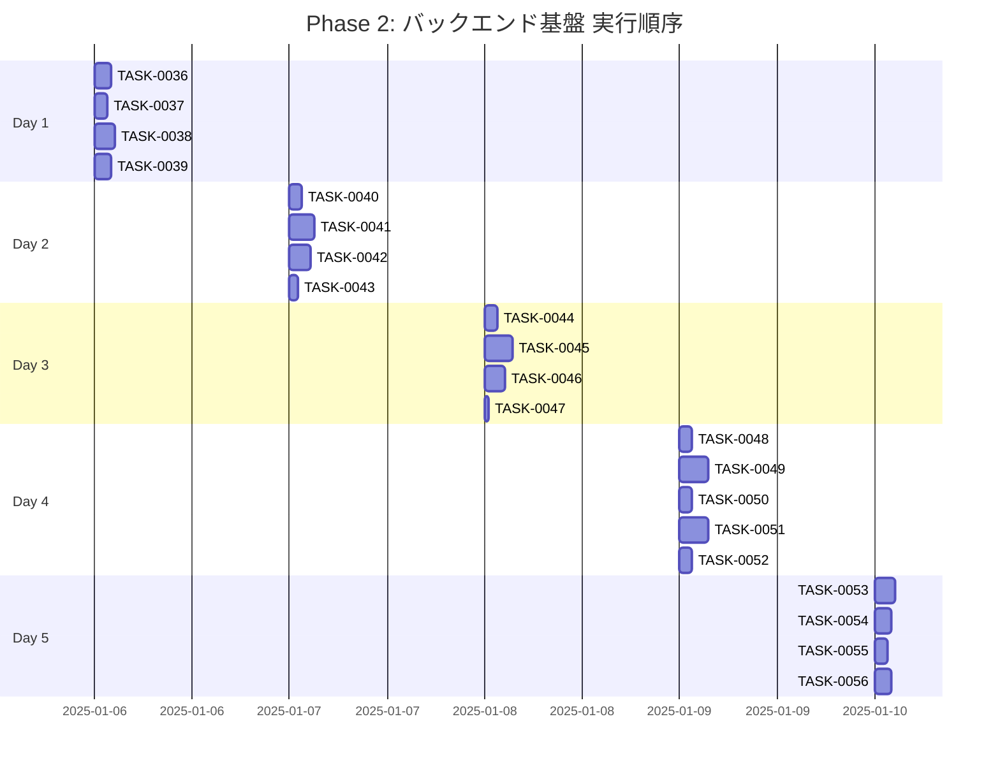

# Phase 2: バックエンド基盤

## フェーズ概要

**要件名**: resource-management-webapp  
**期間**: 5日（40時間）  
**目標**: Repository Pattern実装、Service層基盤、共通APIミドルウェアの実装  
**成果物**: 
- Repository Pattern実装完了（インターフェース、Prisma実装、In-Memory実装）
- Service層基盤実装完了
- 共通APIミドルウェア実装完了
- 依存性注入の仕組み実装完了

**関連要件**: WRREQ-004, WRREQ-067, WRREQ-070-2

### タスク統計

- **総タスク数**: 21タスク
- **推定作業時間**: 40時間
- **DIRECTタスク**: 0タスク
- **TDDタスク**: 21タスク

### クリティカルパス

**クリティカルパス**: TASK-0036 → TASK-0038 → TASK-0040 → TASK-0041 → TASK-0044 → TASK-0045 → TASK-0048 → TASK-0049 → TASK-0051 → TASK-0053 → TASK-0054 → TASK-0055 → TASK-0056

---

## 実行順序（ガントチャート）

---

## タスクプロセス定義

### TDDタスクの実行プロセス

TDDタスクは以下の6ステップで実行します：

1. `/tsumiki:tdd-requirements` - 詳細要件定義
2. `/tsumiki:tdd-testcases` - テストケース作成
3. `/tsumiki:tdd-red` - テスト実装（失敗）
4. `/tsumiki:tdd-green` - 最小実装
5. `/tsumiki:tdd-refactor` - リファクタリング
6. `/tsumiki:tdd-verify-complete` - 品質確認

### DIRECTタスクの実行プロセス

DIRECTタスクは以下の2ステップで実行します：

1. `/tsumiki:direct-setup` - 直接実装・設定
2. `/tsumiki:direct-verify` - 動作確認・品質確認

---

## 週次計画

### Day 1（8時間）
- **目標**: Repository Pattern基盤実装
- **成果物**: 
  - Repositoryインターフェース定義
  - ベースRepository実装
  - Prisma Client設定

### Day 2（8時間）
- **目標**: Card Repository実装
- **成果物**: 
  - ICardRepositoryインターフェース
  - PrismaCardRepository実装
  - InMemoryCardRepository実装

### Day 3（8時間）
- **目標**: Customer Repository実装
- **成果物**: 
  - ICustomerRepositoryインターフェース
  - PrismaCustomerRepository実装
  - InMemoryCustomerRepository実装

### Day 4（8時間）
- **目標**: Service層基盤実装
- **成果物**: 
  - Service層インターフェース定義
  - CardService実装
  - CustomerService実装

### Day 5（8時間）
- **目標**: 依存性注入と共通API実装
- **成果物**: 
  - 依存性注入の仕組み実装
  - 共通APIエンドポイント実装
  - 動作確認とテスト

---

## 日次タスク

### Day 1: Repository Pattern基盤実装

#### TASK-0036: Repositoryインターフェース基盤定義
- [ ] **タスク完了**
- <!-- GitHub Issue: # -->
- **タスクタイプ**: TDD
- **推定工数**: 2時間
- **要件**: WRREQ-004
- **依存タスク**: TASK-0015
- **実装詳細**:
  - `src/repositories/interfaces/base-repository.ts`を作成
  - IBaseRepositoryインターフェースを定義（findAll, findById, create, update, delete等）
  - ジェネリック型を使用して型安全に実装
- **単体テスト要件**: 
  - インターフェースの型定義が正しいことを確認
- **完了条件**: 
  - IBaseRepositoryインターフェースが完成していること

#### TASK-0037: Prisma Client設定とユーティリティ作成
- [ ] **タスク完了**
- <!-- GitHub Issue: # -->
- **タスクタイプ**: TDD
- **推定工数**: 1.5時間
- **要件**: WRREQ-004
- **依存タスク**: TASK-0016
- **実装詳細**:
  - `src/config/prisma.ts`を作成
  - Prisma Clientのシングルトンインスタンスを作成
  - データベース接続管理を実装
  - 接続プール設定を実装
- **単体テスト要件**: 
  - Prisma Clientが正しく初期化されることを確認
- **完了条件**: 
  - Prisma Client設定が完成していること

#### TASK-0038: ベースRepository実装（Prisma）
- [ ] **タスク完了**
- <!-- GitHub Issue: # -->
- **タスクタイプ**: TDD
- **推定工数**: 2.5時間
- **要件**: WRREQ-004
- **依存タスク**: TASK-0036, TASK-0037
- **実装詳細**:
  - `src/repositories/prisma/base-prisma-repository.ts`を作成
  - BasePrismaRepositoryクラスを実装
  - 共通メソッド（findAll, findById, create, update, softDelete等）を実装
  - ページネーション処理を実装
  - ソフトデリート処理を実装
- **単体テスト要件**: 
  - 各メソッドが正しく動作することを確認
  - ページネーションが正しく動作することを確認
  - ソフトデリートが正しく動作することを確認
- **完了条件**: 
  - BasePrismaRepositoryが完成していること

#### TASK-0039: ベースRepository実装（In-Memory）
- [ ] **タスク完了**
- <!-- GitHub Issue: # -->
- **タスクタイプ**: TDD
- **推定工数**: 2時間
- **要件**: WRNFR-012
- **依存タスク**: TASK-0036
- **実装詳細**:
  - `src/repositories/memory/base-memory-repository.ts`を作成
  - BaseMemoryRepositoryクラスを実装
  - メモリ上でデータを管理する実装
  - テスト用の実装
- **単体テスト要件**: 
  - 各メソッドが正しく動作することを確認
  - メモリ上でデータが正しく管理されることを確認
- **完了条件**: 
  - BaseMemoryRepositoryが完成していること

---

### Day 2: Card Repository実装

#### TASK-0040: ICardRepositoryインターフェース定義
- [ ] **タスク完了**
- <!-- GitHub Issue: # -->
- **タスクタイプ**: TDD
- **推定工数**: 1.5時間
- **要件**: WRREQ-012, WRREQ-013, WRREQ-014
- **依存タスク**: TASK-0036
- **実装詳細**:
  - `src/repositories/interfaces/card-repository.ts`を作成
  - ICardRepositoryインターフェースを定義
  - カード固有のメソッドを定義（findByName, findByCardType, findByRarity等）
  - 検索・フィルタリングメソッドを定義
- **単体テスト要件**: 
  - インターフェースの型定義が正しいことを確認
- **完了条件**: 
  - ICardRepositoryインターフェースが完成していること

#### TASK-0041: PrismaCardRepository実装
- [ ] **タスク完了**
- <!-- GitHub Issue: # -->
- **タスクタイプ**: TDD
- **推定工数**: 3時間
- **要件**: WRREQ-004, WRREQ-012, WRREQ-013, WRREQ-014
- **依存タスク**: TASK-0038, TASK-0040
- **実装詳細**:
  - `src/repositories/prisma/card-repository.ts`を作成
  - PrismaCardRepositoryクラスを実装
  - ICardRepositoryインターフェースを実装
  - カード固有のメソッドを実装
  - 検索・フィルタリング機能を実装
  - リレーション処理を実装（evolutionFrom, evolutionTo等）
- **単体テスト要件**: 
  - 各メソッドが正しく動作することを確認
  - 検索・フィルタリングが正しく動作することを確認
  - リレーション処理が正しく動作することを確認
- **統合テスト要件**: 
  - データベースとの統合テストを実施
- **完了条件**: 
  - PrismaCardRepositoryが完成していること

#### TASK-0042: InMemoryCardRepository実装
- [ ] **タスク完了**
- <!-- GitHub Issue: # -->
- **タスクタイプ**: TDD
- **推定工数**: 2.5時間
- **要件**: WRNFR-012
- **依存タスク**: TASK-0039, TASK-0040
- **実装詳細**:
  - `src/repositories/memory/card-repository.ts`を作成
  - InMemoryCardRepositoryクラスを実装
  - ICardRepositoryインターフェースを実装
  - メモリ上でカードデータを管理
  - テスト用の実装
- **単体テスト要件**: 
  - 各メソッドが正しく動作することを確認
  - メモリ上でデータが正しく管理されることを確認
- **完了条件**: 
  - InMemoryCardRepositoryが完成していること

#### TASK-0043: Card Repositoryテスト実装
- [ ] **タスク完了**
- <!-- GitHub Issue: # -->
- **タスクタイプ**: TDD
- **推定工数**: 1時間
- **要件**: WRNFR-012
- **依存タスク**: TASK-0041, TASK-0042
- **実装詳細**:
  - `src/repositories/__tests__/card-repository.test.ts`を作成
  - PrismaCardRepositoryのテストを実装
  - InMemoryCardRepositoryのテストを実装
  - テストカバレッジ80%以上を目標
- **単体テスト要件**: 
  - すべてのテストがパスすることを確認
- **完了条件**: 
  - Card Repositoryのテストが完成していること

---

### Day 3: Customer Repository実装

#### TASK-0044: ICustomerRepositoryインターフェース定義
- [ ] **タスク完了**
- <!-- GitHub Issue: # -->
- **タスクタイプ**: TDD
- **推定工数**: 1.5時間
- **要件**: WRREQ-021, WRREQ-022, WRREQ-023, WRREQ-024
- **依存タスク**: TASK-0036
- **実装詳細**:
  - `src/repositories/interfaces/customer-repository.ts`を作成
  - ICustomerRepositoryインターフェースを定義
  - 顧客固有のメソッドを定義（findByDifficulty, findByCustomerType等）
  - 検索・フィルタリングメソッドを定義
  - N:Mリレーション処理メソッドを定義（rewardCards関連）
- **単体テスト要件**: 
  - インターフェースの型定義が正しいことを確認
- **完了条件**: 
  - ICustomerRepositoryインターフェースが完成していること

#### TASK-0045: PrismaCustomerRepository実装
- [ ] **タスク完了**
- <!-- GitHub Issue: # -->
- **タスクタイプ**: TDD
- **推定工数**: 3.5時間
- **要件**: WRREQ-004, WRREQ-021, WRREQ-022, WRREQ-023, WRREQ-024
- **依存タスク**: TASK-0038, TASK-0044
- **実装詳細**:
  - `src/repositories/prisma/customer-repository.ts`を作成
  - PrismaCustomerRepositoryクラスを実装
  - ICustomerRepositoryインターフェースを実装
  - 顧客固有のメソッドを実装
  - 検索・フィルタリング機能を実装
  - N:Mリレーション処理を実装（rewardCards関連）
  - リレーション処理を実装（mapNodes, unlockableContent等）
- **単体テスト要件**: 
  - 各メソッドが正しく動作することを確認
  - 検索・フィルタリングが正しく動作することを確認
  - N:Mリレーション処理が正しく動作することを確認
- **統合テスト要件**: 
  - データベースとの統合テストを実施
- **完了条件**: 
  - PrismaCustomerRepositoryが完成していること

#### TASK-0046: InMemoryCustomerRepository実装
- [ ] **タスク完了**
- <!-- GitHub Issue: # -->
- **タスクタイプ**: TDD
- **推定工数**: 2.5時間
- **要件**: WRNFR-012
- **依存タスク**: TASK-0039, TASK-0044
- **実装詳細**:
  - `src/repositories/memory/customer-repository.ts`を作成
  - InMemoryCustomerRepositoryクラスを実装
  - ICustomerRepositoryインターフェースを実装
  - メモリ上で顧客データを管理
  - N:Mリレーション処理を実装
  - テスト用の実装
- **単体テスト要件**: 
  - 各メソッドが正しく動作することを確認
  - メモリ上でデータが正しく管理されることを確認
  - N:Mリレーション処理が正しく動作することを確認
- **完了条件**: 
  - InMemoryCustomerRepositoryが完成していること

#### TASK-0047: Customer Repositoryテスト実装
- [ ] **タスク完了**
- <!-- GitHub Issue: # -->
- **タスクタイプ**: TDD
- **推定工数**: 0.5時間
- **要件**: WRNFR-012
- **依存タスク**: TASK-0045, TASK-0046
- **実装詳細**:
  - `src/repositories/__tests__/customer-repository.test.ts`を作成
  - PrismaCustomerRepositoryのテストを実装
  - InMemoryCustomerRepositoryのテストを実装
  - テストカバレッジ80%以上を目標
- **単体テスト要件**: 
  - すべてのテストがパスすることを確認
- **完了条件**: 
  - Customer Repositoryのテストが完成していること

---

### Day 4: Service層基盤実装

#### TASK-0048: Service層インターフェース基盤定義
- [ ] **タスク完了**
- <!-- GitHub Issue: # -->
- **タスクタイプ**: TDD
- **推定工数**: 1.5時間
- **要件**: WRREQ-067
- **依存タスク**: TASK-0036
- **実装詳細**:
  - `src/services/interfaces/base-service.ts`を作成
  - IBaseServiceインターフェースを定義
  - 共通メソッドを定義
- **単体テスト要件**: 
  - インターフェースの型定義が正しいことを確認
- **完了条件**: 
  - IBaseServiceインターフェースが完成していること

#### TASK-0049: CardService実装
- [ ] **タスク完了**
- <!-- GitHub Issue: # -->
- **タスクタイプ**: TDD
- **推定工数**: 3.5時間
- **要件**: WRREQ-012, WRREQ-013, WRREQ-014, WRREQ-016, WRREQ-017, WRREQ-019, WRREQ-020
- **依存タスク**: TASK-0041, TASK-0048
- **実装詳細**:
  - `src/services/card-service.ts`を作成
  - CardServiceクラスを実装
  - カード一覧取得メソッドを実装（ページネーション、検索、フィルタリング）
  - カード詳細取得メソッドを実装
  - カード作成メソッドを実装（重複チェック、バリデーション）
  - カード更新メソッドを実装（部分更新対応）
  - カード削除メソッドを実装（依存関係チェック、ソフトデリート）
  - ビジネスロジックを実装
- **単体テスト要件**: 
  - 各メソッドが正しく動作することを確認
  - 重複チェックが正しく動作することを確認
  - 依存関係チェックが正しく動作することを確認
- **統合テスト要件**: 
  - Repositoryとの統合テストを実施
- **完了条件**: 
  - CardServiceが完成していること

#### TASK-0050: CardServiceテスト実装
- [ ] **タスク完了**
- <!-- GitHub Issue: # -->
- **タスクタイプ**: TDD
- **推定工数**: 1.5時間
- **要件**: WRNFR-012
- **依存タスク**: TASK-0049
- **実装詳細**:
  - `src/services/__tests__/card-service.test.ts`を作成
  - CardServiceのテストを実装
  - In-Memory Repositoryを使用したテスト
  - テストカバレッジ80%以上を目標
- **単体テスト要件**: 
  - すべてのテストがパスすることを確認
- **完了条件**: 
  - CardServiceのテストが完成していること

#### TASK-0051: CustomerService実装
- [ ] **タスク完了**
- <!-- GitHub Issue: # -->
- **タスクタイプ**: TDD
- **推定工数**: 3.5時間
- **要件**: WRREQ-021, WRREQ-022, WRREQ-023, WRREQ-024, WRREQ-025, WRREQ-026
- **依存タスク**: TASK-0045, TASK-0048
- **実装詳細**:
  - `src/services/customer-service.ts`を作成
  - CustomerServiceクラスを実装
  - 顧客一覧取得メソッドを実装（ページネーション、検索、フィルタリング）
  - 顧客詳細取得メソッドを実装
  - 顧客作成メソッドを実装（N:Mリレーション処理、バリデーション）
  - 顧客更新メソッドを実装（部分更新対応、N:Mリレーション処理）
  - 顧客削除メソッドを実装（依存関係チェック、ソフトデリート）
  - ビジネスロジックを実装
- **単体テスト要件**: 
  - 各メソッドが正しく動作することを確認
  - N:Mリレーション処理が正しく動作することを確認
  - 依存関係チェックが正しく動作することを確認
- **統合テスト要件**: 
  - Repositoryとの統合テストを実施
- **完了条件**: 
  - CustomerServiceが完成していること

#### TASK-0052: CustomerServiceテスト実装
- [ ] **タスク完了**
- <!-- GitHub Issue: # -->
- **タスクタイプ**: TDD
- **推定工数**: 1.5時間
- **要件**: WRNFR-012
- **依存タスク**: TASK-0051
- **実装詳細**:
  - `src/services/__tests__/customer-service.test.ts`を作成
  - CustomerServiceのテストを実装
  - In-Memory Repositoryを使用したテスト
  - テストカバレッジ80%以上を目標
- **単体テスト要件**: 
  - すべてのテストがパスすることを確認
- **完了条件**: 
  - CustomerServiceのテストが完成していること

---

### Day 5: 依存性注入と共通API実装

#### TASK-0053: 依存性注入の仕組み実装
- [ ] **タスク完了**
- <!-- GitHub Issue: # -->
- **タスクタイプ**: TDD
- **推定工数**: 2.5時間
- **要件**: WRREQ-067
- **依存タスク**: TASK-0041, TASK-0045
- **実装詳細**:
  - `src/config/di.ts`を作成
  - 依存性注入のコンテナを実装
  - Repositoryの依存性注入を実装
  - Serviceの依存性注入を実装
  - 環境変数に応じてPrisma/In-Memoryを切り替え
- **単体テスト要件**: 
  - 依存性注入が正しく動作することを確認
- **完了条件**: 
  - 依存性注入の仕組みが完成していること

#### TASK-0054: 共通APIエンドポイント実装（ヘルスチェック等）
- [ ] **タスク完了**
- <!-- GitHub Issue: # -->
- **タスクタイプ**: TDD
- **推定工数**: 2時間
- **要件**: WRREQ-067
- **依存タスク**: TASK-0024
- **実装詳細**:
  - `src/routes/health.ts`を作成
  - ヘルスチェックエンドポイントを実装
  - データベース接続確認エンドポイントを実装
  - バージョン情報エンドポイントを実装
- **単体テスト要件**: 
  - 各エンドポイントが正しく動作することを確認
- **完了条件**: 
  - 共通APIエンドポイントが完成していること

#### TASK-0055: APIルーティング設定
- [ ] **タスク完了**
- <!-- GitHub Issue: # -->
- **タスクタイプ**: TDD
- **推定工数**: 1.5時間
- **要件**: WRREQ-067
- **依存タスク**: TASK-0024, TASK-0054
- **実装詳細**:
  - `src/routes/index.ts`を作成
  - APIルーティングを設定
  - 共通ミドルウェアを適用
  - エラーハンドリングミドルウェアを適用
- **単体テスト要件**: 
  - ルーティングが正しく動作することを確認
- **完了条件**: 
  - APIルーティング設定が完成していること

#### TASK-0056: 動作確認と統合テスト
- [ ] **タスク完了**
- <!-- GitHub Issue: # -->
- **タスクタイプ**: TDD
- **推定工数**: 2時間
- **要件**: WRNFR-013
- **依存タスク**: TASK-0053, TASK-0054, TASK-0055
- **実装詳細**:
  - 統合テストを実装
  - エンドツーエンドの動作確認を実施
  - パフォーマンステストを実施
  - ドキュメントを更新
- **統合テスト要件**: 
  - すべての統合テストがパスすることを確認
- **完了条件**: 
  - すべての機能が正常に動作すること
  - 統合テストが完成していること

---

## フェーズ完了条件

- [ ] Repository Patternが実装されていること（インターフェース、Prisma実装、In-Memory実装）
- [ ] Card Repositoryが完成していること
- [ ] Customer Repositoryが完成していること
- [ ] CardServiceが完成していること
- [ ] CustomerServiceが完成していること
- [ ] 依存性注入の仕組みが実装されていること
- [ ] 共通APIエンドポイントが実装されていること
- [ ] すべてのテストがパスしていること

---

## 変更履歴

| 日付 | バージョン | 変更内容 |
|------|----------|---------|
| 2025-01-XX | 1.0 | 初版作成 |
