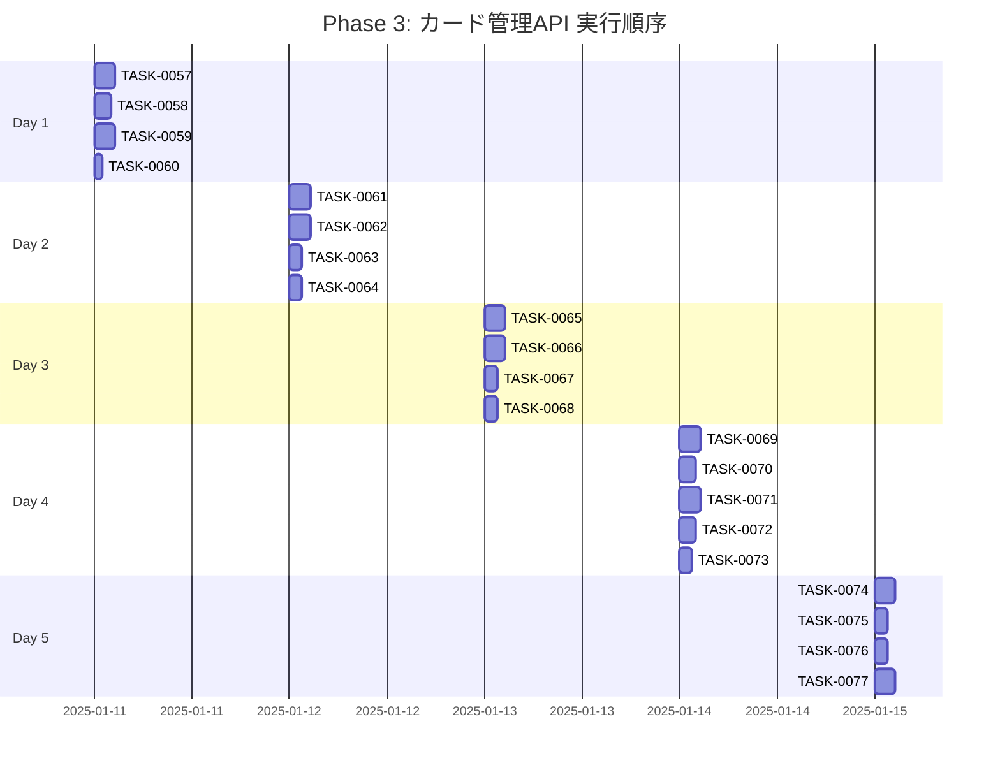

# Phase 3: カード管理API

## フェーズ概要

**要件名**: resource-management-webapp  
**期間**: 5日（40時間）  
**目標**: カード管理APIの実装（CRUD、バリデーション、エラーハンドリング）  
**成果物**: 
- カード一覧取得API実装完了
- カード詳細取得API実装完了
- カード作成API実装完了
- カード更新API実装完了
- カード削除API実装完了
- バリデーション実装完了
- エラーハンドリング実装完了

**関連要件**: WRREQ-012, WRREQ-013, WRREQ-014, WRREQ-016, WRREQ-017, WRREQ-019, WRREQ-020, WRREQ-059, WRREQ-060, WRREQ-067, WRREQ-068, WRREQ-069, WRREQ-070

### タスク統計

- **総タスク数**: 21タスク
- **推定作業時間**: 40時間
- **DIRECTタスク**: 2タスク
- **TDDタスク**: 19タスク

### クリティカルパス

**クリティカルパス**: TASK-0057 → TASK-0058 → TASK-0059 → TASK-0061 → TASK-0062 → TASK-0065 → TASK-0066 → TASK-0067 → TASK-0069 → TASK-0070 → TASK-0071 → TASK-0072 → TASK-0074 → TASK-0077

---

## 実行順序（ガントチャート）

---

## タスクプロセス定義

### TDDタスクの実行プロセス

TDDタスクは以下の6ステップで実行します：

1. `/tsumiki:tdd-requirements` - 詳細要件定義
2. `/tsumiki:tdd-testcases` - テストケース作成
3. `/tsumiki:tdd-red` - テスト実装（失敗）
4. `/tsumiki:tdd-green` - 最小実装
5. `/tsumiki:tdd-refactor` - リファクタリング
6. `/tsumiki:tdd-verify-complete` - 品質確認

### DIRECTタスクの実行プロセス

DIRECTタスクは以下の2ステップで実行します：

1. `/tsumiki:direct-setup` - 直接実装・設定
2. `/tsumiki:direct-verify` - 動作確認・品質確認

---

## 週次計画

### Day 1（8時間）
- **目標**: カード一覧取得API実装
- **成果物**: 
  - カード一覧取得エンドポイント実装
  - ページネーション実装
  - 検索・フィルタリング実装

### Day 2（8時間）
- **目標**: カード詳細取得API実装
- **成果物**: 
  - カード詳細取得エンドポイント実装
  - リレーション処理実装

### Day 3（8時間）
- **目標**: カード作成API実装
- **成果物**: 
  - カード作成エンドポイント実装
  - バリデーション実装
  - 重複チェック実装

### Day 4（8時間）
- **目標**: カード更新・削除API実装
- **成果物**: 
  - カード更新エンドポイント実装
  - カード削除エンドポイント実装
  - 依存関係チェック実装

### Day 5（8時間）
- **目標**: テスト実装と動作確認
- **成果物**: 
  - APIテスト実装
  - 統合テスト実装
  - 動作確認とドキュメント作成

---

## 日次タスク

### Day 1: カード一覧取得API実装

#### TASK-0057: カード一覧取得APIエンドポイント実装
- [ ] **タスク完了**
- <!-- GitHub Issue: # -->
- **タスクタイプ**: TDD
- **推定工数**: 2.5時間
- **要件**: WRREQ-016, WRREQ-059, WRREQ-060, WRREQ-067
- **依存タスク**: TASK-0049, TASK-0028
- **実装詳細**:
  - `src/routes/cards.ts`を作成
  - `GET /api/cards`エンドポイントを実装
  - クエリパラメータのバリデーション（page, limit, search, cardType, rarity）
  - CardServiceのgetCardsメソッドを呼び出し
  - レスポンス形式を整える
- **単体テスト要件**: 
  - エンドポイントが正しく動作することを確認
  - クエリパラメータのバリデーションが正しく動作することを確認
- **統合テスト要件**: 
  - Service層との統合テストを実施
- **完了条件**: 
  - カード一覧取得APIが完成していること

#### TASK-0058: ページネーション処理実装
- [ ] **タスク完了**
- <!-- GitHub Issue: # -->
- **タスクタイプ**: TDD
- **推定工数**: 2時間
- **要件**: WRREQ-016, WRNFR-002
- **依存タスク**: TASK-0057
- **実装詳細**:
  - ページネーション処理を実装
  - デフォルト値設定（page: 1, limit: 20）
  - 総件数、総ページ数の計算
  - レスポンスにページネーション情報を含める
- **単体テスト要件**: 
  - ページネーションが正しく動作することを確認
  - 境界値テスト（page=0, limit=0等）を実施
- **完了条件**: 
  - ページネーション処理が完成していること

#### TASK-0059: 検索・フィルタリング処理実装
- [ ] **タスク完了**
- <!-- GitHub Issue: # -->
- **タスクタイプ**: TDD
- **推定工数**: 2.5時間
- **要件**: WRREQ-016, WRREQ-059, WRREQ-060, WRNFR-003
- **依存タスク**: TASK-0057
- **実装詳細**:
  - カード名での部分一致検索を実装
  - カード系統でのフィルタリングを実装
  - レアリティでのフィルタリングを実装
  - 複数条件の組み合わせに対応
  - デバウンス処理（必要に応じて）
- **単体テスト要件**: 
  - 検索・フィルタリングが正しく動作することを確認
  - 複数条件の組み合わせが正しく動作することを確認
- **完了条件**: 
  - 検索・フィルタリング処理が完成していること

#### TASK-0060: カード一覧取得APIテスト実装
- [ ] **タスク完了**
- <!-- GitHub Issue: # -->
- **タスクタイプ**: TDD
- **推定工数**: 1時間
- **要件**: WRNFR-012
- **依存タスク**: TASK-0057, TASK-0058, TASK-0059
- **実装詳細**:
  - `src/routes/__tests__/cards.test.ts`を作成
  - カード一覧取得APIのテストを実装
  - ページネーションのテストを実装
  - 検索・フィルタリングのテストを実装
  - エラーケースのテストを実装
- **単体テスト要件**: 
  - すべてのテストがパスすることを確認
- **完了条件**: 
  - カード一覧取得APIのテストが完成していること

---

### Day 2: カード詳細取得API実装

#### TASK-0061: カード詳細取得APIエンドポイント実装
- [ ] **タスク完了**
- <!-- GitHub Issue: # -->
- **タスクタイプ**: TDD
- **推定工数**: 2.5時間
- **要件**: WRREQ-016, WRREQ-067
- **依存タスク**: TASK-0049, TASK-0028
- **実装詳細**:
  - `GET /api/cards/:id`エンドポイントを実装
  - パスパラメータのバリデーション（UUID形式）
  - CardServiceのgetCardByIdメソッドを呼び出し
  - リレーション情報を含める（evolutionFrom, evolutionTo, initialDeckStyles, unlockableContent）
  - 404エラーハンドリング
- **単体テスト要件**: 
  - エンドポイントが正しく動作することを確認
  - パスパラメータのバリデーションが正しく動作することを確認
  - 404エラーが正しく返されることを確認
- **統合テスト要件**: 
  - Service層との統合テストを実施
- **完了条件**: 
  - カード詳細取得APIが完成していること

#### TASK-0062: リレーション処理実装
- [ ] **タスク完了**
- <!-- GitHub Issue: # -->
- **タスクタイプ**: TDD
- **推定工数**: 2.5時間
- **要件**: WRREQ-015
- **依存タスク**: TASK-0061
- **実装詳細**:
  - 進化元カード（evolutionFrom）の取得処理を実装
  - 進化先カード（evolutionTo）の取得処理を実装
  - 初期デッキに含む錬金スタイル（initialDeckStyles）の取得処理を実装
  - アンロック条件（unlockableContent）の取得処理を実装
  - レスポンスにリレーション情報を含める
- **単体テスト要件**: 
  - リレーション処理が正しく動作することを確認
  - リレーションが存在しない場合の処理が正しいことを確認
- **完了条件**: 
  - リレーション処理が完成していること

#### TASK-0063: カード詳細取得APIテスト実装
- [ ] **タスク完了**
- <!-- GitHub Issue: # -->
- **タスクタイプ**: TDD
- **推定工数**: 1時間
- **要件**: WRNFR-012
- **依存タスク**: TASK-0061, TASK-0062
- **実装詳細**:
  - カード詳細取得APIのテストを実装
  - リレーション処理のテストを実装
  - 404エラーのテストを実装
  - 不正なID形式のテストを実装
- **単体テスト要件**: 
  - すべてのテストがパスすることを確認
- **完了条件**: 
  - カード詳細取得APIのテストが完成していること

#### TASK-0064: エラーハンドリング強化
- [ ] **タスク完了**
- <!-- GitHub Issue: # -->
- **タスクタイプ**: TDD
- **推定工数**: 2時間
- **要件**: WRREQ-069, WRNFR-011
- **依存タスク**: TASK-0061
- **実装詳細**:
  - 各種エラーケースのハンドリングを実装
  - エラーレスポンス形式を統一
  - エラーログの記録を実装
  - クライアント向けエラーメッセージの整備
- **単体テスト要件**: 
  - エラーハンドリングが正しく動作することを確認
- **完了条件**: 
  - エラーハンドリングが強化されていること

---

### Day 3: カード作成API実装

#### TASK-0065: カード作成APIエンドポイント実装
- [ ] **タスク完了**
- <!-- GitHub Issue: # -->
- **タスクタイプ**: TDD
- **推定工数**: 2.5時間
- **要件**: WRREQ-017, WRREQ-067, WRREQ-070
- **依存タスク**: TASK-0049, TASK-0028
- **実装詳細**:
  - `POST /api/cards`エンドポイントを実装
  - リクエストボディのバリデーション（Zodスキーマ）
  - CardServiceのcreateCardメソッドを呼び出し
  - 201 Createdステータスコードを返す
  - レスポンスに作成されたカード情報を含める
- **単体テスト要件**: 
  - エンドポイントが正しく動作することを確認
  - リクエストボディのバリデーションが正しく動作することを確認
- **統合テスト要件**: 
  - Service層との統合テストを実施
- **完了条件**: 
  - カード作成APIが完成していること

#### TASK-0066: カード作成バリデーション実装
- [ ] **タスク完了**
- <!-- GitHub Issue: # -->
- **タスクタイプ**: TDD
- **推定工数**: 2.5時間
- **要件**: WRREQ-070, WREDGE-004, WREDGE-005
- **依存タスク**: TASK-0065
- **実装詳細**:
  - Zodスキーマを定義（`src/schemas/card-schema.ts`）
  - 必須項目のバリデーション（name, description, cardType, attribute, stabilityValue, energyCost）
  - 文字数制限のバリデーション（name: 1-100文字, description: 1-1000文字）
  - 数値範囲のバリデーション（stabilityValue: -100〜100, energyCost: 0〜5）
  - カード系統のバリデーション（ENUM値チェック）
  - レアリティのバリデーション（ENUM値チェック、nullable）
  - 属性値のバリデーション（JSON形式チェック）
  - エラーメッセージの整備
- **単体テスト要件**: 
  - 各バリデーションルールが正しく動作することを確認
  - 境界値テストを実施
- **完了条件**: 
  - カード作成バリデーションが完成していること

#### TASK-0067: 重複チェック実装
- [ ] **タスク完了**
- <!-- GitHub Issue: # -->
- **タスクタイプ**: TDD
- **推定工数**: 1.5時間
- **要件**: WRREQ-020
- **依存タスク**: TASK-0065
- **実装詳細**:
  - カード名の重複チェックを実装
  - CardServiceのfindByNameメソッドを使用
  - 重複エラー時は409 Conflictステータスコードを返す
  - エラーメッセージを整備
- **単体テスト要件**: 
  - 重複チェックが正しく動作することを確認
  - 重複エラーが正しく返されることを確認
- **完了条件**: 
  - 重複チェックが完成していること

#### TASK-0068: カード作成APIテスト実装
- [ ] **タスク完了**
- <!-- GitHub Issue: # -->
- **タスクタイプ**: TDD
- **推定工数**: 1.5時間
- **要件**: WRNFR-012
- **依存タスク**: TASK-0065, TASK-0066, TASK-0067
- **実装詳細**:
  - カード作成APIのテストを実装
  - バリデーションエラーのテストを実装
  - 重複エラーのテストを実装
  - 成功ケースのテストを実装
- **単体テスト要件**: 
  - すべてのテストがパスすることを確認
- **完了条件**: 
  - カード作成APIのテストが完成していること

---

### Day 4: カード更新・削除API実装

#### TASK-0069: カード更新APIエンドポイント実装
- [ ] **タスク完了**
- <!-- GitHub Issue: # -->
- **タスクタイプ**: TDD
- **推定工数**: 2.5時間
- **要件**: WRREQ-017, WRREQ-067, WRREQ-070
- **依存タスク**: TASK-0049, TASK-0028
- **実装詳細**:
  - `PUT /api/cards/:id`エンドポイントを実装
  - パスパラメータのバリデーション（UUID形式）
  - リクエストボディのバリデーション（部分更新対応）
  - CardServiceのupdateCardメソッドを呼び出し
  - 200 OKステータスコードを返す
  - レスポンスに更新されたカード情報を含める
- **単体テスト要件**: 
  - エンドポイントが正しく動作することを確認
  - 部分更新が正しく動作することを確認
- **統合テスト要件**: 
  - Service層との統合テストを実施
- **完了条件**: 
  - カード更新APIが完成していること

#### TASK-0070: カード更新バリデーション実装
- [ ] **タスク完了**
- <!-- GitHub Issue: # -->
- **タスクタイプ**: TDD
- **推定工数**: 2時間
- **要件**: WRREQ-070
- **依存タスク**: TASK-0069
- **実装詳細**:
  - 部分更新用のZodスキーマを定義
  - 各フィールドのバリデーション（更新時も同様のルールを適用）
  - 重複チェック（name更新時のみ）
  - エラーメッセージの整備
- **単体テスト要件**: 
  - 各バリデーションルールが正しく動作することを確認
- **完了条件**: 
  - カード更新バリデーションが完成していること

#### TASK-0071: カード削除APIエンドポイント実装
- [ ] **タスク完了**
- <!-- GitHub Issue: # -->
- **タスクタイプ**: TDD
- **推定工数**: 2.5時間
- **要件**: WRREQ-017, WRREQ-019, WRREQ-067
- **依存タスク**: TASK-0049, TASK-0028
- **実装詳細**:
  - `DELETE /api/cards/:id`エンドポイントを実装
  - パスパラメータのバリデーション（UUID形式）
  - CardServiceのdeleteCardメソッドを呼び出し
  - 依存関係チェックを実装
  - 204 No Contentステータスコードを返す（ソフトデリート）
  - 依存関係がある場合は409 Conflictを返す
- **単体テスト要件**: 
  - エンドポイントが正しく動作することを確認
  - 依存関係チェックが正しく動作することを確認
- **統合テスト要件**: 
  - Service層との統合テストを実施
- **完了条件**: 
  - カード削除APIが完成していること

#### TASK-0072: 依存関係チェック実装
- [ ] **タスク完了**
- <!-- GitHub Issue: # -->
- **タスクタイプ**: TDD
- **推定工数**: 2時間
- **要件**: WRREQ-019, WREDGE-007
- **依存タスク**: TASK-0071
- **実装詳細**:
  - カードの依存関係をチェック（AlchemyStyleの初期デッキ、UnlockableContent等）
  - 依存関係がある場合のエラーレスポンスを実装
  - エラーメッセージに依存関係の詳細を含める
  - 409 Conflictステータスコードを返す
- **単体テスト要件**: 
  - 依存関係チェックが正しく動作することを確認
  - 依存関係がある場合のエラーが正しく返されることを確認
- **完了条件**: 
  - 依存関係チェックが完成していること

#### TASK-0073: カード更新・削除APIテスト実装
- [ ] **タスク完了**
- <!-- GitHub Issue: # -->
- **タスクタイプ**: TDD
- **推定工数**: 1.5時間
- **要件**: WRNFR-012
- **依存タスク**: TASK-0069, TASK-0070, TASK-0071, TASK-0072
- **実装詳細**:
  - カード更新APIのテストを実装
  - カード削除APIのテストを実装
  - 依存関係チェックのテストを実装
  - エラーケースのテストを実装
- **単体テスト要件**: 
  - すべてのテストがパスすることを確認
- **完了条件**: 
  - カード更新・削除APIのテストが完成していること

---

### Day 5: テスト実装と動作確認

#### TASK-0074: API統合テスト実装
- [ ] **タスク完了**
- <!-- GitHub Issue: # -->
- **タスクタイプ**: TDD
- **推定工数**: 2.5時間
- **要件**: WRNFR-013
- **依存タスク**: TASK-0060, TASK-0063, TASK-0068, TASK-0073
- **実装詳細**:
  - `src/routes/__tests__/cards.integration.test.ts`を作成
  - エンドツーエンドの統合テストを実装
  - 各APIエンドポイントの統合テストを実装
  - データベースを使用した統合テストを実装
- **統合テスト要件**: 
  - すべての統合テストがパスすることを確認
- **完了条件**: 
  - API統合テストが完成していること

#### TASK-0075: パフォーマンステスト実装
- [ ] **タスク完了**
- <!-- GitHub Issue: # -->
- **タスクタイプ**: TDD
- **推定工数**: 1.5時間
- **要件**: WRNFR-001, WRNFR-002, WRNFR-003
- **依存タスク**: TASK-0057, TASK-0059
- **実装詳細**:
  - パフォーマンステストを実装
  - 一覧取得APIの応答時間を測定（目標: 500ms以内）
  - 検索・フィルタリングの応答時間を測定（目標: 500ms以内）
  - 1000件以上のデータでのテストを実施
- **完了条件**: 
  - パフォーマンステストが完成していること
  - パフォーマンス要件を満たしていること

#### TASK-0076: APIドキュメント作成
- [ ] **タスク完了**
- <!-- GitHub Issue: # -->
- **タスクタイプ**: DIRECT
- **推定工数**: 1.5時間
- **要件**: なし（一般的な開発プロセス）
- **依存タスク**: TASK-0057, TASK-0061, TASK-0065, TASK-0069, TASK-0071
- **実装詳細**:
  - APIエンドポイントのドキュメントを作成
  - リクエスト・レスポンスの例を記載
  - エラーケースの例を記載
  - OpenAPI/Swagger形式でのドキュメント作成（オプション）
- **完了条件**: 
  - APIドキュメントが完成していること

#### TASK-0077: 動作確認と最終調整
- [ ] **タスク完了**
- <!-- GitHub Issue: # -->
- **タスクタイプ**: DIRECT
- **推定工数**: 2.5時間
- **要件**: なし（一般的な開発プロセス）
- **依存タスク**: TASK-0074, TASK-0075, TASK-0076
- **実装詳細**:
  - すべてのAPIエンドポイントの動作確認を実施
  - エラーハンドリングの確認を実施
  - パフォーマンスの確認を実施
  - 最終的な調整とバグ修正
- **完了条件**: 
  - すべての機能が正常に動作すること
  - パフォーマンス要件を満たしていること

---

## フェーズ完了条件

- [ ] カード一覧取得APIが実装されていること
- [ ] カード詳細取得APIが実装されていること
- [ ] カード作成APIが実装されていること
- [ ] カード更新APIが実装されていること
- [ ] カード削除APIが実装されていること
- [ ] バリデーションが実装されていること
- [ ] エラーハンドリングが実装されていること
- [ ] すべてのテストがパスしていること
- [ ] パフォーマンス要件を満たしていること

---

## 変更履歴

| 日付 | バージョン | 変更内容 |
|------|----------|---------|
| 2025-01-XX | 1.0 | 初版作成 |

