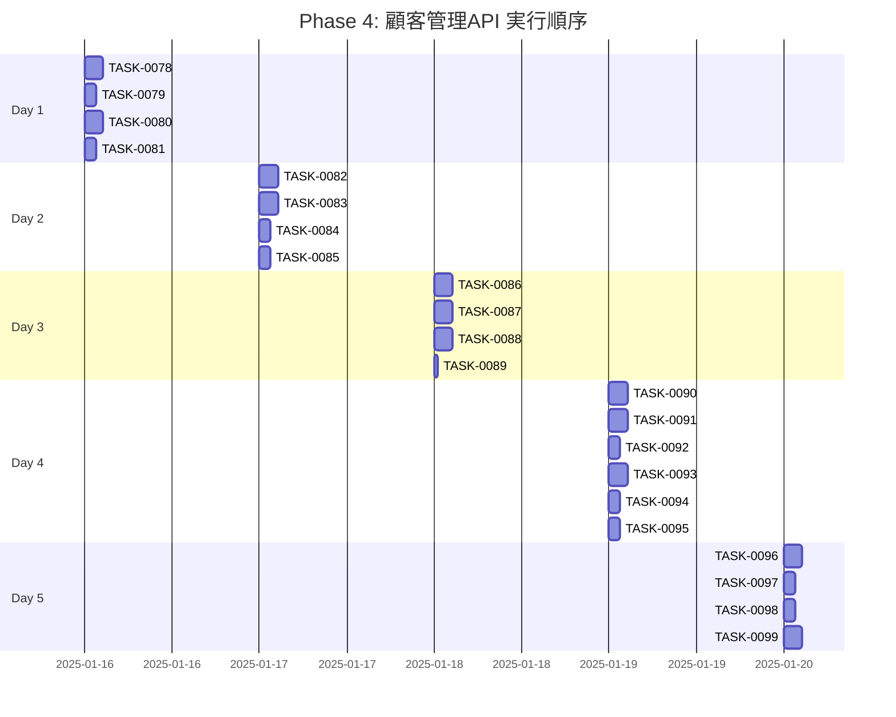

# Phase 4: 顧客管理API

## フェーズ概要

**要件名**: resource-management-webapp  
**期間**: 5日（40時間）  
**目標**: 顧客管理APIの実装（CRUD、N:Mリレーション処理）  
**成果物**: 
- 顧客一覧取得API実装完了
- 顧客詳細取得API実装完了
- 顧客作成API実装完了（N:Mリレーション処理含む）
- 顧客更新API実装完了（N:Mリレーション処理含む）
- 顧客削除API実装完了
- バリデーション実装完了
- エラーハンドリング実装完了

**関連要件**: WRREQ-021, WRREQ-022, WRREQ-023, WRREQ-024, WRREQ-025, WRREQ-026, WRREQ-061, WRREQ-067, WRREQ-068, WRREQ-069, WRREQ-070

### タスク統計

- **総タスク数**: 22タスク
- **推定作業時間**: 40時間
- **DIRECTタスク**: 2タスク
- **TDDタスク**: 20タスク

### クリティカルパス

**クリティカルパス**: TASK-0078 → TASK-0079 → TASK-0080 → TASK-0082 → TASK-0083 → TASK-0086 → TASK-0087 → TASK-0088 → TASK-0090 → TASK-0091 → TASK-0093 → TASK-0094 → TASK-0096 → TASK-0099

---

## 実行順序（ガントチャート）

---

## タスクプロセス定義

### TDDタスクの実行プロセス

TDDタスクは以下の6ステップで実行します：

1. `/tsumiki:tdd-requirements` - 詳細要件定義
2. `/tsumiki:tdd-testcases` - テストケース作成
3. `/tsumiki:tdd-red` - テスト実装（失敗）
4. `/tsumiki:tdd-green` - 最小実装
5. `/tsumiki:tdd-refactor` - リファクタリング
6. `/tsumiki:tdd-verify-complete` - 品質確認

### DIRECTタスクの実行プロセス

DIRECTタスクは以下の2ステップで実行します：

1. `/tsumiki:direct-setup` - 直接実装・設定
2. `/tsumiki:direct-verify` - 動作確認・品質確認

---

## 週次計画

### Day 1（8時間）
- **目標**: 顧客一覧取得API実装
- **成果物**: 
  - 顧客一覧取得エンドポイント実装
  - ページネーション実装
  - 検索・フィルタリング実装

### Day 2（8時間）
- **目標**: 顧客詳細取得API実装
- **成果物**: 
  - 顧客詳細取得エンドポイント実装
  - リレーション処理実装（報酬カード、マップノード等）

### Day 3（8時間）
- **目標**: 顧客作成API実装
- **成果物**: 
  - 顧客作成エンドポイント実装
  - N:Mリレーション処理実装（報酬カード）
  - バリデーション実装

### Day 4（8時間）
- **目標**: 顧客更新・削除API実装
- **成果物**: 
  - 顧客更新エンドポイント実装（N:Mリレーション処理含む）
  - 顧客削除エンドポイント実装
  - 依存関係チェック実装

### Day 5（8時間）
- **目標**: テスト実装と動作確認
- **成果物**: 
  - APIテスト実装
  - 統合テスト実装
  - 動作確認とドキュメント作成

---

## 日次タスク

### Day 1: 顧客一覧取得API実装

#### TASK-0078: 顧客一覧取得APIエンドポイント実装
- [ ] **タスク完了**
- <!-- GitHub Issue: # -->
- **タスクタイプ**: TDD
- **推定工数**: 2.5時間
- **要件**: WRREQ-025, WRREQ-059, WRREQ-061, WRREQ-067
- **依存タスク**: TASK-0051, TASK-0028
- **実装詳細**:
  - `src/routes/customers.ts`を作成
  - `GET /api/customers`エンドポイントを実装
  - クエリパラメータのバリデーション（page, limit, search, difficulty, customerType）
  - CustomerServiceのgetCustomersメソッドを呼び出し
  - レスポンス形式を整える
- **単体テスト要件**: 
  - エンドポイントが正しく動作することを確認
  - クエリパラメータのバリデーションが正しく動作することを確認
- **統合テスト要件**: 
  - Service層との統合テストを実施
- **完了条件**: 
  - 顧客一覧取得APIが完成していること

#### TASK-0079: ページネーション処理実装
- [ ] **タスク完了**
- <!-- GitHub Issue: # -->
- **タスクタイプ**: TDD
- **推定工数**: 1.5時間
- **要件**: WRREQ-025, WRNFR-002
- **依存タスク**: TASK-0078
- **実装詳細**:
  - ページネーション処理を実装（カード管理APIと同様）
  - デフォルト値設定（page: 1, limit: 20）
  - 総件数、総ページ数の計算
  - レスポンスにページネーション情報を含める
- **単体テスト要件**: 
  - ページネーションが正しく動作することを確認
- **完了条件**: 
  - ページネーション処理が完成していること

#### TASK-0080: 検索・フィルタリング処理実装
- [ ] **タスク完了**
- <!-- GitHub Issue: # -->
- **タスクタイプ**: TDD
- **推定工数**: 2.5時間
- **要件**: WRREQ-025, WRREQ-059, WRREQ-061, WRNFR-003
- **依存タスク**: TASK-0078
- **実装詳細**:
  - 顧客名での部分一致検索を実装
  - 難易度でのフィルタリングを実装（1〜5星）
  - 顧客タイプでのフィルタリングを実装
  - 複数条件の組み合わせに対応
- **単体テスト要件**: 
  - 検索・フィルタリングが正しく動作することを確認
  - 複数条件の組み合わせが正しく動作することを確認
- **完了条件**: 
  - 検索・フィルタリング処理が完成していること

#### TASK-0081: 顧客一覧取得APIテスト実装
- [ ] **タスク完了**
- <!-- GitHub Issue: # -->
- **タスクタイプ**: TDD
- **推定工数**: 1.5時間
- **要件**: WRNFR-012
- **依存タスク**: TASK-0078, TASK-0079, TASK-0080
- **実装詳細**:
  - `src/routes/__tests__/customers.test.ts`を作成
  - 顧客一覧取得APIのテストを実装
  - ページネーションのテストを実装
  - 検索・フィルタリングのテストを実装
  - エラーケースのテストを実装
- **単体テスト要件**: 
  - すべてのテストがパスすることを確認
- **完了条件**: 
  - 顧客一覧取得APIのテストが完成していること

---

### Day 2: 顧客詳細取得API実装

#### TASK-0082: 顧客詳細取得APIエンドポイント実装
- [ ] **タスク完了**
- <!-- GitHub Issue: # -->
- **タスクタイプ**: TDD
- **推定工数**: 2.5時間
- **要件**: WRREQ-025, WRREQ-067
- **依存タスク**: TASK-0051, TASK-0028
- **実装詳細**:
  - `GET /api/customers/:id`エンドポイントを実装
  - パスパラメータのバリデーション（UUID形式）
  - CustomerServiceのgetCustomerByIdメソッドを呼び出し
  - リレーション情報を含める（rewardCards, mapNodes, unlockableContent）
  - 404エラーハンドリング
- **単体テスト要件**: 
  - エンドポイントが正しく動作することを確認
  - 404エラーが正しく返されることを確認
- **統合テスト要件**: 
  - Service層との統合テストを実施
- **完了条件**: 
  - 顧客詳細取得APIが完成していること

#### TASK-0083: リレーション処理実装（報酬カード、マップノード等）
- [ ] **タスク完了**
- <!-- GitHub Issue: # -->
- **タスクタイプ**: TDD
- **推定工数**: 2.5時間
- **要件**: WRREQ-024
- **依存タスク**: TASK-0082
- **実装詳細**:
  - 報酬カード（rewardCards）の取得処理を実装（N:Mリレーション）
  - マップノード（mapNodes）の取得処理を実装（1:Nリレーション）
  - アンロック条件（unlockableContent）の取得処理を実装（1:1リレーション）
  - レスポンスにリレーション情報を含める
- **単体テスト要件**: 
  - リレーション処理が正しく動作することを確認
  - N:Mリレーションが正しく動作することを確認
- **完了条件**: 
  - リレーション処理が完成していること

#### TASK-0084: 顧客詳細取得APIテスト実装
- [ ] **タスク完了**
- <!-- GitHub Issue: # -->
- **タスクタイプ**: TDD
- **推定工数**: 1.5時間
- **要件**: WRNFR-012
- **依存タスク**: TASK-0082, TASK-0083
- **実装詳細**:
  - 顧客詳細取得APIのテストを実装
  - リレーション処理のテストを実装
  - 404エラーのテストを実装
- **単体テスト要件**: 
  - すべてのテストがパスすることを確認
- **完了条件**: 
  - 顧客詳細取得APIのテストが完成していること

#### TASK-0085: エラーハンドリング強化
- [ ] **タスク完了**
- <!-- GitHub Issue: # -->
- **タスクタイプ**: TDD
- **推定工数**: 1.5時間
- **要件**: WRREQ-069, WRNFR-011
- **依存タスク**: TASK-0082
- **実装詳細**:
  - 各種エラーケースのハンドリングを実装
  - エラーレスポンス形式を統一（カード管理APIと同様）
  - エラーログの記録を実装
- **単体テスト要件**: 
  - エラーハンドリングが正しく動作することを確認
- **完了条件**: 
  - エラーハンドリングが強化されていること

---

### Day 3: 顧客作成API実装

#### TASK-0086: 顧客作成APIエンドポイント実装
- [ ] **タスク完了**
- <!-- GitHub Issue: # -->
- **タスクタイプ**: TDD
- **推定工数**: 2.5時間
- **要件**: WRREQ-026, WRREQ-067, WRREQ-070
- **依存タスク**: TASK-0051, TASK-0028
- **実装詳細**:
  - `POST /api/customers`エンドポイントを実装
  - リクエストボディのバリデーション（Zodスキーマ）
  - CustomerServiceのcreateCustomerメソッドを呼び出し
  - 201 Createdステータスコードを返す
  - レスポンスに作成された顧客情報を含める
- **単体テスト要件**: 
  - エンドポイントが正しく動作することを確認
  - リクエストボディのバリデーションが正しく動作することを確認
- **統合テスト要件**: 
  - Service層との統合テストを実施
- **完了条件**: 
  - 顧客作成APIが完成していること

#### TASK-0087: N:Mリレーション処理実装（報酬カード）
- [ ] **タスク完了**
- <!-- GitHub Issue: # -->
- **タスクタイプ**: TDD
- **推定工数**: 2.5時間
- **要件**: WRREQ-024
- **依存タスク**: TASK-0086
- **実装詳細**:
  - 報酬カード（rewardCardIds）のN:Mリレーション処理を実装
  - リクエストボディにrewardCardIds配列を含める
  - CustomerServiceでN:Mリレーションを処理
  - 中間テーブル（CustomerRewardCards）への登録処理
  - 存在しないカードIDのバリデーション
- **単体テスト要件**: 
  - N:Mリレーション処理が正しく動作することを確認
  - 存在しないカードIDのエラーが正しく返されることを確認
- **完了条件**: 
  - N:Mリレーション処理が完成していること

#### TASK-0088: 顧客作成バリデーション実装
- [ ] **タスク完了**
- <!-- GitHub Issue: # -->
- **タスクタイプ**: TDD
- **推定工数**: 2.5時間
- **要件**: WRREQ-070, WREDGE-006
- **依存タスク**: TASK-0086
- **実装詳細**:
  - Zodスキーマを定義（`src/schemas/customer-schema.ts`）
  - 必須項目のバリデーション（name, description, customerType, difficulty, requiredAttribute, qualityCondition, stabilityCondition, rewardFame, rewardKnowledge）
  - 文字数制限のバリデーション（name: 1-100文字, description: 1-1000文字）
  - 数値範囲のバリデーション（difficulty: 1〜5, qualityCondition: 0〜100, stabilityCondition: 0〜100, rewardFame: 0〜1000, rewardKnowledge: 0〜1000）
  - 属性値のバリデーション（JSON形式チェック）
  - rewardCardIdsのバリデーション（UUID配列、存在チェック）
  - エラーメッセージの整備
- **単体テスト要件**: 
  - 各バリデーションルールが正しく動作することを確認
  - 境界値テストを実施
- **完了条件**: 
  - 顧客作成バリデーションが完成していること

#### TASK-0089: 顧客作成APIテスト実装
- [ ] **タスク完了**
- <!-- GitHub Issue: # -->
- **タスクタイプ**: TDD
- **推定工数**: 0.5時間
- **要件**: WRNFR-012
- **依存タスク**: TASK-0086, TASK-0087, TASK-0088
- **実装詳細**:
  - 顧客作成APIのテストを実装
  - バリデーションエラーのテストを実装
  - N:Mリレーション処理のテストを実装
  - 成功ケースのテストを実装
- **単体テスト要件**: 
  - すべてのテストがパスすることを確認
- **完了条件**: 
  - 顧客作成APIのテストが完成していること

---

### Day 4: 顧客更新・削除API実装

#### TASK-0090: 顧客更新APIエンドポイント実装
- [ ] **タスク完了**
- <!-- GitHub Issue: # -->
- **タスクタイプ**: TDD
- **推定工数**: 2.5時間
- **要件**: WRREQ-026, WRREQ-067, WRREQ-070
- **依存タスク**: TASK-0051, TASK-0028
- **実装詳細**:
  - `PUT /api/customers/:id`エンドポイントを実装
  - パスパラメータのバリデーション（UUID形式）
  - リクエストボディのバリデーション（部分更新対応）
  - CustomerServiceのupdateCustomerメソッドを呼び出し
  - 200 OKステータスコードを返す
  - レスポンスに更新された顧客情報を含める
- **単体テスト要件**: 
  - エンドポイントが正しく動作することを確認
  - 部分更新が正しく動作することを確認
- **統合テスト要件**: 
  - Service層との統合テストを実施
- **完了条件**: 
  - 顧客更新APIが完成していること

#### TASK-0091: 顧客更新時のN:Mリレーション処理実装
- [ ] **タスク完了**
- <!-- GitHub Issue: # -->
- **タスクタイプ**: TDD
- **推定工数**: 2.5時間
- **要件**: WRREQ-024
- **依存タスク**: TASK-0090
- **実装詳細**:
  - 報酬カード（rewardCardIds）の更新処理を実装
  - 既存のN:Mリレーションを削除
  - 新しいN:Mリレーションを追加
  - トランザクション処理を実装
  - 部分更新対応（rewardCardIdsが指定された場合のみ更新）
- **単体テスト要件**: 
  - N:Mリレーション更新が正しく動作することを確認
  - トランザクション処理が正しく動作することを確認
- **完了条件**: 
  - 顧客更新時のN:Mリレーション処理が完成していること

#### TASK-0092: 顧客更新バリデーション実装
- [ ] **タスク完了**
- <!-- GitHub Issue: # -->
- **タスクタイプ**: TDD
- **推定工数**: 1.5時間
- **要件**: WRREQ-070
- **依存タスク**: TASK-0090
- **実装詳細**:
  - 部分更新用のZodスキーマを定義
  - 各フィールドのバリデーション（更新時も同様のルールを適用）
  - rewardCardIdsのバリデーション（UUID配列、存在チェック）
  - エラーメッセージの整備
- **単体テスト要件**: 
  - 各バリデーションルールが正しく動作することを確認
- **完了条件**: 
  - 顧客更新バリデーションが完成していること

#### TASK-0093: 顧客削除APIエンドポイント実装
- [ ] **タスク完了**
- <!-- GitHub Issue: # -->
- **タスクタイプ**: TDD
- **推定工数**: 2.5時間
- **要件**: WRREQ-026, WRREQ-067
- **依存タスク**: TASK-0051, TASK-0028
- **実装詳細**:
  - `DELETE /api/customers/:id`エンドポイントを実装
  - パスパラメータのバリデーション（UUID形式）
  - CustomerServiceのdeleteCustomerメソッドを呼び出し
  - 依存関係チェックを実装
  - 204 No Contentステータスコードを返す（ソフトデリート）
  - 依存関係がある場合は409 Conflictを返す
- **単体テスト要件**: 
  - エンドポイントが正しく動作することを確認
  - 依存関係チェックが正しく動作することを確認
- **統合テスト要件**: 
  - Service層との統合テストを実施
- **完了条件**: 
  - 顧客削除APIが完成していること

#### TASK-0094: 依存関係チェック実装
- [ ] **タスク完了**
- <!-- GitHub Issue: # -->
- **タスクタイプ**: TDD
- **推定工数**: 1.5時間
- **要件**: WRREQ-019, WREDGE-008
- **依存タスク**: TASK-0093
- **実装詳細**:
  - 顧客の依存関係をチェック（MapNode、UnlockableContent等）
  - 依存関係がある場合のエラーレスポンスを実装
  - エラーメッセージに依存関係の詳細を含める
  - 409 Conflictステータスコードを返す
- **単体テスト要件**: 
  - 依存関係チェックが正しく動作することを確認
- **完了条件**: 
  - 依存関係チェックが完成していること

#### TASK-0095: 顧客更新・削除APIテスト実装
- [ ] **タスク完了**
- <!-- GitHub Issue: # -->
- **タスクタイプ**: TDD
- **推定工数**: 1.5時間
- **要件**: WRNFR-012
- **依存タスク**: TASK-0090, TASK-0091, TASK-0092, TASK-0093, TASK-0094
- **実装詳細**:
  - 顧客更新APIのテストを実装
  - 顧客削除APIのテストを実装
  - N:Mリレーション更新のテストを実装
  - 依存関係チェックのテストを実装
  - エラーケースのテストを実装
- **単体テスト要件**: 
  - すべてのテストがパスすることを確認
- **完了条件**: 
  - 顧客更新・削除APIのテストが完成していること

---

### Day 5: テスト実装と動作確認

#### TASK-0096: API統合テスト実装
- [ ] **タスク完了**
- <!-- GitHub Issue: # -->
- **タスクタイプ**: TDD
- **推定工数**: 2.5時間
- **要件**: WRNFR-013
- **依存タスク**: TASK-0081, TASK-0084, TASK-0089, TASK-0095
- **実装詳細**:
  - `src/routes/__tests__/customers.integration.test.ts`を作成
  - エンドツーエンドの統合テストを実装
  - 各APIエンドポイントの統合テストを実装
  - N:Mリレーション処理の統合テストを実装
  - データベースを使用した統合テストを実装
- **統合テスト要件**: 
  - すべての統合テストがパスすることを確認
- **完了条件**: 
  - API統合テストが完成していること

#### TASK-0097: パフォーマンステスト実装
- [ ] **タスク完了**
- <!-- GitHub Issue: # -->
- **タスクタイプ**: TDD
- **推定工数**: 1.5時間
- **要件**: WRNFR-001, WRNFR-002, WRNFR-003
- **依存タスク**: TASK-0078, TASK-0080
- **実装詳細**:
  - パフォーマンステストを実装
  - 一覧取得APIの応答時間を測定（目標: 500ms以内）
  - 検索・フィルタリングの応答時間を測定（目標: 500ms以内）
  - 1000件以上のデータでのテストを実施
- **完了条件**: 
  - パフォーマンステストが完成していること
  - パフォーマンス要件を満たしていること

#### TASK-0098: APIドキュメント作成
- [ ] **タスク完了**
- <!-- GitHub Issue: # -->
- **タスクタイプ**: DIRECT
- **推定工数**: 1.5時間
- **要件**: なし（一般的な開発プロセス）
- **依存タスク**: TASK-0078, TASK-0082, TASK-0086, TASK-0090, TASK-0093
- **実装詳細**:
  - APIエンドポイントのドキュメントを作成
  - リクエスト・レスポンスの例を記載
  - N:Mリレーション処理の説明を記載
  - エラーケースの例を記載
- **完了条件**: 
  - APIドキュメントが完成していること

#### TASK-0099: 動作確認と最終調整
- [ ] **タスク完了**
- <!-- GitHub Issue: # -->
- **タスクタイプ**: DIRECT
- **推定工数**: 2.5時間
- **要件**: なし（一般的な開発プロセス）
- **依存タスク**: TASK-0096, TASK-0097, TASK-0098
- **実装詳細**:
  - すべてのAPIエンドポイントの動作確認を実施
  - N:Mリレーション処理の確認を実施
  - エラーハンドリングの確認を実施
  - パフォーマンスの確認を実施
  - 最終的な調整とバグ修正
- **完了条件**: 
  - すべての機能が正常に動作すること
  - パフォーマンス要件を満たしていること

---

## フェーズ完了条件

- [ ] 顧客一覧取得APIが実装されていること
- [ ] 顧客詳細取得APIが実装されていること
- [ ] 顧客作成APIが実装されていること（N:Mリレーション処理含む）
- [ ] 顧客更新APIが実装されていること（N:Mリレーション処理含む）
- [ ] 顧客削除APIが実装されていること
- [ ] バリデーションが実装されていること
- [ ] エラーハンドリングが実装されていること
- [ ] すべてのテストがパスしていること
- [ ] パフォーマンス要件を満たしていること

---

## 変更履歴

| 日付 | バージョン | 変更内容 |
|------|----------|---------|
| 2025-01-XX | 1.0 | 初版作成 |

