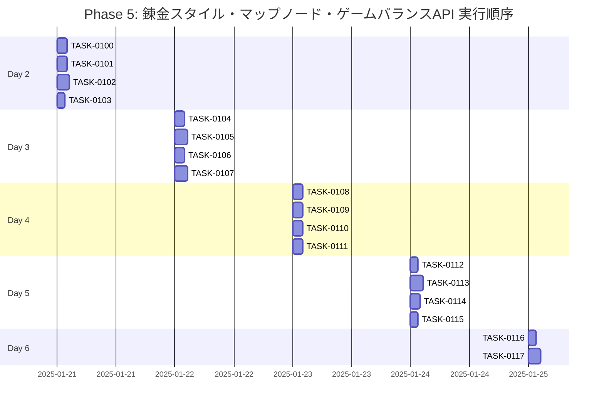

# Phase 5: 錬金スタイル・マップノード・ゲームバランスAPI

## フェーズ概要

**要件名**: resource-management-webapp  
**期間**: 5日（40時間）  
**目標**: 錬金スタイル・マップノード・ゲームバランスAPIの実装  
**成果物**: 
- 錬金スタイル管理API実装完了（CRUD、N:Mリレーション処理含む）
- マップノード管理API実装完了（CRUD）
- ゲームバランス管理API実装完了（取得・更新）
- バリデーション実装完了
- エラーハンドリング実装完了

**関連要件**: WRREQ-029, WRREQ-030, WRREQ-031, WRREQ-033, WRREQ-034, WRREQ-035, WRREQ-036, WRREQ-037, WRREQ-048, WRREQ-049, WRREQ-050, WRREQ-051, WRREQ-062, WRREQ-067, WRREQ-068, WRREQ-069, WRREQ-070

### タスク統計

- **総タスク数**: 18タスク
- **推定作業時間**: 40時間
- **DIRECTタスク**: 2タスク
- **TDDタスク**: 16タスク

### クリティカルパス

**クリティカルパス**: TASK-0100 → TASK-0101 → TASK-0102 → TASK-0105 → TASK-0106 → TASK-0107 → TASK-0109 → TASK-0110 → TASK-0111 → TASK-0114 → TASK-0117

---

## 実行順序（ガントチャート）

---

## タスクプロセス定義

### TDDタスクの実行プロセス

TDDタスクは以下の6ステップで実行します：

1. `/tsumiki:tdd-requirements` - 詳細要件定義
2. `/tsumiki:tdd-testcases` - テストケース作成
3. `/tsumiki:tdd-red` - テスト実装（失敗）
4. `/tsumiki:tdd-green` - 最小実装
5. `/tsumiki:tdd-refactor` - リファクタリング
6. `/tsumiki:tdd-verify-complete` - 品質確認

### DIRECTタスクの実行プロセス

DIRECTタスクは以下の2ステップで実行します：

1. `/tsumiki:direct-setup` - 直接実装・設定
2. `/tsumiki:direct-verify` - 動作確認・品質確認

---

## 週次計画

### Day 1-2（16時間）
- **目標**: 錬金スタイル管理API実装
- **成果物**: 
  - 錬金スタイルCRUD API実装
  - N:Mリレーション処理実装（初期デッキカード）

### Day 3（8時間）
- **目標**: マップノード管理API実装
- **成果物**: 
  - マップノードCRUD API実装
  - 検索・フィルタリング実装

### Day 4（8時間）
- **目標**: ゲームバランス管理API実装
- **成果物**: 
  - ゲームバランス取得API実装
  - ゲームバランス更新API実装

### Day 5（8時間）
- **目標**: テスト実装と動作確認
- **成果物**: 
  - APIテスト実装
  - 統合テスト実装
  - 動作確認とドキュメント作成

---

## 日次タスク

### Day 1-2: 錬金スタイル管理API実装

#### TASK-0100: 錬金スタイルRepository実装
- [ ] **タスク完了**
- <!-- GitHub Issue: # -->
- **タスクタイプ**: TDD
- **推定工数**: 3時間
- **要件**: WRREQ-029, WRREQ-030
- **依存タスク**: TASK-0038, TASK-0039
- **実装詳細**:
  - `src/repositories/interfaces/alchemy-style-repository.ts`を作成
  - `src/repositories/prisma/alchemy-style-repository.ts`を作成
  - `src/repositories/memory/alchemy-style-repository.ts`を作成
  - N:Mリレーション処理を実装（初期デッキカード）
- **単体テスト要件**: 
  - Repositoryが正しく動作することを確認
- **完了条件**: 
  - 錬金スタイルRepositoryが完成していること

#### TASK-0101: 錬金スタイルService実装
- [ ] **タスク完了**
- <!-- GitHub Issue: # -->
- **タスクタイプ**: TDD
- **推定工数**: 3時間
- **要件**: WRREQ-029, WRREQ-030, WRREQ-031
- **依存タスク**: TASK-0100
- **実装詳細**:
  - `src/services/alchemy-style-service.ts`を作成
  - 錬金スタイル一覧取得メソッドを実装
  - 錬金スタイル詳細取得メソッドを実装
  - 錬金スタイル作成メソッドを実装（N:Mリレーション処理含む）
  - 錬金スタイル更新メソッドを実装（N:Mリレーション処理含む）
  - 錬金スタイル削除メソッドを実装
- **単体テスト要件**: 
  - Serviceが正しく動作することを確認
- **完了条件**: 
  - 錬金スタイルServiceが完成していること

#### TASK-0102: 錬金スタイル管理APIエンドポイント実装
- [ ] **タスク完了**
- <!-- GitHub Issue: # -->
- **タスクタイプ**: TDD
- **推定工数**: 4時間
- **要件**: WRREQ-031, WRREQ-067
- **依存タスク**: TASK-0101, TASK-0028
- **実装詳細**:
  - `src/routes/alchemy-styles.ts`を作成
  - `GET /api/alchemy-styles`エンドポイントを実装
  - `GET /api/alchemy-styles/:id`エンドポイントを実装
  - `POST /api/alchemy-styles`エンドポイントを実装
  - `PUT /api/alchemy-styles/:id`エンドポイントを実装
  - `DELETE /api/alchemy-styles/:id`エンドポイントを実装
- **単体テスト要件**: 
  - 各エンドポイントが正しく動作することを確認
- **完了条件**: 
  - 錬金スタイル管理APIが完成していること

#### TASK-0103: 錬金スタイルバリデーション実装
- [ ] **タスク完了**
- <!-- GitHub Issue: # -->
- **タスクタイプ**: TDD
- **推定工数**: 2時間
- **要件**: WRREQ-070
- **依存タスク**: TASK-0102
- **実装詳細**:
  - Zodスキーマを定義（`src/schemas/alchemy-style-schema.ts`）
  - バリデーションルールを実装
  - initialDeckCardIdsのバリデーション（UUID配列、存在チェック）
- **単体テスト要件**: 
  - バリデーションが正しく動作することを確認
- **完了条件**: 
  - 錬金スタイルバリデーションが完成していること

#### TASK-0104: 錬金スタイル管理APIテスト実装
- [ ] **タスク完了**
- <!-- GitHub Issue: # -->
- **タスクタイプ**: TDD
- **推定工数**: 2時間
- **要件**: WRNFR-012
- **依存タスク**: TASK-0102, TASK-0103
- **実装詳細**:
  - `src/routes/__tests__/alchemy-styles.test.ts`を作成
  - 各APIエンドポイントのテストを実装
  - N:Mリレーション処理のテストを実装
- **単体テスト要件**: 
  - すべてのテストがパスすることを確認
- **完了条件**: 
  - 錬金スタイル管理APIのテストが完成していること

---

### Day 3: マップノード管理API実装

#### TASK-0105: マップノードRepository実装
- [ ] **タスク完了**
- <!-- GitHub Issue: # -->
- **タスクタイプ**: TDD
- **推定工数**: 2時間
- **要件**: WRREQ-033, WRREQ-034
- **依存タスク**: TASK-0038, TASK-0039
- **実装詳細**:
  - `src/repositories/interfaces/map-node-repository.ts`を作成
  - `src/repositories/prisma/map-node-repository.ts`を作成
  - `src/repositories/memory/map-node-repository.ts`を作成
  - 検索・フィルタリング機能を実装
- **単体テスト要件**: 
  - Repositoryが正しく動作することを確認
- **完了条件**: 
  - マップノードRepositoryが完成していること

#### TASK-0106: マップノードService実装
- [ ] **タスク完了**
- <!-- GitHub Issue: # -->
- **タスクタイプ**: TDD
- **推定工数**: 2時間
- **要件**: WRREQ-033, WRREQ-034, WRREQ-037
- **依存タスク**: TASK-0105
- **実装詳細**:
  - `src/services/map-node-service.ts`を作成
  - マップノード一覧取得メソッドを実装（ページネーション、検索、フィルタリング）
  - マップノード詳細取得メソッドを実装
  - マップノード作成メソッドを実装
  - マップノード更新メソッドを実装
  - マップノード削除メソッドを実装
- **単体テスト要件**: 
  - Serviceが正しく動作することを確認
- **完了条件**: 
  - マップノードServiceが完成していること

#### TASK-0107: マップノード管理APIエンドポイント実装
- [ ] **タスク完了**
- <!-- GitHub Issue: # -->
- **タスクタイプ**: TDD
- **推定工数**: 2.5時間
- **要件**: WRREQ-037, WRREQ-062, WRREQ-067
- **依存タスク**: TASK-0106, TASK-0028
- **実装詳細**:
  - `src/routes/map-nodes.ts`を作成
  - `GET /api/map-nodes`エンドポイントを実装（ページネーション、検索、フィルタリング）
  - `GET /api/map-nodes/:id`エンドポイントを実装
  - `POST /api/map-nodes`エンドポイントを実装
  - `PUT /api/map-nodes/:id`エンドポイントを実装
  - `DELETE /api/map-nodes/:id`エンドポイントを実装
- **単体テスト要件**: 
  - 各エンドポイントが正しく動作することを確認
- **完了条件**: 
  - マップノード管理APIが完成していること

#### TASK-0108: マップノードバリデーション実装
- [ ] **タスク完了**
- <!-- GitHub Issue: # -->
- **タスクタイプ**: TDD
- **推定工数**: 1.5時間
- **要件**: WRREQ-070
- **依存タスク**: TASK-0107
- **実装詳細**:
  - Zodスキーマを定義（`src/schemas/map-node-schema.ts`）
  - バリデーションルールを実装
  - eventContent、rewardsのJSON形式バリデーション
- **単体テスト要件**: 
  - バリデーションが正しく動作することを確認
- **完了条件**: 
  - マップノードバリデーションが完成していること

---

### Day 4: ゲームバランス管理API実装

#### TASK-0109: ゲームバランスRepository実装
- [ ] **タスク完了**
- <!-- GitHub Issue: # -->
- **タスクタイプ**: TDD
- **推定工数**: 1.5時間
- **要件**: WRREQ-048, WRREQ-049, WRREQ-050, WRREQ-051
- **依存タスク**: TASK-0038, TASK-0039
- **実装詳細**:
  - `src/repositories/interfaces/game-balance-repository.ts`を作成
  - `src/repositories/prisma/game-balance-repository.ts`を作成
  - `src/repositories/memory/game-balance-repository.ts`を作成
  - カテゴリでのフィルタリング機能を実装
- **単体テスト要件**: 
  - Repositoryが正しく動作することを確認
- **完了条件**: 
  - ゲームバランスRepositoryが完成していること

#### TASK-0110: ゲームバランスService実装
- [ ] **タスク完了**
- <!-- GitHub Issue: # -->
- **タスクタイプ**: TDD
- **推定工数**: 2時間
- **要件**: WRREQ-048, WRREQ-049, WRREQ-050, WRREQ-051
- **依存タスク**: TASK-0109
- **実装詳細**:
  - `src/services/game-balance-service.ts`を作成
  - ゲームバランス一覧取得メソッドを実装（カテゴリフィルタリング）
  - ゲームバランス詳細取得メソッドを実装
  - ゲームバランス更新メソッドを実装（settingValue, descriptionのみ更新可能）
- **単体テスト要件**: 
  - Serviceが正しく動作することを確認
- **完了条件**: 
  - ゲームバランスServiceが完成していること

#### TASK-0111: ゲームバランス管理APIエンドポイント実装
- [ ] **タスク完了**
- <!-- GitHub Issue: # -->
- **タスクタイプ**: TDD
- **推定工数**: 2.5時間
- **要件**: WRREQ-048, WRREQ-067
- **依存タスク**: TASK-0110, TASK-0028
- **実装詳細**:
  - `src/routes/game-balance.ts`を作成
  - `GET /api/game-balance`エンドポイントを実装（カテゴリフィルタリング）
  - `GET /api/game-balance/:id`エンドポイントを実装
  - `PUT /api/game-balance/:id`エンドポイントを実装
- **単体テスト要件**: 
  - 各エンドポイントが正しく動作することを確認
- **完了条件**: 
  - ゲームバランス管理APIが完成していること

#### TASK-0112: ゲームバランスバリデーション実装
- [ ] **タスク完了**
- <!-- GitHub Issue: # -->
- **タスクタイプ**: TDD
- **推定工数**: 1.5時間
- **要件**: WRREQ-070
- **依存タスク**: TASK-0111
- **実装詳細**:
  - Zodスキーマを定義（`src/schemas/game-balance-schema.ts`）
  - バリデーションルールを実装
  - settingValueのバリデーション（文字列、最大500文字）
- **単体テスト要件**: 
  - バリデーションが正しく動作することを確認
- **完了条件**: 
  - ゲームバランスバリデーションが完成していること

#### TASK-0113: マップノード・ゲームバランス管理APIテスト実装
- [ ] **タスク完了**
- <!-- GitHub Issue: # -->
- **タスクタイプ**: TDD
- **推定工数**: 0.5時間
- **要件**: WRNFR-012
- **依存タスク**: TASK-0107, TASK-0108, TASK-0111, TASK-0112
- **実装詳細**:
  - `src/routes/__tests__/map-nodes.test.ts`を作成
  - `src/routes/__tests__/game-balance.test.ts`を作成
  - 各APIエンドポイントのテストを実装
- **単体テスト要件**: 
  - すべてのテストがパスすることを確認
- **完了条件**: 
  - マップノード・ゲームバランス管理APIのテストが完成していること

---

### Day 5: テスト実装と動作確認

#### TASK-0114: API統合テスト実装
- [ ] **タスク完了**
- <!-- GitHub Issue: # -->
- **タスクタイプ**: TDD
- **推定工数**: 2.5時間
- **要件**: WRNFR-013
- **依存タスク**: TASK-0104, TASK-0113
- **実装詳細**:
  - `src/routes/__tests__/alchemy-styles.integration.test.ts`を作成
  - `src/routes/__tests__/map-nodes.integration.test.ts`を作成
  - `src/routes/__tests__/game-balance.integration.test.ts`を作成
  - エンドツーエンドの統合テストを実装
- **統合テスト要件**: 
  - すべての統合テストがパスすることを確認
- **完了条件**: 
  - API統合テストが完成していること

#### TASK-0115: パフォーマンステスト実装
- [ ] **タスク完了**
- <!-- GitHub Issue: # -->
- **タスクタイプ**: TDD
- **推定工数**: 1.5時間
- **要件**: WRNFR-001, WRNFR-002, WRNFR-003
- **依存タスク**: TASK-0102, TASK-0107
- **実装詳細**:
  - パフォーマンステストを実装
  - 各APIエンドポイントの応答時間を測定（目標: 500ms以内）
- **完了条件**: 
  - パフォーマンステストが完成していること
  - パフォーマンス要件を満たしていること

#### TASK-0116: APIドキュメント作成
- [ ] **タスク完了**
- <!-- GitHub Issue: # -->
- **タスクタイプ**: DIRECT
- **推定工数**: 1.5時間
- **要件**: なし（一般的な開発プロセス）
- **依存タスク**: TASK-0102, TASK-0107, TASK-0111
- **実装詳細**:
  - APIエンドポイントのドキュメントを作成
  - リクエスト・レスポンスの例を記載
  - エラーケースの例を記載
- **完了条件**: 
  - APIドキュメントが完成していること

#### TASK-0117: 動作確認と最終調整
- [ ] **タスク完了**
- <!-- GitHub Issue: # -->
- **タスクタイプ**: DIRECT
- **推定工数**: 2.5時間
- **要件**: なし（一般的な開発プロセス）
- **依存タスク**: TASK-0114, TASK-0115, TASK-0116
- **実装詳細**:
  - すべてのAPIエンドポイントの動作確認を実施
  - エラーハンドリングの確認を実施
  - パフォーマンスの確認を実施
  - 最終的な調整とバグ修正
- **完了条件**: 
  - すべての機能が正常に動作すること
  - パフォーマンス要件を満たしていること

---

## フェーズ完了条件

- [ ] 錬金スタイル管理APIが実装されていること
- [ ] マップノード管理APIが実装されていること
- [ ] ゲームバランス管理APIが実装されていること
- [ ] バリデーションが実装されていること
- [ ] エラーハンドリングが実装されていること
- [ ] すべてのテストがパスしていること
- [ ] パフォーマンス要件を満たしていること

---

## 変更履歴

| 日付 | バージョン | 変更内容 |
|------|----------|---------|
| 2025-01-XX | 1.0 | 初版作成 |

