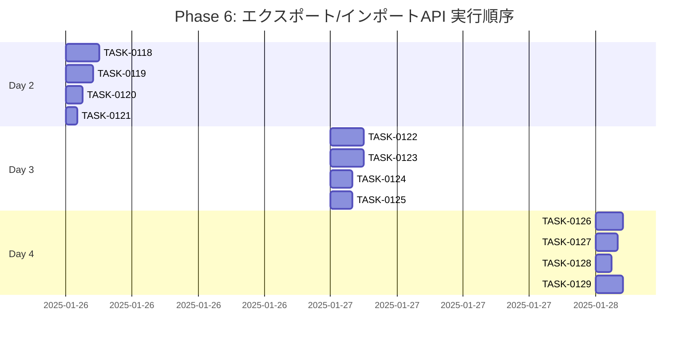

# Phase 6: エクスポート/インポートAPI

## フェーズ概要

**要件名**: resource-management-webapp  
**期間**: 3日（24時間）  
**目標**: データエクスポート/インポートAPIの実装  
**成果物**: 
- データエクスポートAPI実装完了
- データインポートAPI実装完了
- バリデーション実装完了
- エラーハンドリング実装完了

**関連要件**: WRREQ-043, WRREQ-044, WRREQ-045, WRREQ-046, WRREQ-047, WRREQ-067, WRREQ-068, WRREQ-069, WRREQ-070, WREDGE-002, WREDGE-003

### タスク統計

- **総タスク数**: 12タスク
- **推定作業時間**: 40時間
- **DIRECTタスク**: 0タスク
- **TDDタスク**: 12タスク

### クリティカルパス

**クリティカルパス**: TASK-0118 → TASK-0119 → TASK-0122 → TASK-0123 → TASK-0124 → TASK-0126 → TASK-0129

---

## 実行順序（ガントチャート）

---

## タスクプロセス定義

### TDDタスクの実行プロセス

TDDタスクは以下の6ステップで実行します：

1. `/tsumiki:tdd-requirements` - 詳細要件定義
2. `/tsumiki:tdd-testcases` - テストケース作成
3. `/tsumiki:tdd-red` - テスト実装（失敗）
4. `/tsumiki:tdd-green` - 最小実装
5. `/tsumiki:tdd-refactor` - リファクタリング
6. `/tsumiki:tdd-verify-complete` - 品質確認

### DIRECTタスクの実行プロセス

DIRECTタスクは以下の2ステップで実行します：

1. `/tsumiki:direct-setup` - 直接実装・設定
2. `/tsumiki:direct-verify` - 動作確認・品質確認

---

## 週次計画

### Day 1（8時間）
- **目標**: データエクスポートAPI実装
- **成果物**: 
  - データエクスポートエンドポイント実装
  - リソース選択機能実装

### Day 2（8時間）
- **目標**: データインポートAPI実装
- **成果物**: 
  - データインポートエンドポイント実装
  - スキーマバリデーション実装

### Day 3（8時間）
- **目標**: テスト実装と動作確認
- **成果物**: 
  - APIテスト実装
  - 統合テスト実装
  - 動作確認とドキュメント作成

---

## 日次タスク

### Day 1: データエクスポートAPI実装

#### TASK-0118: データエクスポートService実装
- [ ] **タスク完了**
- <!-- GitHub Issue: # -->
- **タスクタイプ**: TDD
- **推定工数**: 3時間
- **要件**: WRREQ-043, WRREQ-045
- **依存タスク**: TASK-0049, TASK-0051, TASK-0101, TASK-0106
- **実装詳細**:
  - `src/services/export-service.ts`を作成
  - 全データエクスポートメソッドを実装
  - リソース選択機能を実装（cards, customers, alchemyStyles, mapNodes等）
  - データ整合性チェックを実装
  - JSON形式への変換処理を実装
- **単体テスト要件**: 
  - Serviceが正しく動作することを確認
  - リソース選択が正しく動作することを確認
- **完了条件**: 
  - データエクスポートServiceが完成していること

#### TASK-0119: データエクスポートAPIエンドポイント実装
- [ ] **タスク完了**
- <!-- GitHub Issue: # -->
- **タスクタイプ**: TDD
- **推定工数**: 2.5時間
- **要件**: WRREQ-043, WRREQ-067
- **依存タスク**: TASK-0118, TASK-0028
- **実装詳細**:
  - `src/routes/export.ts`を作成
  - `GET /api/export`エンドポイントを実装
  - クエリパラメータのバリデーション（resources配列）
  - ExportServiceのexportDataメソッドを呼び出し
  - JSONファイルとしてダウンロード可能な形式で返す
  - Content-Dispositionヘッダーを設定
- **単体テスト要件**: 
  - エンドポイントが正しく動作することを確認
  - ファイルダウンロードが正しく動作することを確認
- **統合テスト要件**: 
  - Service層との統合テストを実施
- **完了条件**: 
  - データエクスポートAPIが完成していること

#### TASK-0120: データエクスポートバリデーション実装
- [ ] **タスク完了**
- <!-- GitHub Issue: # -->
- **タスクタイプ**: TDD
- **推定工数**: 1.5時間
- **要件**: WRREQ-070
- **依存タスク**: TASK-0119
- **実装詳細**:
  - クエリパラメータのバリデーションを実装
  - resources配列のバリデーション（有効なリソース名のみ許可）
  - エラーメッセージの整備
- **単体テスト要件**: 
  - バリデーションが正しく動作することを確認
- **完了条件**: 
  - データエクスポートバリデーションが完成していること

#### TASK-0121: データエクスポートAPIテスト実装
- [ ] **タスク完了**
- <!-- GitHub Issue: # -->
- **タスクタイプ**: TDD
- **推定工数**: 1時間
- **要件**: WRNFR-012
- **依存タスク**: TASK-0119, TASK-0120
- **実装詳細**:
  - `src/routes/__tests__/export.test.ts`を作成
  - データエクスポートAPIのテストを実装
  - リソース選択のテストを実装
  - エラーケースのテストを実装
- **単体テスト要件**: 
  - すべてのテストがパスすることを確認
- **完了条件**: 
  - データエクスポートAPIのテストが完成していること

---

### Day 2: データインポートAPI実装

#### TASK-0122: データインポートService実装
- [ ] **タスク完了**
- <!-- GitHub Issue: # -->
- **タスクタイプ**: TDD
- **推定工数**: 3.5時間
- **要件**: WRREQ-044, WRREQ-046, WRREQ-047
- **依存タスク**: TASK-0049, TASK-0051, TASK-0101, TASK-0106
- **実装詳細**:
  - `src/services/import-service.ts`を作成
  - JSONファイルの読み込み処理を実装
  - スキーマバリデーションを実装（Zodを使用）
  - データ整合性チェックを実装
  - トランザクション処理を実装
  - バルクインサート処理を実装
  - インポート結果の返却処理を実装
- **単体テスト要件**: 
  - Serviceが正しく動作することを確認
  - スキーマバリデーションが正しく動作することを確認
  - データ整合性チェックが正しく動作することを確認
- **完了条件**: 
  - データインポートServiceが完成していること

#### TASK-0123: データインポートAPIエンドポイント実装
- [ ] **タスク完了**
- <!-- GitHub Issue: # -->
- **タスクタイプ**: TDD
- **推定工数**: 2.5時間
- **要件**: WRREQ-044, WRREQ-067, WREDGE-002
- **依存タスク**: TASK-0122, TASK-0028
- **実装詳細**:
  - `src/routes/import.ts`を作成
  - `POST /api/import`エンドポイントを実装
  - multipart/form-dataの処理を実装
  - ファイルサイズ制限を実装（10MB）
  - ImportServiceのimportDataメソッドを呼び出し
  - インポート結果をレスポンスで返す
- **単体テスト要件**: 
  - エンドポイントが正しく動作することを確認
  - ファイルアップロードが正しく動作することを確認
  - ファイルサイズ制限が正しく動作することを確認
- **統合テスト要件**: 
  - Service層との統合テストを実施
- **完了条件**: 
  - データインポートAPIが完成していること

#### TASK-0124: スキーマバリデーション実装
- [ ] **タスク完了**
- <!-- GitHub Issue: # -->
- **タスクタイプ**: TDD
- **推定工数**: 2時間
- **要件**: WRREQ-046, WREDGE-003
- **依存タスク**: TASK-0122
- **実装詳細**:
  - インポート用のZodスキーマを定義（`src/schemas/import-schema.ts`）
  - 各リソースのスキーマを定義
  - 詳細なエラーメッセージを実装（エラー位置、フィールド名等）
  - エラーレスポンス形式を整備
- **単体テスト要件**: 
  - スキーマバリデーションが正しく動作することを確認
  - エラーメッセージが詳細であることを確認
- **完了条件**: 
  - スキーマバリデーションが完成していること

#### TASK-0125: データインポートAPIテスト実装
- [ ] **タスク完了**
- <!-- GitHub Issue: # -->
- **タスクタイプ**: TDD
- **推定工数**: 1時間
- **要件**: WRNFR-012
- **依存タスク**: TASK-0123, TASK-0124
- **実装詳細**:
  - `src/routes/__tests__/import.test.ts`を作成
  - データインポートAPIのテストを実装
  - スキーマバリデーションのテストを実装
  - ファイルサイズ制限のテストを実装
  - エラーケースのテストを実装
- **単体テスト要件**: 
  - すべてのテストがパスすることを確認
- **完了条件**: 
  - データインポートAPIのテストが完成していること

---

### Day 3: テスト実装と動作確認

#### TASK-0126: API統合テスト実装
- [ ] **タスク完了**
- <!-- GitHub Issue: # -->
- **タスクタイプ**: TDD
- **推定工数**: 2.5時間
- **要件**: WRNFR-013
- **依存タスク**: TASK-0121, TASK-0125
- **実装詳細**:
  - `src/routes/__tests__/export.integration.test.ts`を作成
  - `src/routes/__tests__/import.integration.test.ts`を作成
  - エンドツーエンドの統合テストを実装
  - エクスポート→インポートの一連の流れのテストを実装
  - データベースを使用した統合テストを実装
- **統合テスト要件**: 
  - すべての統合テストがパスすることを確認
- **完了条件**: 
  - API統合テストが完成していること

#### TASK-0127: エラーハンドリング強化
- [ ] **タスク完了**
- <!-- GitHub Issue: # -->
- **タスクタイプ**: TDD
- **推定工数**: 2時間
- **要件**: WRREQ-047, WRREQ-069, WREDGE-002, WREDGE-003
- **依存タスク**: TASK-0122, TASK-0123
- **実装詳細**:
  - 各種エラーケースのハンドリングを実装
  - ファイルサイズエラーのハンドリング
  - 不正なJSON形式エラーのハンドリング
  - スキーマバリデーションエラーの詳細な表示
  - エラーログの記録を実装
- **単体テスト要件**: 
  - エラーハンドリングが正しく動作することを確認
- **完了条件**: 
  - エラーハンドリングが強化されていること

#### TASK-0128: APIドキュメント作成
- [ ] **タスク完了**
- <!-- GitHub Issue: # -->
- **タスクタイプ**: DIRECT
- **推定工数**: 1.5時間
- **要件**: なし（一般的な開発プロセス）
- **依存タスク**: TASK-0119, TASK-0123
- **実装詳細**:
  - APIエンドポイントのドキュメントを作成
  - リクエスト・レスポンスの例を記載
  - エラーケースの例を記載
  - ファイル形式の説明を記載
- **完了条件**: 
  - APIドキュメントが完成していること

#### TASK-0129: 動作確認と最終調整
- [ ] **タスク完了**
- <!-- GitHub Issue: # -->
- **タスクタイプ**: DIRECT
- **推定工数**: 2時間
- **要件**: なし（一般的な開発プロセス）
- **依存タスク**: TASK-0126, TASK-0127, TASK-0128
- **実装詳細**:
  - すべてのAPIエンドポイントの動作確認を実施
  - エクスポート→インポートの一連の流れの確認を実施
  - エラーハンドリングの確認を実施
  - 最終的な調整とバグ修正
- **完了条件**: 
  - すべての機能が正常に動作すること

---

## フェーズ完了条件

- [ ] データエクスポートAPIが実装されていること
- [ ] データインポートAPIが実装されていること
- [ ] スキーマバリデーションが実装されていること
- [ ] エラーハンドリングが実装されていること
- [ ] すべてのテストがパスしていること

---

## 変更履歴

| 日付 | バージョン | 変更内容 |
|------|----------|---------|
| 2025-01-XX | 1.0 | 初版作成 |

